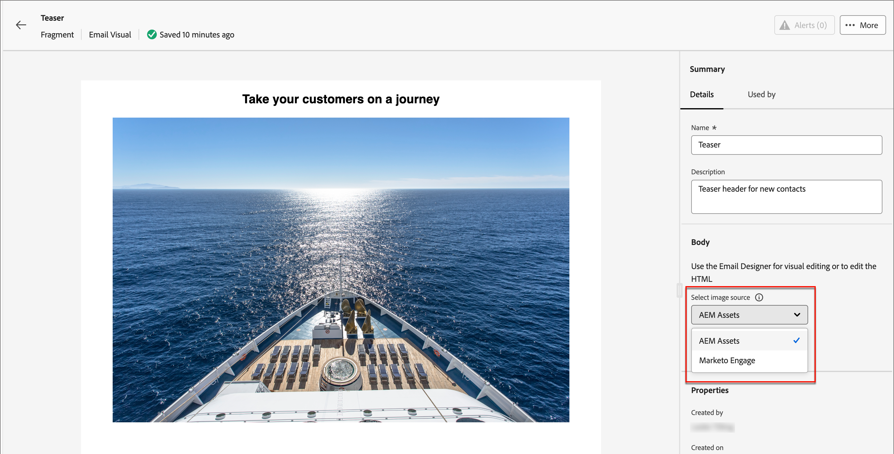
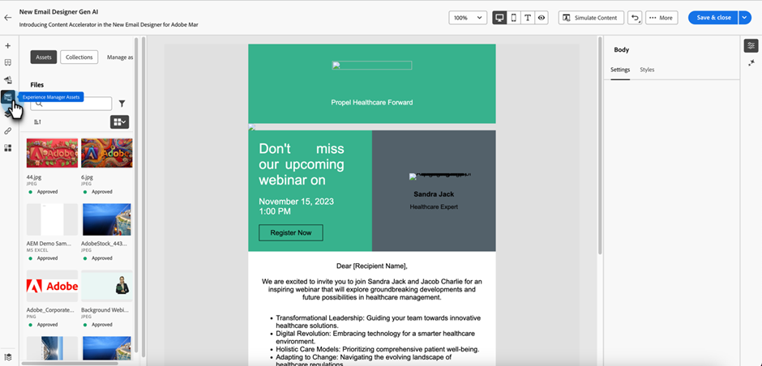
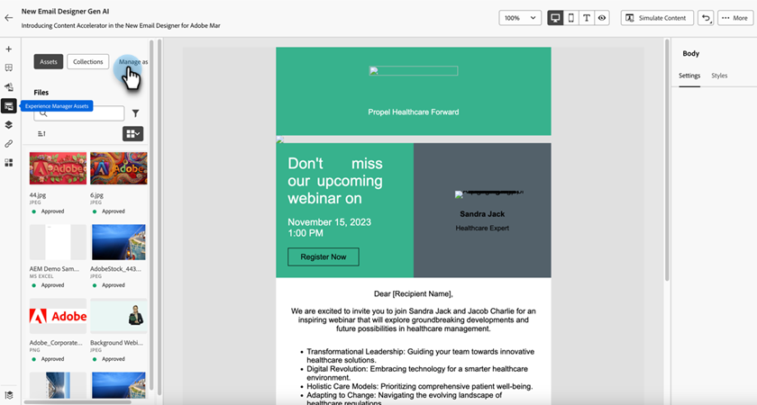

# Werken met Experience Manager-elementen {#work-with-experience-manager-assets}

Wanneer _Adobe Experience Manager Assets as a Cloud Service_ met Adobe Marketo Engage wordt geïntegreerd, kunt u tot digitale activa voor gebruik in uw marketing inhoud gemakkelijk toegang hebben.

>[!PREREQUISITES]
>
>[ verbind uw Cloud Servicen van Adobe Experience Manager met uw instantie van Adobe Marketo Engage ](/help/marketo/product-docs/email-marketing/email-designer/aem-cloud-services.md){target="_blank"}

>[!NOTE]
>
>Momenteel, slechts worden de beeldactiva van _Adobe Experience Manager Assets_ gesteund in Marketo Engage. Wijzigingen in de activa moeten worden aangebracht vanuit de centrale gegevensbank van Adobe Experience Manager Assets. [ leer meer ](https://experienceleague.adobe.com/en/docs/experience-manager-cloud-service/content/assets/manage/manage-digital-assets) {target="_blank"}

Wanneer u deze digitale activa gebruikt, verspreiden de recentste veranderingen in _as a Cloud Service Assets_ automatisch aan levende e-mailcampagnes door verbonden verwijzingen. Als de beelden in _as a Cloud Service Adobe Experience Manager Assets_ worden geschrapt, verschijnen de beelden met een gebroken verwijzing in uw e-mails. Wanneer elementen die momenteel in Marketo Engage worden gebruikt, worden gewijzigd of verwijderd, krijgen de auteurs van de e-mail een melding over de wijzigingen in de afbeelding. Alle wijzigingen in de activa moeten plaatsvinden in de centrale gegevensbank van Adobe Experience Manager Assets.

## AEM Assets gebruiken als afbeeldingsbron {#use-aem-assets-as-the-image-source}

Als uw omgeving een of meer verbindingen met de opslagplaats voor middelen heeft, kunt u AEM Assets aanwijzen als bron voor elementen wanneer u gegevens voor een e-mail, e-mailsjabloon of visueel fragment maakt of bekijkt.

* Wanneer u nieuwe inhoud maakt, kiest u `AEM Assets` als het **[!UICONTROL Image Source]** -item in het dialoogvenster.

{width="400"}

* Wanneer u een bestaande inhoudsbron opent, kiest u `AEM Assets` in de _[!UICONTROL Body]_-sectie aan de rechterkant.

{width="700" zoomable="yes"}

## Elementen openen voor ontwerpen {#access-assets-for-authoring}

>[!IMPORTANT]
>
>Een beheerder moet gebruikers die toegang tot elementen nodig hebben, toevoegen aan de profielen Assets Consumer Users en/of Assets Users-producten. [Meer informatie](https://experienceleague.adobe.com/en/docs/experience-manager-cloud-service/content/security/ims-support#managing-products-and-user-access-in-admin-console)

In de visuele inhoudsredacteur, klik het _pictogram van de selecteur van Activa van de Experience Manager_ in linkerzijbalk. Hiermee wijzigt u het deelvenster Gereedschappen in een lijst met beschikbare middelen in de geselecteerde opslagplaats.

{width="700" zoomable="yes"} toegang te hebben

Als u meer dan één aangesloten AEM opslagplaats hebt, klikt u op de knop **[!UICONTROL Manage as]** om de opslagplaats te kiezen die u wilt gebruiken.

{width="700" zoomable="yes"} toegang te hebben

Kies de gewenste opslagplaats.

 toegang te hebben

Er zijn meerdere methoden om een afbeeldingselement toe te voegen aan het visuele canvas:

* Sleep een afbeeldingsminiatuur vanuit de linkernavigatie en zet deze neer.

{width="700" zoomable="yes"} toegang te hebben

* Voeg een afbeeldingscomponent toe aan het canvas en klik op **[!UICONTROL Browse]** om het dialoogvenster _[!UICONTROL Select Assets]_te openen.

  In het dialoogvenster kunt u een afbeelding kiezen in de geselecteerde opslagplaats.

  Er zijn meerdere gereedschappen beschikbaar om u te helpen de middelen te vinden die u nodig hebt.

{width="700" zoomable="yes"} te vinden en te selecteren

* Wijzig de **[!UICONTROL Repository]** rechtsboven.

* Klik op **[!UICONTROL Manage assets]** rechtsboven om de Assets-opslagplaats te openen in een ander browsertabblad en AEM Assets-beheergereedschappen te gebruiken.

* Klik het _type van Mening_ selecteur bij het hoogste recht om de vertoning in **[!UICONTROL List View]**, **[!UICONTROL Grid View]**, **[!UICONTROL Gallery View]**, of **[!UICONTROL Waterfall View]** te veranderen.

* Klik het _pictogram van de Sorteervolgorde_ om de sorteervolgorde tussen het stijgen en het dalen te veranderen.

* Klik op de menupijl **[!UICONTROL Sort by]** om de sorteercriteria te wijzigen in **[!UICONTROL Name]** , **[!UICONTROL Size]** of **[!UICONTROL Modified]** .

* Klik het _pictogram van de Filter_ op de bovenkant verlaten om de getoonde punten volgens uw criteria te filtreren.

* Typ tekst in het veld Zoeken om de weergegeven items te filteren op een overeenkomst met de elementnaam.

{width="700" zoomable="yes"} de plaats te bepalen
