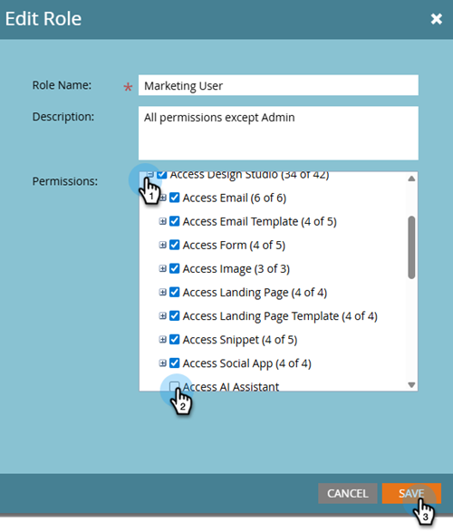
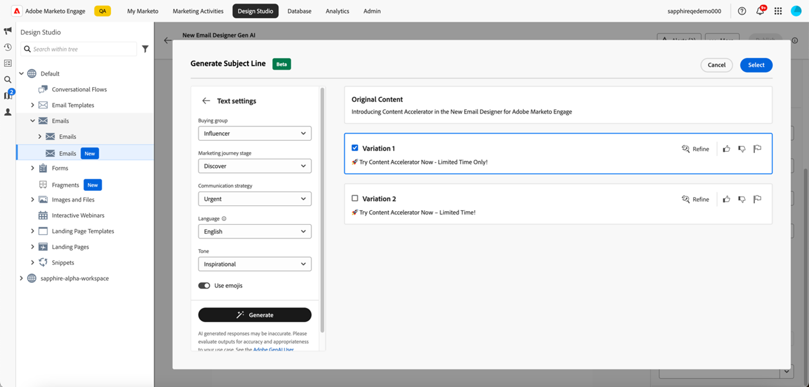
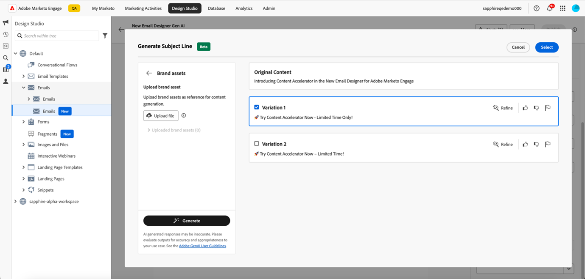
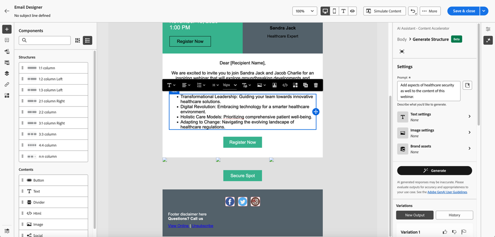

# AI-assistent gebruiken {#use-ai-assistant}

Met AI Assistant in de Marketo Engage Email Designer kunt u hedendaagse, krachtige en intuïtieve e-mails maken. Dit wordt bereikt door middel van Adobe-generatieve AI-technologie en snelle bibliotheek, samen met Firefly voor het genereren van beelden, die helpen bij het creëren van geschikte inhoud voor een bepaalde groep personen/inkoopgroepen, de fase van de marketingreis, de communicatiestrategie, de toon, enz. U kunt ook speciale merkmiddelen gebruiken om inhoud te maken.

>[!PREREQUISITES]
>
>AI Assistant is niet standaard ingeschakeld. U moet eerst met de [ termijnen van de Kern Gen-AI en de supplementaire termijnen ](https://www.adobe.com/legal/terms/enterprise-licensing/genai-ww.html){target="_blank"} voor het gebruiken van de Gen-AI functionaliteit in E-mail Designer akkoord gaan. Neem contact op met het Adobe-accountteam (uw accountmanager) voor meer informatie.

## Machtigingen instellen {#set-up-permissions}

_na_ na de voorwaarde hierboven, moeten de beheerders van Marketo toegang tot specifieke gebruikers/rollen toepassen alvorens de gebruikers de knopen GenAI zullen zien.

+++Leer hoe u machtigingen instelt

1. In Marketo Engage, klik **Admin** en selecteer **Gebruikers &amp; Rollen**.

   

1. In het **lusje van Rollen**, klik op de gewenste rol tweemaal.

   

1. Onder _Studio van het Ontwerp van de Toegang_, selecteer **Hulp AI van de Toegang {** checkbox en klik **sparen**.

   

1. Klik op het tabblad Gebruikers en selecteer de gebruiker tot wie u toegang wilt verlenen.

   

1. Selecteer de rol die u hebt gekozen in Stap 3 en de gewenste werkruimte (indien van toepassing). Klik **sparen**.

   

+++

## Gebruiksscenario&#39;s {#use-cases}

Er zijn drie hoofdgebruikscenario&#39;s voor AI Assistant:

* [ creeer een onderwerpregel ](#create-a-subject-line) voor uw e-mail
* [ creeer inhoud voor een specifieke sectie ](#create-content-for-a-specific-section) van uw e-mail
* [ creeer volledige e-mail ](#create-an-entire-email) van een geselecteerd malplaatje

## Een onderwerpregel maken {#create-a-subject-line}

Wanneer een e-mailbericht wordt gemaakt met de nieuwe e-mailtoepassing Designer, voert u een tijdelijke onderwerpregel in.

Nadat e-mail is gecreeerd, is de onderwerpregel in de _kolom van Details_ op het recht. Klik de AI hulpknoop ( ) naast het om hulp te krijgen die tot een nieuwe onderwerpregel leidt gebruikend de functionaliteit van Gen AI.

Laat de **optie van de verwijzingsinhoud van het Gebruik** voor AI Medewerker toe om nieuwe inhoud te personaliseren die op de geselecteerde inhoud wordt gebaseerd.

Voer de vraag in om de onderwerpregel aan te passen. Voer relevante tekstinstellingen in en upload eventuele merkelementen die u als referentie wilt gebruiken om een geschikte onderwerpregel te maken.

De tekstinstellingen zijn:

<table><tbody>
  <tr>
    <td style="width:25%"><b>Groep voor kopen</b></td>
    <td>Specifieke inkoopgroep waarvoor u zich richt (bijvoorbeeld: Praktijk, Influencer, Besluitvormer).</td>
  </tr>
  <tr>
    <td style="width:25%"><b>Handelsfase</b></td>
    <td>Ontvangers in een bepaalde fase van de marketingreis (bijvoorbeeld Discover, Evaluate, Commit).</td>
  </tr>
  <tr>
    <td style="width:25%"><b>Communicatiestrategie</b></td>
    <td>De doelstelling van de mededeling (bijvoorbeeld Urgent, Sociale Bewijs, Informatief).</td>
  </tr>
  <tr>
    <td style="width:25%"><b>Taal</b></td>
    <td>Taal waarin u de onderwerpregel wilt genereren.</td>
  </tr>
  <tr>
    <td style="width:25%"><b>Tint</b></td>
    <td>Toon waarin u de inhoud wilt genereren (bijvoorbeeld Inspirational, Exciting, Humoureuze).</td>
  </tr>
  <tr>
    <td style="width:25%"><b>Emojis</b></td>
    <td>Hiermee kunt u emojis opnemen in de gegenereerde inhoud.</td>
  </tr>
</tbody>
</table>

Op klikkend **produceer**, verschijnen de steekproeven voor u om van te kiezen:

U kunt ook een merkmiddel uploaden om inhoud binnen het element als verwijzing te gebruiken om de onderwerpregel tot stand te brengen.

Om een variatie te kiezen, zijn checkbox te selecteren en **Uitgezocht** te klikken. U kunt het ook tweken door **te klikken verfijnen**. Daarnaast kunt u feedback geven door op het pictogram met de duimen omhoog of omlaag te klikken, zodat de Gen-AI-technologie uw voorkeuren leert kennen.

Nadat u de selectie hebt aangebracht, wordt de onderwerpregel ingevuld in uw e-maildetails.

## Inhoud maken voor een specifieke sectie van uw e-mail {#create-content-for-a-specific-section}

Nadat u de e-mail hebt gemaakt, kunt u bepaalde secties, afbeeldingen of tekst wijzigen.

In dit voorbeeld gebruiken we een financiële template. Als een of meer van de bestaande afbeeldingen niet naar wens zijn, kunt u de AI-assistent de opdracht geven een nieuwe afbeelding te maken op basis van uw beschrijving. Selecteer de gewenste afbeelding en klik op het pictogram AI-assistent.

Voer de relevante details in de prompt in, zoals &quot;Een bankier die op zijn bureau zit met stapels geld.&quot; U kunt de snelle bibliotheek (rechts van de herinnering) ook gebruiken als u niet zeker bent wat om binnen te gaan. Klik **Montages van het Beeld**.

Klik knevel om _toe te laten produceer beelden gebruikend AI_, dan om het even welke gewenste montages, met inbegrip van welk model om te gebruiken (Adobe Firefly of Gemini 2.5 Nano Banana). Wanneer gedaan, klik **produceren**.

Er worden meerdere varianten gemaakt. Kies uw favoriet en klik **toepassen**.

>[!NOTE]
>
>Als geen van de beelden aan uw behoeften voldoen, **** opnieuw produceren om nieuwe versies tot stand te brengen.

Tekstdelen van de e-mail kunnen net als afbeeldingen worden gewijzigd.

## Een volledige e-mail maken op basis van een geselecteerde sjabloon {#create-an-entire-email}

Deze optie is alleen beschikbaar als de e-mail is gemaakt met een bestaande sjabloon. Dit kan een standaardsjabloon zijn die wordt geboden door de e-mail-Designer, een opgeslagen sjabloon die u al hebt gemaakt of een geïmporteerde sjabloon met de optie HTML importeren. Deze optie is niet beschikbaar als u [ Ontwerp van Scratch ](/help/marketo/product-docs/email-marketing/email-designer/email-authoring.md#design-from-scratch) voor uw e-mail kiest.

Selecteer een sjabloon zonder een component in de sjabloon te selecteren en klik op de knop AI-assistent in de e-mailtoepassing Designer.

Voer de relevante prompt in en kies de tekstinstellingen, merkelementen en afbeeldingsinstellingen die u voor uw e-mail wilt gebruiken.

Als u beelden zou willen produceren gebruikend Firefly, selecteer de Montages van het Beeld en selecteer de knevel voor **produceer Beelden gebruikend AI**.

Selecteer het gewenste _Type van Inhoud_, _Kleur en Toon_, _Verlichting_, en _Samenstelling_ om beelden Gen-AI voor uw e-mail tot stand te brengen. Klik **produceren** wanneer gedaan.

Zie hoe een variatie in uw e-mail door **Voorproef** te klikken zal kijken. Kies een variatie door **te klikken toepassen**.
