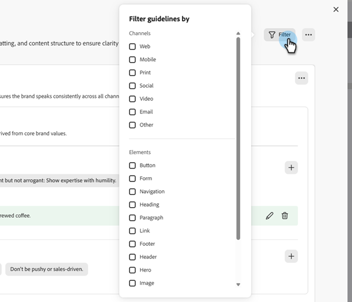

# Uw merken maken en beheren {#create-and-manage-brands}

Merkrichtlijnen zijn een gedetailleerde reeks regels en normen die de visuele en verbale identiteit van een merk bepalen. Zij fungeren als referentie om een consistente merkweergave te behouden op alle marketing- en communicatieplatforms.

Voer uw merkgegevens handmatig in en ordent deze of upload documenten met brandrichtlijnen voor automatische informatie-extractie.

>[!AVAILABILITY]
>
>U moet met de [&#x200B; gebruikersovereenkomst &#x200B;](https://www.adobe.com/legal/licenses-terms/adobe-dx-gen-ai-user-guidelines.html){target="_blank"} akkoord gaan alvorens u de Medewerker AI in Adobe Marketo Engage kunt gebruiken. Neem voor meer informatie contact op met uw Adobe-accountmanager.

## Handelsmerken {#access}

Gebruikers die het **[!UICONTROL brands]** -menu in [!DNL Adobe Marketo Engage] willen openen, moeten hiervoor toestemming krijgen.

+++  Leer hoe u merkgerelateerde machtigingen kunt toewijzen

### Gebruikers en rollen {#users-and-roles}

1. In _Admin_, uitgezochte **Gebruikers &amp; Rollen**.

1. Selecteer de gewenste rol.

1. Klik om het **menu van de Studio van het Ontwerp van de Toegang uit te breiden**.

1. Selecteer **Medewerker van de Toegang AI** en klik **sparen**.

+++

## Uw merk maken en beheren {#create-brand-kit}

Als u de richtlijn voor uw merk wilt maken en beheren, kunt u de details zelf invoeren of het document met uw eigen merkenrichtlijnen uploaden om de informatie automatisch te laten uitnemen.

1. In _Admin_, uitgezochte **Nieuwe Ervaring**.

   

1. Naast _beheert uw Merken_, geeft de klik **&#x200B;**&#x200B;uit.

   

1. Klik op **[!UICONTROL Create brand]** .

1. Voer een **[!UICONTROL Name]** in voor uw merk.

1. Sleep of selecteer uw PDF om uw merkrichtlijnen te uploaden en automatisch relevante merkgegevens te extraheren. Klik op **[!UICONTROL Create]** .

   Het uitpakken van informatie begint. Het kan enkele minuten duren.

   

1. De instellingen voor inhoud en visuele ontwerpen worden nu automatisch ingevuld. Blader door de verschillende tabbladen om de informatie naar wens aan te passen.

1. Vanuit het geavanceerde menu van elke sectie of categorie kunt u automatisch verwijzingen toevoegen om relevante merkgegevens te extraheren.

   Gebruik de opties **[!UICONTROL Clear section]** of **[!UICONTROL Clear category]** om bestaande inhoud te verwijderen.

   {width="800" zoomable="yes"}

   {width="800" zoomable="yes"}

1. Klik **Filter** aan filterrichtlijnen door kanaal of elementtype.

   

1. Wanneer u klaar bent met configureren, klikt u op **[!UICONTROL Save]** en vervolgens op **[!UICONTROL Publish]** om uw merkenhulplijn beschikbaar te maken in AI Assistant.

1. Klik op **[!UICONTROL Edit brand]** om wijzigingen aan te brengen in uw gepubliceerde merk.

   >[!NOTE]
   >
   >Hiermee maakt u een tijdelijke kopie in de bewerkingsmodus, waarbij de live versie wordt vervangen nadat deze is gepubliceerd.

   

1. Open het geavanceerde menu vanaf het dashboard van **[!UICONTROL Brands]** door op het pictogram met drie punten te klikken:

* Merk weergeven
* Bewerken
* Dupliceren
* Publiceren
* Publiceren ongedaan maken
* Verwijderen

  

De richtlijnen voor uw merk zijn nu beschikbaar in het keuzemenu **[!UICONTROL Brand]** in AI Assistant, waarmee u inhoud en elementen kunt genereren die zijn afgestemd op uw specificaties.

### Een standaardmerk instellen {#default-brand}

U kunt een gepubliceerd merk aanwijzen als uw standaard die automatisch moet worden toegepast wanneer u inhoud genereert en scores voor uitlijning berekent tijdens het maken van de campagne.

Als u een standaardmerk wilt instellen, gaat u naar het **[!UICONTROL Brands]** -dashboard. Open het geavanceerde menu door op het pictogram met drie punten te klikken en **[!UICONTROL Mark as default brand]** te selecteren.

