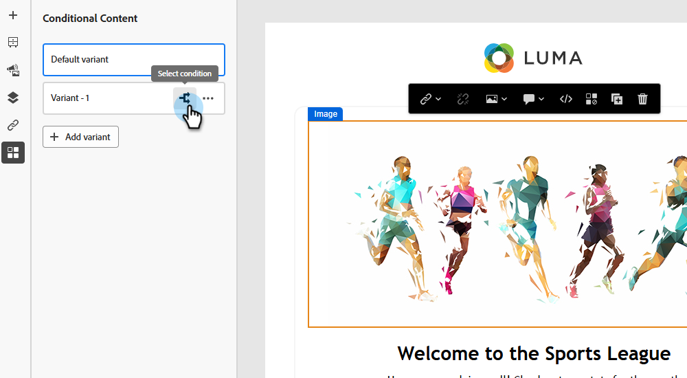
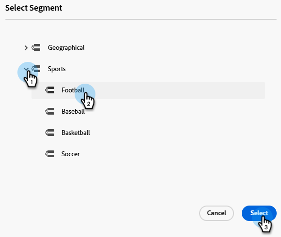
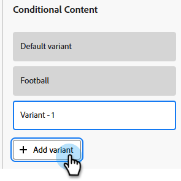

# Voorwaardelijke content {#conditional-content}

Met voorwaardelijke inhoud kunt u dynamisch bepalen welke inhoud zichtbaar is voor welk publiek. Gebruik bestaande segmenten om te bepalen wat een ontvanger ziet op basis van vooraf gedefinieerde criteria.

>[!PREREQUISITES]
>
>Heb minstens één gecreeerde Segmentatie [&#x200B; &#x200B;](/help/marketo/product-docs/personalization/segmentation-and-snippets/segmentation/create-a-segmentation.md) en [&#x200B; goedgekeurd &#x200B;](/help/marketo/product-docs/personalization/segmentation-and-snippets/segmentation/approve-a-segmentation.md).

## Voorwaardelijke inhoud toevoegen {#add-conditional-content}

1. Open gewenste e-mail en klik **geef e-mailinhoud** uit.

   

1. Selecteer de inhoud die u voorwaardelijk wilt maken (in dit voorbeeld kiezen we de koptekstafbeelding). Klik _toelaten voorwaardelijke inhoud_ pictogram.

   

1. Het markeringsvak wordt oranje. Op de linkerzijde, klik het _Uitgezochte voorwaarde_ pictogram () om uw variant te bepalen.

   {width="700" zoomable="yes"}

1. Kies het gewenste segment en klik **Uitgezocht**.

   

1. Klik _geef beeld_ pictogram uit om het bestaande beeld voor de variant te vervangen. Kies de bron van de nieuwe afbeelding. In dit voorbeeld, kiezen wij de _Beelden &amp; van Dossiers_ bibliotheek in ons Marketo Engage abonnement.

   

1. Kies het toepasselijke beeld en klik **Uitgezocht**.

   {width="600" zoomable="yes"}

1. De nieuwe afbeelding wordt weergegeven. Het is een goed idee om de naam van uw variant te wijzigen, zodat u deze gemakkelijker kunt herkennen. Klik de ellips en selecteer **anders noemen**.

   >[!NOTE]
   >
   >Als u op de ellips klikt, kunt u ook de gedefinieerde voorwaarde van de variant bekijken en deze dupliceren. Als u meer dan één variant hebt, wordt een verwijderoptie beschikbaar. Als u slechts één variant hebt, moet de manier om het te schrappen eenvoudig _toelaten voorwaardelijke inhoud_ pictogram (het zal nu zeggen _voorwaardelijke inhoud_ onbruikbaar maken wanneer u over het) beweegt.

   {width="600" zoomable="yes"}

1. Om extra varianten (facultatief) toe te voegen, klik **variant** toevoegen en de zelfde stappen volgen.

   

1. Als u klaar bent, geeft elke variant de inhoud weer die u hebt geselecteerd.

   

1. Ontvangers zien inhoud op basis van de regels die in elk segment zijn gedefinieerd. In het voorbeeld hierboven, zal iedereen die &quot;voetbal&quot;heeft die op uw gebied van Marketo Engage _wordt vermeld Favoriete Sport_ het voetbalbeeld zien.

>[!MORELIKETHIS]
>
>* [&#x200B; bepalen de Regels van het Segment &#x200B;](/help/marketo/product-docs/personalization/segmentation-and-snippets/segmentation/define-segment-rules.md)
>* [&#x200B; creeer een Gebied van de Douane in Marketo &#x200B;](/help/marketo/product-docs/administration/field-management/create-a-custom-field-in-marketo.md)
