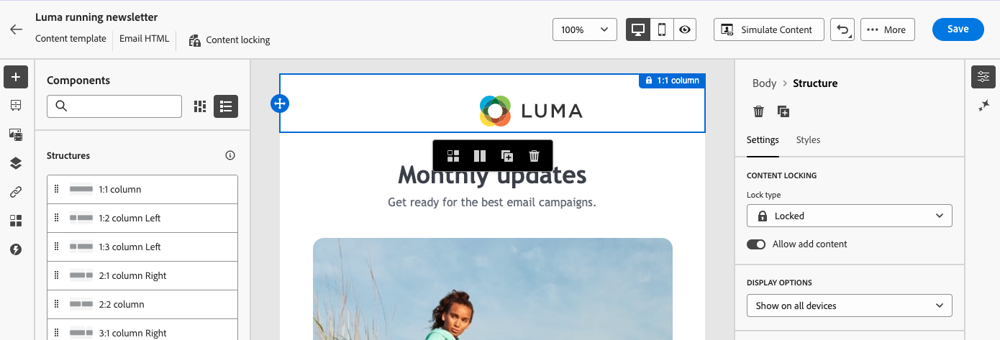
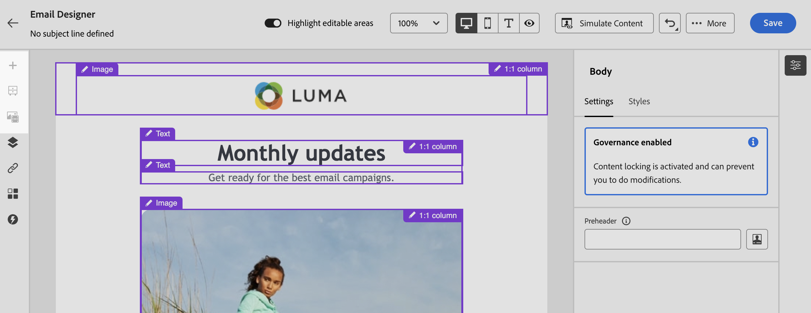
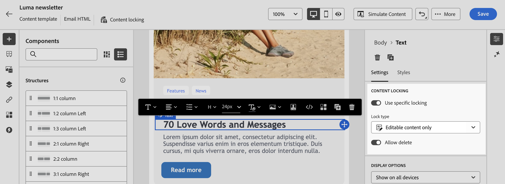

# Inhoud in e-mailsjablonen vergrendelen {#lock-content-email-templates}

Met Marketo Engage kunt u inhoud in e-mailsjablonen vergrendelen door de volledige sjabloon of specifieke structuren/componenten te vergrendelen. Hierdoor kunt u onbedoelde bewerkingen of verwijderingen voorkomen, waardoor u meer controle hebt over de aanpassing van de sjabloon en de efficiëntie en betrouwbaarheid van uw e-mailcampagnes verbetert.

>[!AVAILABILITY]
>
>Gebruikers met machtigingen om inhoudssjablonen te maken, kunnen de vergrendeling van inhoud inschakelen.

Het sluiten van de inhoud kan of op het **structuur** niveau, of op het **component** niveau worden toegepast.

* Wanneer een structuur is vergrendeld:

   * Alle inhoud in die structuur is ook vergrendeld.
   * Er kan geen inhoud worden toegevoegd aan de structuur.
   * Standaard kunt u de structuur niet verwijderen. U kunt deze beperking negeren door de optie Verwijderen toestaan in te schakelen.
   * Afzonderlijke inhoudcomponenten binnen de vergrendelde structuur kunnen worden ingesteld als bewerkbaar.

* Wanneer een structuur bewerkbaar is (structuur niet vergrendeld):

   * Afzonderlijke inhoudcomponenten kunnen binnen die structuur worden vergrendeld.
   * Een component kan standaard niet worden verwijderd als deze is vergrendeld of als de optie Alleen bewerkbare inhoud vergrendelen is geselecteerd. U kunt deze beperking negeren door de optie Verwijderen toestaan in te schakelen.

## Een e-mailsjabloon vergrendelen {#lock-an-email-template}

### Inhoud vergrendelen inschakelen {#enable-content-locking}

U kunt contentvergrendeling voor een e-mailsjabloon rechtstreeks inschakelen in de e-mailsjabloon van de Designer. Dit is zowel het geval als het gaat om het maken van een nieuwe sjabloon of het bewerken van een bestaande sjabloon.

1. Open of maak een e-mailsjabloon en open het scherm voor het bewerken van de inhoud in de e-mail Designer.

1. Schakel in het deelvenster **[!UICONTROL Body]** rechts de optie **[!UICONTROL Governance]** in.

1. Selecteer in de vervolgkeuzelijst **[!UICONTROL Mode]** de gewenste vergrendelingsmodus voor de sjabloon:

   * **[!UICONTROL Content locking]**: Vergrendel specifieke gedeelten van inhoud binnen de sjabloon. Standaard worden alle structuren en componenten bewerkbaar. Vervolgens kunt u afzonderlijke elementen selectief vergrendelen.
   * **[!UICONTROL Read only]**: Vergrendel de volledige inhoud van de sjabloon, zodat wijzigingen niet worden doorgevoerd.

   {width="800" zoomable="yes"}

1. Als u de modus **[!UICONTROL Content locking]** hebt geselecteerd, kunt u nader bepalen hoe gebruikers kunnen communiceren met de sjabloon. Schakel de optie **[!UICONTROL Enable content edition]** in en kies een van de volgende opties:

   * **[!UICONTROL Allow structure & content addition]**: gebruikers kunnen structuren tussen bestaande structuren toevoegen en inhoudscomponenten of fragmenten binnen bewerkbare structuren toevoegen.

   * **[!UICONTROL Allow content addition only]**: gebruikers kunnen inhoudscomponenten of fragmenten toevoegen binnen bewerkbare structuren, maar ze kunnen geen structuren toevoegen of dupliceren.

1. Nadat u de vergrendelingsmodus hebt geselecteerd, kunt u definiëren welke structuren en/of componenten u wilt vergrendelen als u de modus **[!UICONTROL Content locking]** hebt geselecteerd:

   * [Leer hoe u structuren kunt vergrendelen](#lock-structures)
   * [Leer hoe u componenten kunt vergrendelen](#lock-components)

   Als u de modus **[!UICONTROL Read only]** kiest, kunt u doorgaan met het voltooien en opslaan van de sjabloon.

U kunt de instellingen van **[!UICONTROL Governance]** op elk gewenst moment tijdens het ontwerpen van de sjabloon aanpassen door de hoofdtekst van de sjabloon te selecteren. Klik hiertoe op de koppeling **[!UICONTROL Body]** in de navigatieregel die zich boven aan het rechterdeelvenster bevindt.

{width="800" zoomable="yes"}

### Vergrendelingsstructuren {#lock-structures}

Een structuur in de sjabloon vergrendelen:

1. Selecteer de structuur die u wilt vergrendelen.

1. Kies **[!UICONTROL Lock type]** in de vervolgkeuzelijst **[!UICONTROL Locked]** .

   {width="800" zoomable="yes"}

   >[!NOTE]
   >
   >Standaard kunnen gebruikers vergrendelde structuren niet verwijderen. U kunt deze beperking negeren door de optie **[!UICONTROL Allow delete]** in te schakelen.

Nadat een structuur is vergrendeld, kunnen er geen verdere inhoudcomponenten of -fragmenten in worden gedupliceerd of toegevoegd. Alle componenten in een vergrendelde structuur zijn standaard ook vergrendeld. Een component bewerkbaar maken binnen een vergrendelde structuur:

1. Selecteer de component die u wilt ontgrendelen.

1. Schakel de optie **[!UICONTROL Use specific locking]** in.

1. Kies **[!UICONTROL Lock type]** in de vervolgkeuzelijst **[!UICONTROL Editable]** . Selecteer **[!UICONTROL Editable content only]** als u het bewerken van inhoud tijdens het vergrendelen van stijlen wilt toestaan. [ leer hoe te om componenten ](#lock-components) te sluiten

   {width="800" zoomable="yes"}

### Componenten vergrendelen {#lock-components}

Een specifieke component in een structuur vergrendelen:

1. Selecteer de component en schakel de optie **[!UICONTROL Use specific locking]** in het rechterdeelvenster in.

1. Selecteer in de vervolgkeuzelijst **[!UICONTROL Lock type]** de gewenste vergrendelingsoptie:

   {width="800" zoomable="yes"}

   * **[!UICONTROL Editable content lock only]**: vergrendel de stijlen van de component, maar sta het bewerken van inhoud toe.
   * **[!UICONTROL Locked]**: vergrendel zowel de inhoud als de stijlen van de component volledig.

   >[!NOTE]
   >
   >Met het vergrendelingstype **[!UICONTROL Editable]** kunnen gebruikers een component bewerken, zelfs binnen een vergrendelde structuur. [ leer hoe te om structuren ](#lock-structures) te sluiten

1. Standaard kunnen gebruikers vergrendelde componenten niet verwijderen. U kunt verwijdering inschakelen door de optie **[!UICONTROL Allow delete]** te activeren.

### Vergrendelde inhoud identificeren {#identify-locked-content}

Als u vergrendelde structuren en componenten in de sjabloon gemakkelijk wilt identificeren, gebruikt u de **[!UICONTROL Navigation tree]** in het linkerzijmenu. Dit menu biedt een visueel overzicht van alle sjabloonelementen, waarbij vergrendelde items worden gemarkeerd met een vergrendelingspictogram en bewerkbare items met een potloodpictogram.

In het onderstaande voorbeeld wordt governance ingeschakeld voor het sjabloonlichaam. *Structuur 2* is gesloten met *Component 1* editable, terwijl *Structuur 3* volledig gesloten is.

{width="800" zoomable="yes"}

## Sjablonen gebruiken met vergrendelde inhoud {#use-templates-with-locked-content}

Als u een sjabloon met vergrendelde inhoud gebruikt, wordt het bericht **[!UICONTROL Governance enabled]** weergegeven in het rechterdeelvenster.

Afhankelijk van het type vergrendeling dat op de sjabloon wordt toegepast, kunt u verschillende handelingen uitvoeren op de structuren en componenten van de sjabloon. Schakel de optie **[!UICONTROL Highlight editable areas]** in als u snel alle bewerkbare gebieden in de sjabloon wilt identificeren.

In de onderstaande sjabloon zijn bijvoorbeeld alle gebieden bewerkbaar, behalve de bovenste afbeelding die is vergrendeld. Dit betekent dat u deze niet kunt bewerken of verwijderen.

{width="800" zoomable="yes"}

Hier volgen enkele voorbeelden van e-mailversies en de bijbehorende configuratie voor vergrendeling van inhoud die is ingesteld:

<table>
<thead>
  <tr>
    <th>Type inhoudvergrendeling</th>
    <th>Sjabloonconfiguratie</th>
    <th>E-maileditie</th>
  </tr></thead>
<tbody>
  <tr>
    <td>Sjabloon voor alleen-lezen inhoud</td>
    <td></td>
    <td></td>
  </tr>
  <tr>
    <td>Volledige inhoud kan worden bewerkt, maar gebruikers kunnen geen structuur of component toevoegen</td>
    <td></td>
    <td></td>
  </tr>
  <tr>
    <td>Vergrendelde structuur die niet kan worden verwijderd</td>
    <td></td>
    <td></td>
  </tr>
  <tr>
    <td>Component met vergrendelde stijlen die niet kunnen worden verwijderd. Gebruikers kunnen alleen de inhoud wijzigen.</td>
    <td></td>
    <td></td>
  </tr>
  <tr>
    <td>Bewerkbare component binnen een vergrendelde structuur.</td>
    <td></td>
    <td></td>
  </tr>
</tbody>
</table>
