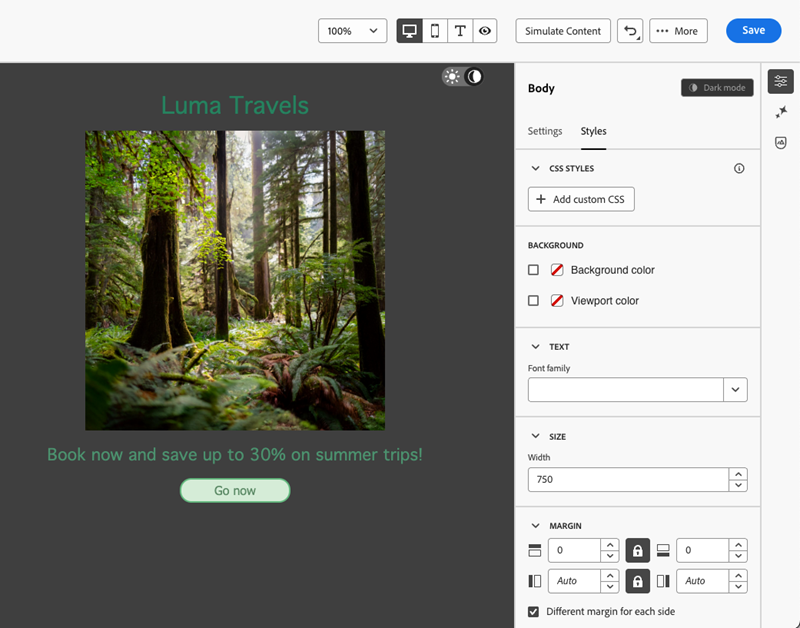
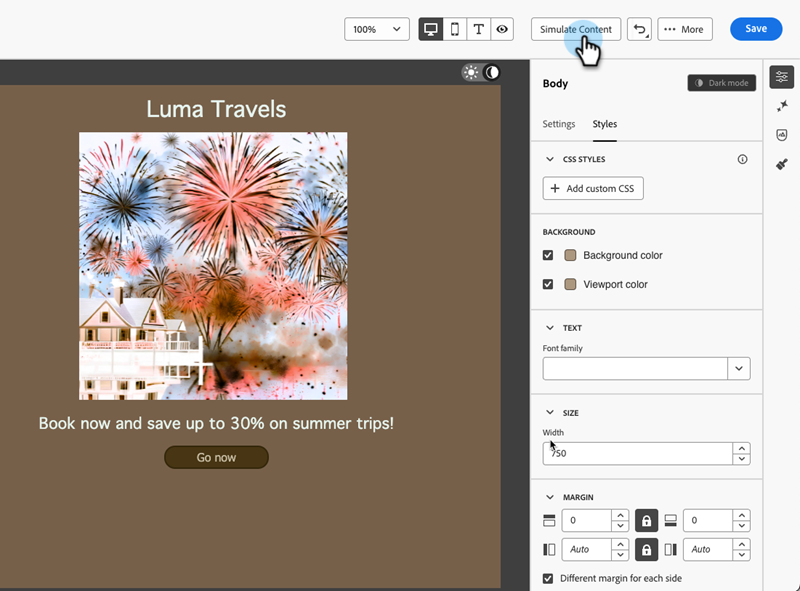

# Donkere modus {#dark-mode}

Wanneer u e-mailberichten ontwerpt, kunt u met de e-mailtoepassing overschakelen naar de weergave **[!UICONTROL Dark mode]** .

In **[!UICONTROL Dark mode]** kunt u specifieke aangepaste instellingen definiëren die moeten worden weergegeven door e-mailclients te ondersteunen wanneer hun donkere modus is ingeschakeld.

## Wat is de donkere modus? {#what-is-dark-mode}

In de donkere modus kunt u ondersteuning bieden voor e-mailclients en apps voor het weergeven van e-mailberichten met donkerdere achtergronden en lichtere kleuren voor tekst, knoppen en andere UI-elementen. Het helpt de oogdruk te verminderen, de accuduur te besparen en de leesbaarheid in omgevingen met weinig licht te verbeteren voor een comfortabeler kijkervaring.

## Guardrails {#guardrails}

Rendering in donkere modus kan aanzienlijk variëren in verschillende e-mailclients.

Voordat u de donkere modus gaat gebruiken, is het belangrijk dat u begrijpt hoe de e-mailhoofdclient deze afhandelt. Er zijn drie zaken om te onderscheiden:

### Clients die de donkere modus niet ondersteunen {#not-supporting}

Sommige e-mailclients ondersteunen deze functie helemaal niet, zoals:

* Yahoo!Mail
* AOL

Ongeacht of u aangepaste instellingen voor de donkere modus definieert, deze e-mailclients geven geen donkere modus weer.

### Clients die hun eigen donkere modus toepassen {#default-support}

Sommige e-mailclients passen stelselmatig hun eigen donkere standaardmodus toe op alle ontvangen e-mailberichten. Kleuren, achtergronden, afbeeldingen, enzovoort, worden automatisch aangepast met instellingen voor de donkere modus die specifiek zijn voor die e-mailclient. Externe wijzigingen zijn niet mogelijk.

Enkele voorbeelden zijn:

* Gmail (desktopwebmail, iOS, Android, mobiele webmail)
* Outlook Windows
* Outlook Windows Mail

Als u in dit geval aangepaste instellingen voor de donkere modus definieert in de Designer-e-mail, worden deze instellingen overschreven door de instellingen van de e-mailclient.

Dus terwijl deze e-mailclients de donkere modus wel afhandelen, wordt uw specifieke ontwerp voor de donkere modus niet weergegeven.

### Clients die aangepaste donkere modus ondersteunen {#custom-dark-mode}

Sommige e-mailclients bieden de optie om de aangepaste donkere modus te renderen met de query `@media (prefers-color-scheme: dark)` . Dit is de methode die wordt gebruikt door de [!DNL Marketo Engage] Email Designer.

De belangrijkste clients die deze optie afhandelen, zijn:

* Apple Mail macOS
* Apple Mail iOS
* Outlook macOS
* Outlook.com
* Outlook iOS
* Outlook Android

De instellingen die u opgeeft in de e-mailtoepassing van de Designer, moeten worden weergegeven.

>[!NOTE]
>
>Leer hoe te om [ montages van de douanedonkere wijze ](#define-custom-dark-mode) in E-mail Designer te bepalen.

Afhankelijk van elke e-mailclient kunnen enkele beperkingen van toepassing zijn. Sommige clients (bijvoorbeeld Apple Mail 16) genereren geen donkere modus als er afbeeldingen aanwezig zijn.

Voor optimale resultaten test u de inhoud in de e-mailclient waarop u zich richt. Om een simulatie in elke cliënt te zien, gebruik [ E-mail teruggevend ](/help/marketo/product-docs/email-marketing/email-designer/test-email-rendering.md) eigenschap in E-mail Designer.

## Donkere modus in de Designer-e-mail {#dark-mode-email-designer}

Wat de donkere modus in de e-mailtoepassing Designer betreft, moet u rekening houden met twee aspecten:

* U kunt een voorvertoning weergeven van hoe de standaard donkere modus wordt weergegeven in de meeste ondersteunde e-mailclients. [Meer informatie](#preview-dark-mode)

* Als u de standaardinstellingen voor het ondersteunen van e-mailclients wilt overschrijven, kunt u aangepaste instellingen voor de donkere modus definiëren in de e-mail die u bewerkt. [Meer informatie](#define-custom-dark-mode)

### Standaardmodus voor donker voorvertonen {#preview-dark-mode}

Leer hoe u de donkere modus kunt openen in de e-mailmodus van Designer en hoe u een voorvertoning van de standaardinstellingen voor de donkere modus kunt weergeven.

1. Selecteer de optie **[!UICONTROL Design from scratch]** op de homepage van Designer via e-mail.

1. Voeg [ structuren en inhoud ](/help/marketo/product-docs/email-marketing/email-designer/email-authoring.md#add-structure-and-content) aan uw e-mail toe.

1. Schakel rechtsboven de schakeloptie **[!UICONTROL Dark mode]** in.

   

1. De standaardvoorvertoning in de donkere modus wordt weergegeven.

   

Standaard wordt in de voorvertoning van de donkere modus van e-mail Designer het kleurschema &#39;full color invert&#39; toegepast op alle elementen behalve afbeeldingen en pictogrammen.

Dat betekent dat er gebieden met lichte en donkere elementen worden gedetecteerd en omgekeerd, zodat lichte achtergronden donker worden en donkere tekst licht, terwijl donkere achtergronden licht worden en lichte tekst donker wordt.

>[!CAUTION]
>
>De uiteindelijke rendering kan variëren afhankelijk van de e-mailclient van de ontvanger. Om een simulatie voor elke e-mailcliënt te zien, gebruik de [ E-mail teruggevende ](/help/marketo/product-docs/email-marketing/email-designer/test-email-rendering.md) eigenschap.

### Aangepaste donkere modus definiëren {#define-custom-dark-mode}

Nadat u naar **[!UICONTROL Dark mode]** hebt overgeschakeld, kunt u specifieke opmaakelementen van uw inhoud bewerken die alleen worden weergegeven wanneer de donkere modus is ingeschakeld in de e-mailclient van de ontvanger (mits deze functie wordt ondersteund).

>[!IMPORTANT]
>
>De uiteindelijke rendering in de donkere modus is afhankelijk van elke e-mailclient. De resultaten kunnen dus per client verschillen. [Meer informatie](#guardrails)

Marketo Engage gebruikt de CSS-query van `@media (prefers-color-scheme: dark)` om de aangepaste stijl voor de donkere modus van e-mail Designer te gebruiken. Deze query detecteert of de e-mailclient van de gebruiker is ingesteld op de donkere modus en past het donkere ontwerp toe dat in uw e-mail is gedefinieerd.

Volg onderstaande stappen om aangepaste instellingen voor de donkere modus te definiëren.

1. Schakelaar aan de [ de wijzevoorproef van de Donker ](#preview-dark-mode) in E-mail Designer.

1. Bewerk alle opmaakkleurkenmerken, zoals tekst, achtergronden, knoppen, enz.

1. U kunt de kleuren van afbeeldingen en pictogrammen niet wijzigen, maar u kunt alleen specifieke elementen definiëren voor de donkere modus. Selecteer een afbeelding om dit te doen. Schakel over naar **[!UICONTROL Dark mode]** met de specifieke schakeloptie in het deelvenster **[!UICONTROL Settings]** en selecteer een ander element.

   

1. U kunt op elk gewenst moment **[!UICONTROL Switch to live view]** gebruiken om te zien hoe uw inhoud op verschillende apparaatgrootten wordt gerenderd. In deze weergave selecteert u de schakeloptie Donkere modus om een voorvertoning weer te geven van de donkere modusversie van de inhoud op verschillende apparaten.

   

   >[!NOTE]
   >
   >De live weergave is een algemene voorvertoning die is ontworpen om te vergelijken hoe de rendering er tussen verschillende apparaatgrootten uitziet. De uiteindelijke rendering kan variëren afhankelijk van de e-mailclient van de ontvanger.

1. Als u tevreden bent met de wijzigingen in de donkere modus, klikt u op **[!UICONTROL Simulate Content]** .

   

1. Selecteer **[!UICONTROL Render email]** en verbind met uw rekening van de NLS. U ziet de uiteindelijke donkere modus voor verschillende e-mailclients. Leer meer over [ E-mail teruggevend ](/help/marketo/product-docs/email-marketing/email-designer/test-email-rendering.md).

   >[!IMPORTANT]
   >
   >Hoewel de simulatie nauwkeurig benadert hoe e-mails in de donkere modus worden weergegeven, kan de werkelijke rendering verschillen als gevolg van verschillen tussen e-mailserviceproviders of apparaatinstellingen.

## Best practices {#best-practices}

Aangezien de donkere wijzetoepassing over belangrijke e-mailcliënten stijgt, is het essentieel om te overwegen hoe uw e-mails in zowel lichte als donkere milieu&#39;s teruggeven, of u [ douane donkere wijze ](#define-custom-dark-mode) of niet gebruikt.

In de donkere modus kunt u kleuren, achtergronden en afbeeldingen wijzigen. Soms worden ontwerpkeuzen genegeerd. Volg de onderstaande aanbevolen procedures om de visuele consistentie, toegankelijkheid en brandintegriteit te garanderen.

**optimaliseer uw beelden en logo&#39;s**

* Sla logo&#39;s en pictogrammen op als PNG&#39;s met transparante achtergronden om zichtbare witte vakken in de donkere modus te voorkomen.

* Vermijd afbeeldingen met een hardcodeerde witte of lichte achtergrond.

* Als transparantie geen optie is, plaatst u afbeeldingen op een effen achtergrond in uw ontwerp om ongewenste kleurinversies te voorkomen.

**bekijk uw achtergronden**

* Zorg voor voldoende contrast tussen tekst en achtergrondkleuren voor leesbaarheid in zowel de lichte als de donkere modus.

* Vertrouw niet alleen op achtergrondkleuren voor essentiële inhoud. Sommige clients overschrijven achtergrondkleuren in de donkere modus, zodat de belangrijkste gegevens nog steeds zichtbaar zijn.

**Ontwerp toegankelijke inhoud op donkere wijze**

* Gebruik kleurcombinaties die u gemakkelijk kunt herkennen voor mensen met kleurenblindheid.

* Gebruik een palet met middentonen om contrast tegen zowel lichte als donkere achtergronden te waarborgen.

* Gebruik toegankelijke kleurcombinaties met hoog contrast om de leesbaarheid te verbeteren en te voldoen aan de WCAG-standaarden (Web Content Accessibility Guidelines). Gebruik gereedschappen zoals de Contrast Checker van WebAIM om het kleurcontrast te controleren.

* Vermijd dunne lettertypen omdat dit van invloed is op de leesbaarheid. Als uw merk een dun lettertype nodig heeft, kunt u het vet in de donkere modus drukken.

* Overslaan puur wit op puur zwart, omdat dit oogbelasting kan veroorzaken en door sommige e-mailclients automatisch kan worden omgekeerd.

* Maak toegankelijke fallback-stijlen als de donkere modus niet wordt ondersteund.

**Test uw e-mails op donkere wijzemilieu**

* Gebruik de e-mail Designer [ donkere wijzevoorproef ](#preview-dark-mode) die omgekeerde kleurenschema&#39;s aan vlekkwesties vroeg gebruikt.

* Gebruik de [ E-mail teruggevende ](/help/marketo/product-docs/email-marketing/email-designer/test-email-rendering.md) eigenschap die hefboomwerkingen Litmus om uw ontwerpen over belangrijke e-mailcliënten te simuleren en te zien hoe de kleuren en de beelden zich op donkere wijze gedragen.
