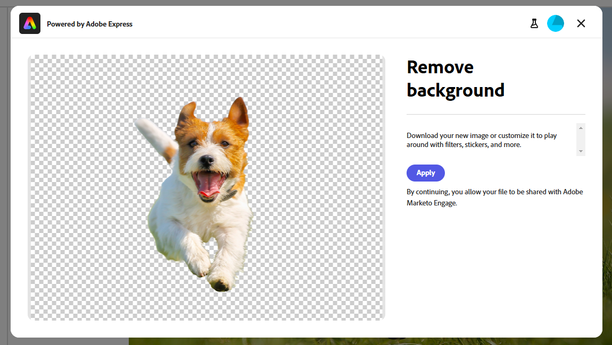

# Afbeeldingen bewerken met Adobe Express {#edit-images-with-adobe-express}

Adobe Marketo Engage kan op een native manier worden geïntegreerd met Adobe Express, zodat u toegang hebt tot verschillende gereedschappen voor het bewerken van afbeeldingen. Met deze gereedschappen kunt u uw afbeeldingen wijzigen in Marketo Engage Design Studio. De integratie biedt de volgende belangrijke voordelen:

* Meer hergebruik van inhoud door nieuwe afbeeldingen te bewerken en op te slaan in Marketo Engage.

* Minder tijd en moeite bij het bijwerken van afbeeldingen of het maken van nieuwe versies van bestaande afbeeldingen.

>[!NOTE]
>
>Adobe Express biedt momenteel alleen ondersteuning voor PNG- en JPEG-afbeeldingsbestandsindelingen.

## De Adobe Express-editor openen {#access-the-adobe-express-editor}

U kunt de Adobe Express-editor op twee manieren openen:

* Klik op de naam van de afbeelding
* _Beeld en dossiers acties_ drop-down menu

>[!BEGINTABS]

>[!TAB  klik op de beeldnaam ]

1. Ga in Marketo Engage naar **[!UICONTROL Design Studio]** en selecteer **[!UICONTROL Images and Files]** .

   {width="600" zoomable="yes"}

1. Selecteer de afbeelding die u wilt bewerken.

   {width="600" zoomable="yes"}

   >[!NOTE]
   >
   >* Als u de elementen op werkruimte en map wilt weergeven, opent u de structuur door op het pictogram **[!UICONTROL Show Folders]** linksboven te klikken.
   >
   >* Als u de tabel op een van de kolommen wilt sorteren, klikt u op de kolomtitel. De pijl in de titelrij geeft de huidige sorteerkolom en -volgorde aan.

1. In het beeld _Details_ lusje, klik **[!UICONTROL Edit in Adobe Express]**.

   {width="600" zoomable="yes"}

   >[!CAUTION]
   >
   >Als er al naar de afbeelding wordt verwezen in een e-mailsjabloon of e-mailsjabloon, wordt die afbeelding tijdens alle bewerkingen bijgewerkt, overal waar deze momenteel wordt gebruikt.

>[!TAB  Beeld en dossieracties ]

1. Ga in Marketo Engage naar **[!UICONTROL Design Studio]** en selecteer **[!UICONTROL Images and Files]** .

   {width="600" zoomable="yes"}

   >[!NOTE]
   >
   >* Als u de elementen op werkruimte en map wilt weergeven, opent u de structuur door op het pictogram **[!UICONTROL Show Folders]** linksboven te klikken.
   >
   >* Als u de tabel op een van de kolommen wilt sorteren, klikt u op de kolomtitel. De pijl in de titelrij geeft de huidige sorteerkolom en -volgorde aan.

1. Schakel het selectievakje naast de afbeelding die u wilt bewerken in. Selecteer **[!UICONTROL Edit in Adobe Express]** in de vervolgkeuzelijst **[!UICONTROL Image and file actions]** .

   {width="600" zoomable="yes"}

   >[!CAUTION]
   >
   >Als er al naar de afbeelding wordt verwezen in een e-mailsjabloon of e-mailsjabloon, wordt die afbeelding tijdens alle bewerkingen bijgewerkt, overal waar deze momenteel wordt gebruikt.

>[!ENDTABS]

## Adobe Express Enterprise-licentie {#adobe-express-enterprise-license}

### Gebruikers met een Enterprise-licentie {#users-with-an-enterprise-license}

Als u een Enterprise-licentie voor Adobe Express hebt, hebt u toegang tot de volledige Express Editor. U kunt afbeeldingsinstellingen zoals kleur, helderheid, scherpte, contrast, grootte en meer aanpassen. Met de optie AI Magic kunt u achtergronden verwijderen, objecten invoegen en verwijderen en delen van een afbeelding wissen. Bezoek de [ Gids van de Gebruiker van Adobe Express ](https://helpx.adobe.com/express/user-guide.html){target="_blank"}  om over elke het plaatsen te leren.

>[!IMPORTANT]
>
>De aangeschafte licentie moet onder dezelfde IMS Org staan als uw Marketo Engage-abonnement om toegang te krijgen tot alle bewerkingsmogelijkheden van Adobe Express. Bovendien moet elke individuele gebruiker een licentie hebben in Adobe Express. De gebruikers [ zonder een vergunning ](#users-without-an-enterprise-license) kunnen tot de snelle acties in Adobe Express slechts toegang hebben.

### Gebruikers zonder Enterprise-licentie {#users-without-an-enterprise-license}

Voor mensen zonder een Enterprise-licentie hebt u nog steeds toegang tot verschillende functies voor snelle bewerking. Deze functies zijn:

* [Grootte afbeelding wijzigen](#resize-image)
* [Achtergrond verwijderen](#remove-background)
* [Afbeelding uitsnijden](#crop-image)
* [Omzetten in PNG/JPEG](#convert-to-png-jpeg)

De functies zijn toegankelijk links op de afbeeldingspagina.

{width="800" zoomable="yes"}

#### Grootte afbeelding wijzigen {#resize-image}

1. Klik **Resize Beeld**.

1. Breng uw gewenste veranderingen aan en klik **toepassen** wanneer gedaan.

{width="800" zoomable="yes"}

<table><tbody>
  <tr>
    <td style="width:25%"><b>Hoogte-breedteverhouding</b></td>
    <td>In de <b> drop-down Verhouding van de Verhouding </b>, kies <b> Standaard </b> om van vooraf berekende gemeenschappelijke fotogrootten te kiezen, of <b> Douane </b> om uw eigen breedte/hoogte te plaatsen. U kunt ook de standaardgrootte van een specifiek platform voor sociale media kiezen (Pinterest, Snapchat, enz.).</td>
  </tr>
  <tr>
    <td style="width:25%"><b>Breedte en Hoogte</b></td>
    <td>Standaard is de hoogte-breedteverhouding vergrendeld, zodat de verhoudingen van de afbeelding hetzelfde blijven wanneer u de grootte aanpast. U kunt desgewenst de vergrendelingsknop selecteren om de hoogte-breedteverhouding te ontgrendelen.</td>
  </tr>
  <tr>
    <td style="width:25%"><b>Herstellen</b></td>
    <td>Klik <b> Terugstellen </b> om het even welke die uitgeeft aan het beeld te verwijderen en het terug te keren aan zijn originele staat.</td>
  </tr>
  <tr>
    <td style="width:25%"><b>Zoomen en uitsnijden</b></td>
    <td>Klik <b> Gezoem en Gewas </b> om binnen op specifieke gebieden van het beeld te zoemen. Het klikken <b> past </b> na het zoemen toe gewassen het beeld aan wat momenteel wordt getoond.</td>
  </tr>
</tbody>
</table>

#### Achtergrond verwijderen {#remove-background}

1. Klik **verwijderen Achtergrond**.

1. Adobe Express geeft de afbeelding zonder achtergrond weer. Als het aan uw behoeften voldoet, **van toepassing is**.

{width="800" zoomable="yes"}

>[!TIP]
>
>Als u niet met het resultaat tevreden bent, klik eenvoudig **X** om het venster te sluiten.

#### Afbeelding uitsnijden {#crop-image}

1. Klik op **[!UICONTROL Crop Image]**.

1. Sleep de hoeken van de afbeelding om de gewenste uitsnijding te maken.

{width="800" zoomable="yes"} uit te snijden

1. Klik op **[!UICONTROL Apply]** als u klaar bent.

#### Omzetten in PNG/JPEG {#convert-to-png-jpeg}

Zet een PNG-bestand om in een JPEG-bestand of een JPEG-bestand in een PNG-bestand.

1. Klik op **[!UICONTROL Convert to PNG/JPEG]**.

{width="800" zoomable="yes"}

1. Klik op **[!UICONTROL Apply]**.

## Uw werk opslaan {#save-your-work}

Wanneer u met al uw uitgeeft wordt gedaan, klik **sparen** om uw werk te bewaren.

{width="800" zoomable="yes"}

De bewerkte afbeelding wordt opgeslagen in dezelfde map als de oorspronkelijke afbeelding.
