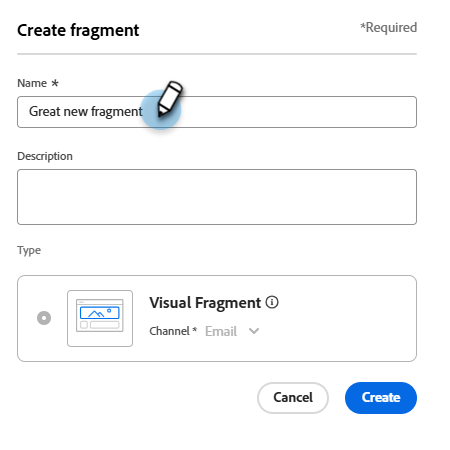
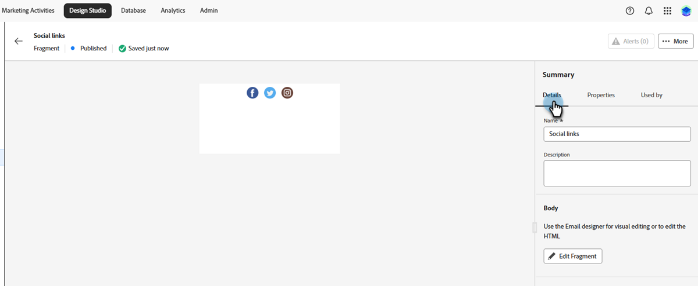
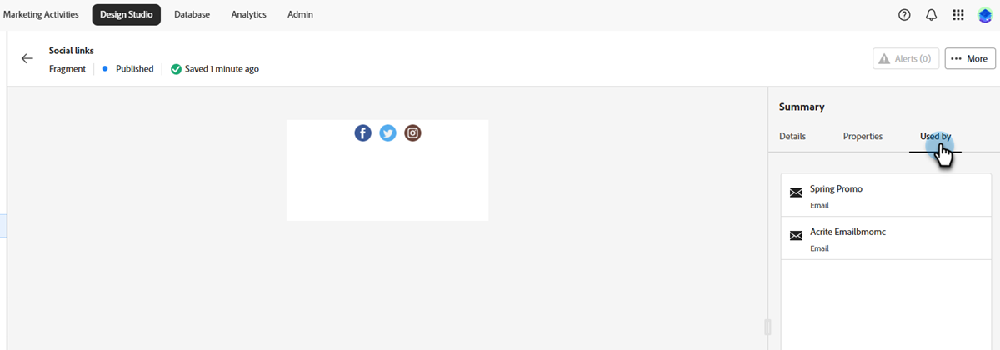
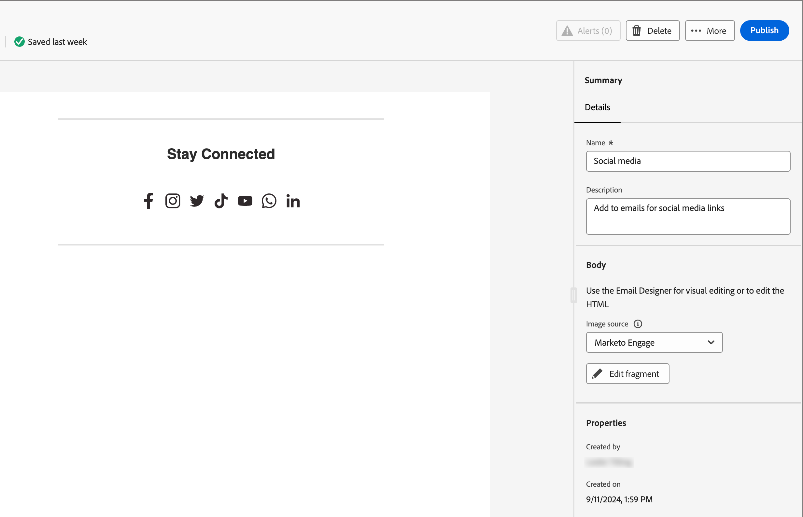

# Fragmenten

Een fragment is een herbruikbare component waarnaar in een of meer e-mailsjablonen kan worden verwezen. Het is doorgaans een blok inhoud (tekst, afbeelding of beide) dat snel in uw project kan worden ingevoegd. Met deze functionaliteit kunt u meerdere aangepaste inhoudsblokken vooraf samenstellen om e-mailinhoud samen te stellen voor een verbeterd ontwerpproces. Veelvoorkomende gebruiksgevallen zijn inhoudsblokken voor kop- en voetteksten voor e-mail, uitnodigingsbanners voor gebeurtenissen, seizoensgebonden berichten en meer.

U kunt zo veel mogelijk gebruikmaken van fragmenten in uw workflows:

* _creeer fragmenten_ - creeer visuele fragmenten, of van kras of door inhoud als fragment van de visuele inhoudsredacteur op te slaan.
* _hergebruik fragmenten_ - gebruik hen zo vele tijden zoals nodig in uw inhoud.

## Visuele fragmenten {#visual-fragments}

Visuele fragmenten zijn vooraf gedefinieerde visuele blokken die zijn gemaakt (met de visuele inhoudeditor) en die u kunt hergebruiken in meerdere e-mails of e-mailsjablonen.

## Fragmenten openen en beheren {#access-and-manage-fragments}

Om tot visuele fragmenten toegang te hebben, ga naar de **Studio van het Ontwerp** in Marketo Engage. Klik in de boomstructuur links op **[!UICONTROL Fragments (New)]** .

{width="600" zoomable="yes"}

Standaard wordt de tabel gesorteerd op de kolom _[!UICONTROL Modified]_. Klik op andere kolomtitels om te wijzigen waarop de tabel wordt gesorteerd. Klik nogmaals op dezelfde titel om te schakelen tussen oplopend en aflopend.

### Zoeken en filteren

Gebruik de zoekbalk om een fragment op naam te zoeken. Klik het _pictogram van de Filter_ ( ) om de beschikbare filteropties te tonen en de gewenste montages te kiezen.

{width="700" zoomable="yes"}

### De kolommen aanpassen {#customize-the-column-display}

Pas de kolommen aan u in de lijst wilt tonen door _te klikken aanpassen lijst_ pictogram ( ) bij het hoogste recht.

Selecteer de gewenste kolommen en klik op **[!UICONTROL Apply]** .

{width="400" zoomable="yes"}

### Fragmentstatus {#fragment-status}

De fragmentstatus bepaalt de beschikbaarheid voor gebruik in een e-mailsjabloon of e-mailsjabloon en de wijzigingen die u daarin kunt aanbrengen.

<table>
<tbody>
  <tr>
    <td width="25%"><b>Concept</b></td>
    <td width="75%">Wanneer u een fragment maakt, bevindt het zich in de conceptstatus. Het blijft een concept totdat u het publiceert voor gebruik in een e-mail- of e-mailsjabloon.
    
Beschikbare acties:
    <li>Alle details bewerken</li>
    <li>Bewerken in visuele ontwerper</li>
    <li>Publiceren</li>
    <li>Dupliceren</li>
    <li>Verwijderen</li>
  </td>
  <tr>
    <td><b>Gepubliceerd</b></td>
    <td>Wanneer u een fragment publiceert, wordt dit beschikbaar voor gebruik in een e-mail- of e-mailsjabloon. Gepubliceerde fragmentinhoud kan niet worden gewijzigd in de visuele ontwerper.
    
Beschikbare acties:
    <li>Beschrijving bewerken</li>
    <li>Toevoegen aan een e-mail of sjabloon</li>
    <li>Conceptversie maken</li>
    <li>Dupliceren</li>
    <li>Verwijderen (indien niet in gebruik)</li>
    </td>
  </tr>
  <tr>
    <td style="width:25%"><b>Gepubliceerd met concept</b></td>
    <td style="width:75%">Wanneer u een concept maakt op basis van een gepubliceerd fragment, blijft de gepubliceerde versie beschikbaar voor gebruik in een e-mail- of e-mailsjabloon en kan de conceptinhoud worden gewijzigd in de visuele ontwerper. Als u de ontwerp versie publiceert, vervangt het de huidige gepubliceerde versie en de inhoud wordt bijgewerkt in <i> alle </i> e-mails en e-mailmalplaatjes waar het in gebruik is. 
    
Beschikbare acties:
    <li>Beschrijving bewerken</li>
    <li>Toevoegen aan een e-mail of sjabloon</li>
    <li>Conceptenversie bewerken in visuele ontwerper</li>
    <li>Conceptversie publiceren</li>
    <li>Dupliceren</li>
    <li>Verwijderen (indien niet in gebruik)</li>
    </td>
  </tr>
</tbody>
</table>

## Fragmenten maken {#create-fragments}

1. Als u een nieuw visueel fragment wilt maken, klikt u op **[!UICONTROL Create fragment]** rechtsboven op de pagina in de lijst met fragmenten.

   {width="700" zoomable="yes"}

1. Geef het fragment een **[!UICONTROL Name]** en een optioneel **[!UICONTROL Description]** .

   _de vereisten van het Fragment_

   * Naam: max. 100 tekens, moet uniek zijn en niet hoofdlettergevoelig
   * Omschrijving: maximaal 300 tekens
   * Tekens: alfa, numerieke en speciale tekens zijn oké
   * Gereserveerde karakters zijn **_niet toegestaan_**: `\ / : * ? " < > |`

   {width="400" zoomable="yes"}

1. Klik op **[!UICONTROL Create]**.

   {width="400" zoomable="yes"}

   >[!NOTE]
   >
   >Het Type van fragment **** kan niet op dit ogenblik worden gewijzigd.

   De visuele ontwerper wordt geopend met een leeg canvas.

1. Gebruik de [ hulpmiddelen van het inhoudsontwerp ](/help/marketo/product-docs/email-marketing/email-designer/email-authoring.md#add-structure-and-content){target="_blank"} om de visuele fragmentinhoud tot stand te brengen.

1. Klik op **[!UICONTROL Save]** om het conceptfragment op te slaan.

1. Als u het fragment beschikbaar wilt maken voor gebruik in een e-mailsjabloon of e-mailsjabloon, klikt u op **[!UICONTROL Publish]** .

## Fragmentdetails weergeven {#view-fragment-details}

Klik op de naam van een fragment in de lijstpagina om de pagina met fragmentdetails te openen. U kunt het fragment bewerken, de naam ervan wijzigen of de beschrijving van het fragment bijwerken. Breng updates aan en klik buiten het naam- of beschrijvingsveld om uw wijzigingen op te slaan.

>[!NOTE]
>
>Als een gepubliceerd fragment wordt gebruikt door een e-mailsjabloon, kunt u de naam van het fragment niet wijzigen of de inhoud ervan bewerken. U kunt een conceptversie maken als u wijzigingen in het fragment wilt aanbrengen.

{width="600" zoomable="yes"}

Klik op **[!UICONTROL Edit fragment]** om het fragment te openen in de visuele inhoudeditor.

Ga de mening op elk ogenblik weg door de _Achter_ pijl bij de hoogste linkerzijde te klikken, die u aan de _pagina van de de 3} lijst van Fragmenten {terugkeert._

## Fragment weergeven dat wordt gebruikt door verwijzingen {#view-fragment-used-by-references}

Klik op de pagina met fragmentdetails op het tabblad **[!UICONTROL Used By]** om details weer te geven over de plaats waar het fragment wordt gebruikt in Marketo Engage.

>[!IMPORTANT]
>
>Een fragment dat momenteel wordt gebruikt door een e-mailsjabloon of e-mailsjabloon kan niet worden verwijderd.

{width="600" zoomable="yes"}

Klik op de koppeling om de bijbehorende sjabloon voor e-mail of e-mail te openen waarin het fragment wordt gebruikt.

## Fragmenten verwijderen {#delete-fragments}

Omdat een fragment dat momenteel in gebruik door een e-mail of e-mailmalplaatje is niet kan worden geschrapt, ben zeker om _te controleren gebruikt-door_ verwijzingen alvorens een fragmentverwijdering in werking te stellen. Een verwijdering kan ook niet ongedaan worden gemaakt. Controleer dit voordat u een verwijderactie start.

U kunt een fragment op een van de volgende manieren verwijderen:

* Klik op **[!UICONTROL Delete]** in de fragmentdetails aan de rechterkant.
* Klik op de aanbiedingspagina van _[!UICONTROL Fragments]_op de ovaal naast het fragment en kies **[!UICONTROL Delete]**.

Met deze handeling wordt een bevestigingsvenster geopend. U kunt het proces afbreken door op **[!UICONTROL Cancel]** te klikken of op **[!UICONTROL Delete]** te klikken om het verwijderen te bevestigen.

{width="400"}

## Fragmenten bewerken {#edit-fragments}

Bewerkingen aan een fragment zijn afhankelijk van de huidige status:

* Wanneer een fragment in _de status van het Ontwerp_ is, kunt u om het even welk van zijn details en de visuele inhoud uitgeven.
* Wanneer een fragment in _Gepubliceerde_ status is, kunt u de fragmentbeschrijving uitgeven, maar niet de naam. U kunt de visuele inhoud niet bewerken.
* Wanneer een fragment in _met ontwerp_ status wordt gepubliceerd, is het uitgeven van de details beperkt tot de beschrijving. U kunt ook de visuele inhoud van de conceptversie bewerken.

>[!BEGINTABS]

>[!TAB  Ontwerp ]

1. Klik op de aanbiedingspagina van _[!UICONTROL Fragments]_op de fragmentnaam om deze te openen.

   Er wordt een voorvertoning van de visuele inhoud weergegeven, met de fragmentdetails aan de rechterkant.

1. Breng de gewenste wijzigingen aan.

   {width="600" zoomable="yes"}

1. Als u de inhoud in de visuele ontwerper wilt wijzigen, klikt u op **[!UICONTROL Edit fragment]** . Klik **sparen** wanneer gedaan.

1. Klik op **[!UICONTROL Save]** of **[!UICONTROL Save & close]** om terug te keren naar de fragmentdetails.

1. Als u het fragment beschikbaar wilt maken voor gebruik in een e-mailsjabloon of e-mailsjabloon, klikt u op **[!UICONTROL Publish]** .

>[!TAB  Gepubliceerd ]

1. Klik op de aanbiedingspagina van _[!UICONTROL Fragments]_op de fragmentnaam om deze te openen.

   Er wordt een voorvertoning van de visuele inhoud weergegeven, met de fragmentdetails aan de rechterkant.

1. Wijzig, indien nodig, de beschrijving.

   Voor een gepubliceerd fragment kunnen niet alle andere details worden gewijzigd.

1. Als u de inhoud wilt bijwerken, klikt u op **[!UICONTROL Create draft version]** rechtsboven.

   Klik op **[!UICONTROL OK]** in het dialoogvenster om de conceptversie te openen in de visuele ontwerper. U kunt de `image source` KG - KOPPELING HIER desgewenst wijzigen.

   {width="300"}

1. Klik op **[!UICONTROL Save]** of **[!UICONTROL Save & close]** om terug te keren naar de fragmentdetails.

1. Als u het fragment beschikbaar wilt maken voor gebruik in een e-mailsjabloon of e-mailsjabloon, klikt u op **[!UICONTROL Publish]** .

>[!NOTE]
>
>Wanneer u de conceptversie publiceert, vervangt deze de huidige gepubliceerde versie en wordt de inhoud bijgewerkt in de e-mails en e-mailsjablonen waar deze al in gebruik is.

>[!TAB  Gepubliceerd met ontwerp ]

U kunt de conceptversie op twee manieren openen om te bewerken op de pagina met _[!UICONTROL Fragments]_-aanbiedingen:

* Klik het _Meer_ pictogram (**..**) naast de fragmentnaam en kies **[!UICONTROL Open draft version]**.

  {width="300"}

* Klik op de fragmentnaam om deze te openen. Klik vervolgens rechtsboven op **[!UICONTROL Open draft version]** .

Er wordt een voorbeeld van de visuele inhoud voor de conceptversie weergegeven, met de fragmentdetails aan de rechterkant.

De inhoud bijwerken:

1. Klik op **[!UICONTROL Edit fragment]** rechtsboven. Klik **sparen** wanneer gedaan.

1. Klik op **[!UICONTROL Save]** of **[!UICONTROL Save & close]** om terug te keren naar de fragmentdetails.

1. Als u het fragment beschikbaar wilt maken voor gebruik in een e-mailsjabloon of e-mailsjabloon, klikt u op **[!UICONTROL Publish]** .

>[!NOTE]
>
>Wanneer u de conceptversie publiceert, vervangt deze de huidige gepubliceerde versie en wordt de inhoud bijgewerkt in de e-mails en e-mailsjablonen waar deze al in gebruik is.

>[!ENDTABS]

## Fragmenten dupliceren {#duplicate-fragments}

U kunt een fragment op een van de volgende manieren dupliceren:

* Van de _[!UICONTROL Fragments]_lijstpagina, klik het_ Meer _pictogram (**...**) naast de fragmentnaam en kies **[!UICONTROL Duplicate]**.
* Klik rechtsboven op de pagina met fragmentdetails op **[!UICONTROL ... More]** en kies **[!UICONTROL Duplicate]** .

{width="600" zoomable="yes"}

Voer in het dialoogvenster een unieke naam en een optionele beschrijving in. Klik op **[!UICONTROL Duplicate]**.

{width="400"} in

Het gedupliceerde fragment verschijnt dan in de _lijst van Fragmenten_.

## Een nieuw fragment opslaan vanuit e-mail- of sjablooninhoud {#save-a-new-fragment-from-email-or-template-content}

Wanneer u een e-mail- of e-mailsjabloon maakt/bewerkt in de visuele inhoudeditor, kunt u de inhoud geheel of gedeeltelijk opslaan als een fragment voor hergebruik.

1. Als u inhoud als een fragment wilt opslaan, klikt u op **[!UICONTROL More]** en kiest u **[!UICONTROL Save as Fragment]** .

1. Selecteer de verschillende elementen die u in het fragment wilt opnemen.

   Selecteer meerdere structuren door de knop Shift of Control ingedrukt te houden.

   U kunt alleen structuren selecteren die aan elkaar grenzen.

1. Selecteer de inhoud en klik op **[!UICONTROL Create]** rechtsboven.

1. Voer in het dialoogvenster een naam en optionele beschrijving voor het fragment in en klik op **[!UICONTROL Create]** .

Het fragment wordt dan getoond in de _Fragmenten_ het vermelden pagina en is beschikbaar voor gebruik binnen e-mail en e-mailmalplaatjes.

## Visuele fragmenten toevoegen aan uw e-mail- of sjablooninhoud {#add-visual-fragments-to-your-email-or-template-content}

Fragmenten zijn ontworpen voor hergebruik. U kunt maximaal 30 euro toevoegen aan een e-mailsjabloon of een e-mailsjabloon. Deze sjabloon kan maar één niveau bevatten.

* [Een fragment toevoegen aan een e-mailbericht](/help/marketo/product-docs/email-marketing/email-designer/email-authoring.md#add-fragments)

* [Een fragment toevoegen aan een e-mailsjabloon](/help/marketo/product-docs/email-marketing/email-designer/email-template-authoring.md#add-fragments)

De inhoud van het fragment wordt dynamisch bijgewerkt binnen de structuur om een visuele weergave te geven van hoe de inhoud in de e-mail wordt weergegeven.

>[!TIP]
>
>Als u wilt dat het fragment de volledige horizontale lay-out binnen de e-mail in beslag neemt, voegt u een [!UICONTROL 1:1 column] -structuur toe en sleept u het fragment er vervolgens in.

Nadat de sjabloon voor e-mail/e-mail is opgeslagen, wordt deze weergegeven op de pagina met fragmentdetails wanneer het tabblad _[!UICONTROL Used By]_is geselecteerd. Toegevoegde fragmenten kunnen niet worden bewerkt in de e-mail of de sjabloon. Het gepubliceerde bronfragment definieert de inhoud.

## Fragmentacties tijdens het ontwerpen van e-mail- en sjablonen {#fragment-actions-during-email-and-template-authoring}

Als een fragment aan een e-mailsjabloon of e-mailsjabloon wordt toegevoegd, kan de inhoud ervan niet worden bewerkt in de e-mail of sjabloon. U kunt echter de volgende handelingen toepassen:

* **[!UICONTROL Delete]** - Hiermee verwijdert u het fragment uit de huidige e-mail- of e-mailsjablooninhoud (de fragmentbron blijft ongewijzigd).
* **[!UICONTROL Refresh]** - Hiermee vernieuwt u de inhoud van het fragment in de huidige e-mail- of e-mailsjabloon. Vernieuwen is handig als u recente bewerkingen aan het fragment wilt spiegelen nadat u het fragment hebt toegevoegd aan de e-mailsjabloon of de e-mailsjabloon.
* **[!UICONTROL Duplicate]** - Hiermee dupliceert u het fragment in dezelfde e-mail- of e-mailsjabloon in de editor. Het gedupliceerde fragment wordt net onder het origineel toegevoegd.
* **[!UICONTROL Open Fragment]** - Hiermee wordt een nieuw browsertabblad geopend met de pagina voor de fragmenteditor en details.
* **[!UICONTROL Break inheritance]** - Hierdoor wordt de overerving van het fragment (en de wijzigingen ervan) van de bron verbroken. Gebruik deze handeling om de fragmentinhoud beschikbaar te maken als onafhankelijke en bewerkbare inhoud binnen de e-mail- of e-mailsjabloon. Deze actie verwijdert ook het e-mail of e-mailmalplaatje uit _Gebruikt door_ verwijzing voor het originele fragment.

Wanneer u het fragment op de editorpagina selecteert, zijn deze acties beschikbaar bij de contexttoolbar en het eigenschappenpaneel op het recht.

{width="600" zoomable="yes"} toe
