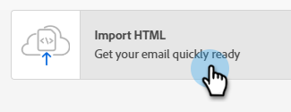

# GenStudio-integratie voor Marketo Engage {#genstudio-integration-for-marketo-engage}

Adobe GenStudio for Performance Marketing is een generatieve AI-First-toepassing waarmee u uw eigen advertenties en e-mails kunt maken om onhandige, gepersonaliseerde marketingcampagnes te voeren die aan uw merkstandaarden voldoen en aan uw bedrijfsbeleid voldoen. Het biedt een groot aantal gereedschappen die de complexiteit van het maken van inhoud vereenvoudigen.

>[!AVAILABILITY]
>
>Voor het benutten van deze functie:
>
>* Uw IMS org moet zijn ingericht met GenStudio for Performance Marketing op dezelfde IMS org als Marketo Engage (neem voor meer informatie contact op met uw accountmanager)
>* U moet een gebruikersrecht op GenStudio for Performance Marketing hebben (Systeembeheer, Editor of productprofiel voor medewerkers)

>[!INFO]
>
>Leer meer over [ GenStudio for Performance Marketing ](https://experienceleague.adobe.com/nl/docs/genstudio-for-performance-marketing/user-guide/home){target="_blank"}.

## GenStudio Capabilities in Marketo Engage benutten {#leverage-genstudio-capabilities}

Met deze integratie kan een technische markator die Marketo Engage gebruikt om e-mailcampagnes te ontwikkelen en automatiseren, samenwerken met een prestatiemarkering die inhoud maakt met GenStudio. Hierdoor kunnen ze on-brand-inhoud van GenStudio eenvoudig integreren in Marketo Engage.

## Een HTML-sjabloon exporteren van Marketo Engage naar GenStudio {#export-an-html-template}

Exporteer eenvoudig een sjabloon met de richtlijnen van je merk naar GenStudio for Performance Marketing.

1. Open in Marketo Engage de inhoud van je e-mail.

1. In E-mail Designer, klik **Meer** knoop en selecteer **de Uitvoer HTML**.

   

1. [ upload het HTML ](https://experienceleague.adobe.com/nl/docs/genstudio-for-performance-marketing/user-guide/content/templates/use-templates#templates-from-ajo-and-marketo){target="_blank"} uitgevoerde malplaatje in GenStudio for Performance Marketing.

1. In GenStudio, gebruik dit malplaatje om [ verscheidene e-mailvariaties ](https://experienceleague.adobe.com/nl/docs/genstudio-for-performance-marketing/user-guide/create/create-email-experience){target="_blank"} met AI herinneringen tot stand te brengen en hen te bewaren.

## GenStudio-ervaringen in Marketo Engage benutten {#leverage-genstudio-experiences}

Voer de onderstaande stappen uit om gebruik te maken van de GenStudio-e-mailvariaties die u hebt gemaakt door deze te importeren in Marketo Engage.

1. In Marketo Engage, [ creeer een e-mail ](/help/marketo/product-docs/email-marketing/email-designer/email-authoring.md#create-an-email).

1. In de E-mail detailpagina, klik **e-mailinhoud** uitgeven.

    uit

1. Selecteer **de Invoer HTML**.

   

1. Klik de **knoop van Adobe GenStudio for Performance Marketing**.

   

1. Blader naar de ervaringen van GenStudio om uw inhoud te gaan samenstellen. U kunt de ervaringen filteren op criteria als producten, personen, merken of zelfs kleuren.

1. Selecteer een ervaring en klik **Gebruik**.

   {width="800" zoomable="yes"}

1. De geselecteerde inhoud wordt weergegeven in de e-mailtoepassing van de Designer.

   {width="800" zoomable="yes"}

>[!NOTE]
>
>GenStudio-ervaringen die zijn gemaakt op basis van een Marketo Engage-sjabloon worden rechtstreeks geïmporteerd in de e-mail-Designer. GenStudio-ervaringen die zijn gemaakt zonder een Marketo Engage-sjabloon, worden geïmporteerd in de compatibiliteitsmodus.

Gebruik de [ e-mailinhoud het uitgeven hulpmiddelen ](/help/marketo/product-docs/email-marketing/email-designer/email-authoring.md#add-structure-and-content){target="_blank"} en [ verpersoonlijkingsgebieden ](/help/marketo/product-docs/email-marketing/email-designer/email-authoring.md#personalize-content){target="_blank"} om uw e-mail zoals gewenst uit te geven.
