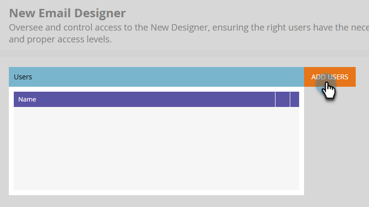

# Overzicht {#overview}

Welkom bij de nieuwe Adobe Marketo Engage Email Designer.

De e-mailontwerper is de nieuwste innovatie in Marketo Engage die een vernieuwde ervaring moet bieden voor het maken van e-mailsjablonen en e-mailsjablonen om de productiviteit en efficiëntie te verbeteren door een visuele drag-and-drop editor en standaardsjablonen voor &#39;out-of-the-box&#39; te bieden. Maak eenvoudig aangepaste e-mailsjablonen zonder geld te hoeven besteden aan leveranciers.

E-mails die in de nieuwe ontwerper zijn gemaakt, kunnen worden gebruikt in e-mailprogramma&#39;s en in slimme lijsten/campagnes. De krachtige nieuwe verbeteringen aan de ontwerper komen binnenkort.

## Toegang krijgen {#how-to-access}

+++Leer hoe u toegang krijgt tot de e-mailontwerper

Om tot de nieuwe e-mailontwerper toegang te hebben, moet uw Marketo Engage abonnement aan het [ Systeem van Identity Management van Adobe (IMS) ](https://experienceleague.adobe.com/en/docs/marketo/using/product-docs/administration/marketo-with-adobe-identity/adobe-identity-management-overview) worden gemigreerd. Als u nog niet bent geweest en u zou willen verzoeken om het wordt bespoedigd, gelieve het Team van de Rekening van Adobe (uw rekeningsmanager), of [ de Steun van Marketo ](https://nation.marketo.com/t5/support/ct-p/Support) te contacteren.

### Gebruikers toevoegen {#add-users}

1. Ga in Marketo Engage naar het **[!UICONTROL Admin]** -gebied en selecteer **[!UICONTROL New Email Designer]** .

   {width="600" zoomable="yes"}

1. Klik op **[!UICONTROL Add Users]**.

   {width="600" zoomable="yes"} toe

1. Selecteer de gewenste gebruikers in de vervolgkeuzelijst **[!UICONTROL Add New Values]** . Klik op **[!UICONTROL OK]** als u klaar bent.

   {width="600" zoomable="yes"}

+++

## Beschikbare artikelen {#available-articles}

* [ E-mail authoring ](/help/marketo/product-docs/email-marketing/email-designer/email-authoring.md){target="_blank"}: Leer hoe te om, een e-mail in de nieuwe redacteur tot stand te brengen te ontwerpen en van verwijzingen te voorzien.

* [ malplaatje het auteursrecht van de E-mail ](/help/marketo/product-docs/email-marketing/email-designer/email-template-authoring.md){target="_blank"}: Leer hoe te om, tot een e-mailmalplaatje in de nieuwe redacteur te leiden te ontwerpen en toegang te hebben.

* [ Fragments ](/help/marketo/product-docs/email-marketing/email-designer/fragments.md){target="_blank"}: Leer om visuele inhoudsfragmenten als herbruikbare componenten voor e-mail en e-mailmalplaatjes tot stand te brengen en te gebruiken.

* [ Werk met de activa van AEM ](/help/marketo/product-docs/email-marketing/email-designer/aem-assets.md){target="_blank"}: Leer hoe te om tot uw digitale activa van AEM voor gebruik in Marketo Engage gemakkelijk toegang te hebben.

* [ geeft Beelden met Adobe Express ](/help/marketo/product-docs/email-marketing/email-designer/edit-images-adobe-express.md){target="_blank"} uit: Leer hoe te om beelden in de E-mailredacteur van Adobe Marketo Engage uit te geven gebruikend Adobe Express.

* [ Gebruik de Medewerker AI ](/help/marketo/product-docs/email-marketing/email-designer/ai-assistant.md){target="_blank"}: De generatieve AI technologie van Adobe van de hefboomwerking om nuttige tekst en/of beelden aan uw e-mails toe te voegen.

* [ de inhoud van het Slot in e-mailmalplaatjes ](/help/marketo/product-docs/email-marketing/email-designer/content-locking.md){target="_blank"}: Leer hoe te om inhoud in e-mailmalplaatjes te sluiten, die helpen onopzettelijke uitgeeft of schrappingen verhinderen.

## Veelgestelde vragen {#faq}

**zal de oude e-mailredacteur blijven functioneren? Zo ja, voor hoe lang?**

Ja, de oude (klassieke) e-maileditor zal naast de nieuwe e-mailontwerper bestaan. E-mails die in de klassieke editor zijn gemaakt, blijven behouden. Er is geen datum waarop de klassieke redacteur op dit ogenblik zal worden afgekeurd, maar het zal door 2025 blijven functioneren.

**zullen onze bestaande e-mailmalplaatjes in de nieuwe ontwerper werken? Als niet, moeten wij malplaatjes creëren gebruikend de nieuwe ontwerper zodat beantwoorden alle secties/modules aan hoe wij onze inhoud willen kijken?**

Nee, er kan niet worden verwezen naar e-mailsjablonen van de klassieke editor in de nieuwe ontwerper. U zult nieuwe malplaatjes in de nieuwe ontwerper moeten creëren. Nochtans, kunt u _malplaatje HTML in de nieuwe ontwerper invoeren, dan noodzakelijke tweaks maken._ We werken ook aan een manier om sjablonen eenvoudig te migreren van de klassieke editor naar de nieuwe ontwerper.

**is er een manier om branding (doopvonten, logo&#39;s, en kleuren) af te dwingen?**

De sectie met vergrendelde inhoud maakt deel uit van de nieuwe ontwerper. De vergrendeling van stijlen, kleuren, enzovoort, zal later dit jaar plaatsvinden.

**zal het maken modules voor malplaatjes klantentabeler en scalable zijn?**

Ja, absoluut, beter aanpasbaar met onze WYSIWYG-editor (what-you-see-is-what-you-get).

**hoe werkt het proces van de e-mailmalplaatjeverwezenlijking in de nieuwe ontwerper? Is het WYSIWYG, of vereist het HTML kennis?**

Het is WYSIWYG; HTML-kennis is niet nodig. U kunt gemakkelijk
sjablonen in de ontwerper, waardoor de behoefte aan externe webontwikkelaars afneemt. U kunt echter nog steeds CSS bijwerken en afzonderlijke secties bewerken via HTML. We werken ook aan een manier om sjablonen eenvoudig te migreren van de klassieke editor naar de nieuwe ontwerper.

**steunt de nieuwe e-mailontwerper de taal van AMP?**

Op dit moment is AMP niet ondersteund.

**de dynamische inhoud door attribuut is groot, maar werkt de dynamische inhoud door segment nog?**

Momenteel, steunt de nieuwe ontwerper slechts attributen, maar wij werken aan het krijgen van segmenten toegevoegd in een toekomstige versie.

**Hoe kan ik vertellen of is ons Marketo Engage abonnement gemigreerd aan IMS (Adobe Admin Console)?**

Als u login aan Marketo Engage via [ Adobe Experience Cloud ](https://experiencecloud.adobe.com/) {target="_blank"}, uw abonnement is gemigreerd.
