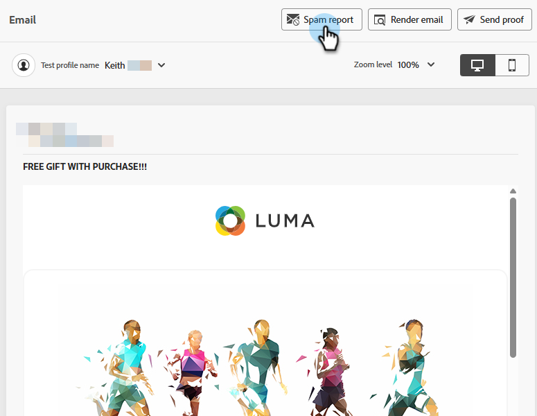

# E-mailspamrapport {#email-spam-report}

Gebruikend SpamAssassin in Marketo Engage, kunt u uw e-mailinhoud testen en de waarschijnlijkheid zien van ISPs/de leveranciers van de Brievenbus die het als spam merken.

SpamAssassin analyseert uw inhoud en wijst een score toe die op diverse criteria wordt gebaseerd. Hoe lager de score, hoe beter. Het is belangrijk om een lage score te behouden, omdat het verzenden van e-mails met een hoge score een negatief effect kan hebben op de algehele prestaties.

## Heb toegang tot het spamrapport {#access-the-spam-report}

1. In uw e-mail, klik **Simuleer Inhoud**.

   {width="600" zoomable="yes"}

   >[!NOTE]
   >
   >Als u nog geen testprofiel hebt toegevoegd, moet u dat meteen na Stap 1 doen.

1. Klik het **Spam- rapport** knoop.

   

1. Er wordt een spamrapport gegenereerd.

   {width="600" zoomable="yes"}

1. Controleer de scores en beschrijvingen voor elk item.

   >[!IMPORTANT]
   >
   >Als de totale score hoger is dan 5, kan uw e-mail door de ontvanger worden geblokkeerd, of als spam bij levering worden gemerkt.

1. Als u de score als te hoog beschouwt, geef uw inhoud in E-mail Designer uit die op de bevindingen van het rapport wordt gebaseerd en stel dan het **Spam- rapport** opnieuw in werking.

   {width="800" zoomable="yes"}

Wanneer de score naar je smaak is, kan deze worden verzonden.

{width="800" zoomable="yes"}

>[!NOTE]
>
>De score van spam wordt afgeleid via SpamAssassin, en **de regels zijn niet bezeten door Adobe**. Meer details over deze regels kunnen in de [&#x200B; documentatie SpamAssassin &#x200B;](https://spamassassin.apache.org/#_blank){target="_blank"} worden gevonden. Een volledige lijst van fouten [&#x200B; kan hier &#x200B;](https://spamassassin.apache.org/old/tests_3_0_x.html){target="_blank"} worden gezien.
