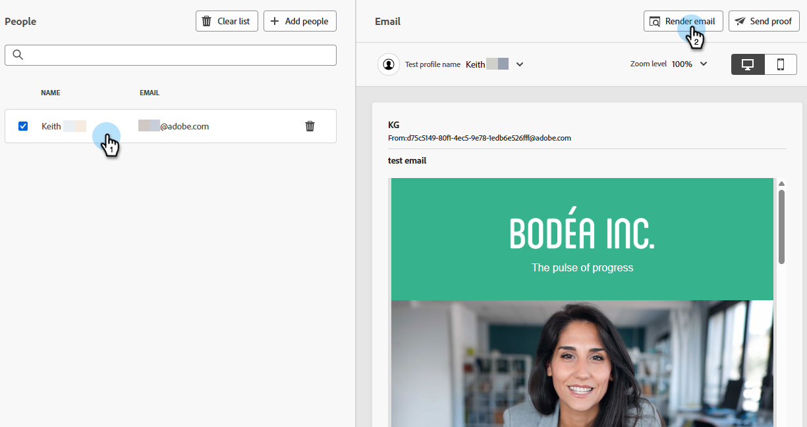
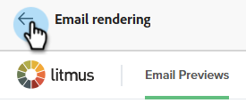

# E-mailrendering testen met Litmus {#test-email-rendering-with-litmus}

Hefboomwerking uw [ Litmus ](https://www.litmus.com/email-testing) rekening in Marketo Engage om onmiddellijk te zien hoe uw e-mail in populaire e-mailcliënten teruggeeft.

>[!AVAILABILITY]
>
>Deze eigenschap is beschikbaar aan alle gebruikers van Marketo Engage die een actieve [ rekening van de Onderneming van 0} Litmus {hebben.](https://www.litmus.com/enterprise){target="_blank"}

## Hoe wordt het gebruikt {#how-to-use}

1. Op _geef e-mailinhoud_ scherm uit, klik de **Simuleer Inhoud** knoop.

   

1. Selecteer uw testende ontvanger en klik **teruggeven e-mail** knoop.

   {width="800" zoomable="yes"}

1. Als u niet reeds hebt, **verbind uw rekening van de Samenvatting**. Als u dit reeds hebt gedaan, sla aan Stap 6 over.

   {width="800" zoomable="yes"}

1. Ga uw geloofsbrieven van de Straal in en klik **binnen Teken**.

   >[!IMPORTANT]
   >
   >Wanneer u uw Litmus-account aansluit op Marketo Engage, gaat u ermee akkoord dat teste-mails naar Litmus worden verzonden. Na verzending worden deze teste-mails niet meer door Adobe beheerd. Het beleid voor het bewaren van gegevens in de vorm van een Litmus-e-mail is daarom van toepassing op deze e-mails, inclusief personalisatiegegevens die daarin kunnen worden opgenomen.

1. Klik **verbinden** om de integratie te voltooien.

   

1. Klik de **test van de Looppas** knoop om e-mailvoorproeven te produceren.

1. Bekijk hoe uw inhoud eruit ziet in populaire e-mailclients voor desktops, mobiele apparaten en het web. Klik zoveel miniaturen als u wilt voorvertonen.

   {width="800" zoomable="yes"}

   >[!NOTE]
   >
   >Leer hoe te [ uw standaard e-mailcliëntlijst ](https://help.litmus.com/article/227-change-your-default-email-clients-list) aanpassen.

1. Wanneer u klaar het testen bent, klik de achterste pijl op upper-left om aan het _Simulate Inhoud_ scherm terug te keren.

   

**OPTIONELE STAP**: Als u besluit om veranderingen in uw e-mail aan te brengen, nadat u **E-mail** teruggeeft om hen te bekijken, ben zeker om **** knoop op het hoger-recht van het 6} E-mailPreviews _scherm van de Previews {te klikken._

