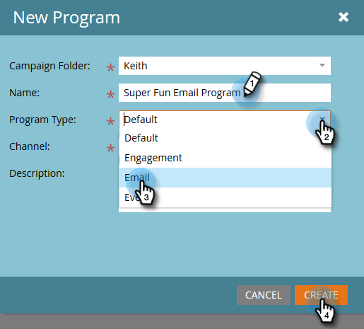

# Een e-mailprogramma maken {#create-an-email-program}

Met e-mailprogramma&#39;s kunt u snel en eenvoudig een e-mailbericht naar een groep mensen verzenden.

1. Ga naar **[!UICONTROL Marketing Activities]** .

   

1. Selecteer de map waarin u het programma wilt maken, klik op de vervolgkeuzelijst **[!UICONTROL New]** en selecteer **[!UICONTROL New Program]** .

   

1. Voer een naam in, selecteer **[!UICONTROL Email]** als [!UICONTROL Program Type] en klik op **[!UICONTROL Create]** .

   

   >[!NOTE]
   >
   >Wanneer u **[!UICONTROL Email]** selecteert als programmeertype, wordt het kanaal automatisch ingesteld op **[!UICONTROL Email Send]** . U kunt deze desgewenst wijzigen.

   

Mooi! Het programma staat nu in de boom en is klaar om te worden gebruikt. De volgende stap is het definiëren van uw publiek. Zie de verwante artikelen van Marketo hieronder.

>[!MORELIKETHIS]
>
>* [ bepaal een Publiek met een Slimme Lijst ](/help/marketo/product-docs/email-marketing/email-programs/managing-people-in-email-programs/define-an-audience-with-a-smart-list.md)
>* [ bepaal een Publiek door een Lijst ](/help/marketo/product-docs/email-marketing/email-programs/managing-people-in-email-programs/define-an-audience-by-importing-a-list.md) in te voeren
