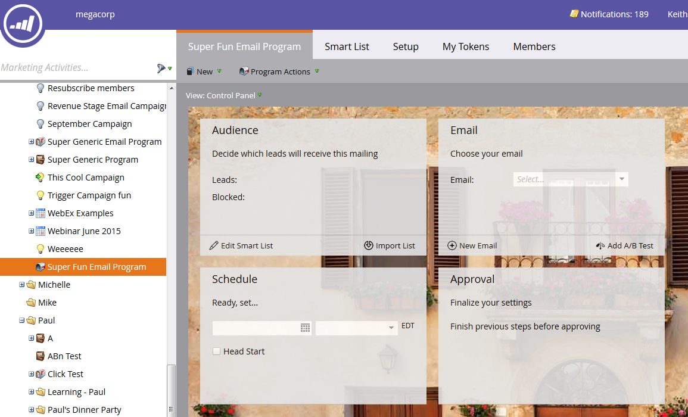

# Een e-mailprogramma maken {#create-an-email-program}

Met e-mailprogramma&#39;s kunt u snel en eenvoudig een e-mailbericht naar een groep mensen verzenden.

1. Ga naar **Marketingactiviteiten**.

   

1. Selecteer de map waarin u het programma wilt maken, klik op de knop **Nieuw** en selecteert u **Nieuw programma**.

   

1. Geef een naam op en selecteer **E-mail** als het Type Programma, en klik **Maken**.

   

   >[!NOTE]
   >
   >Als u **E-mail** Als Type Programma, zal het Kanaal automatisch plaatsen aan **E-mail verzenden**. U kunt deze desgewenst wijzigen.

   

Mooi! Het programma staat nu in de boom en is klaar om te worden gebruikt. De volgende stap is het definiëren van uw publiek. Zie de verwante artikelen van Marketo hieronder.

>[!MORELIKETHIS]
>
>* [Een publiek definiëren met een slimme lijst](/help/marketo/product-docs/email-marketing/email-programs/managing-people-in-email-programs/define-an-audience-with-a-smart-list.md)
>* [Een publiek definiëren door een lijst te importeren](/help/marketo/product-docs/email-marketing/email-programs/managing-people-in-email-programs/define-an-audience-by-importing-a-list.md)

