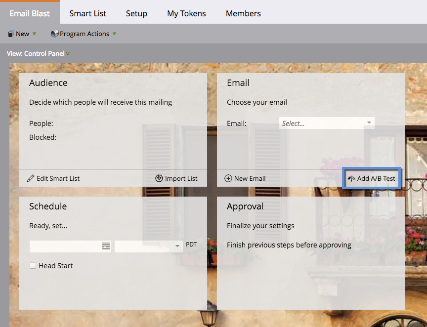

# E-mailprogramma&#39;s {#understanding-email-programs}

Verzend e-mails, maak A/B-tests en volg uw resultaten allemaal op één locatie.

## Deelvenster Beheer {#control-panel}

Vier vakken zorgen ervoor dat je gefocust blijft. **Publiek** definieert de &quot;who&quot; **E-mail** biedt de &quot;wat&quot;, **Schema** definieert &quot;when&quot;, en **Goedkeuring** maakt het klaar om te gaan.

## A/B-tests {#a-b-testing}

Met A/B-tests kunt u aantonen welke e-mail het beste is.

Meer informatie over de volgende A/B-tests:

* [Testen van &quot;onderwerpregel&quot; A/B](/help/marketo/product-docs/email-marketing/email-programs/email-program-actions/email-test-a-b-test/use-subject-line-a-b-testing.md)
* [A/B testen van het &quot;hele e-mailadres&quot;](/help/marketo/product-docs/email-marketing/email-programs/email-program-actions/email-test-a-b-test/use-whole-email-a-b-testing.md)
* [&quot;Van adres&quot; A/B testen](/help/marketo/product-docs/email-marketing/email-programs/email-program-actions/email-test-a-b-test/use-from-address-a-b-testing.md)
* [&quot;Datum/tijd&quot; A/B-test](/help/marketo/product-docs/email-marketing/email-programs/email-program-actions/email-test-a-b-test/use-date-time-a-b-testing.md)

## Dashboards {#dashboards}

>[!CAUTION]
>
>Voor nauwkeurige rapportage dient u _hergebruiken_ een e-mailbericht van een e-mailprogramma door ernaar te verwijzen in een slimme campagne of door het middel van een nieuwe e-mailprogramma te verplaatsen. Als u dit doet, worden alle gegevens geaggregeerd in elk rapporteringsdashboard dat aan die e-mail is gekoppeld. Als u een e-mail opnieuw moet gebruiken, gelieve [klonen](/help/marketo/product-docs/core-marketo-concepts/programs/working-with-programs/clone-an-asset-in-a-program.md){target="_blank"} in plaats daarvan, aangezien het e-mailbericht wordt gekopieerd maar er een wordt gemaakt met een nieuwe e-mailid.

Geniet van de vruchten van je werk. De dashboards tonen u e-mailprogramma en A/B testprestaties in een oogopslag.

>[!TIP]
>
>Sommigen gebruiken e-mailprogramma&#39;s liever dan een e-mail via een slimme campagne te verzenden vanwege het gedetailleerde rapporteringsdashboard van het programma.

## Nesten {#nesting}

E-mailprogramma&#39;s spelen goed met andere programma&#39;s.

U kunt bijvoorbeeld een e-mailprogramma gebruiken om een webinar-uitnodiging te verzenden.

Gebruik een e-mailprogramma in een standaardprogramma om de zaken te organiseren.

>[!TIP]
>
>Als u een bestaand e-mailprogramma wilt opnemen in een ander programma, moet u het klonen.

>[!NOTE]
>
>E-mailprogramma&#39;s kunnen niet worden genest in [betrokkenheidsprogramma&#39;s](/help/marketo/getting-started/quick-wins/drip-drip-nurture.md). Ze kunnen ook niet opnieuw worden verzonden en kunnen slechts één test tegelijk uitvoeren.

## Planningsinstellingen {#schedule-settings}

Nu u e-mailprogramma&#39;s begrijpt, kunt u beginnen met een van de verwante artikelen hieronder!

>[!MORELIKETHIS]
>
>* [Een e-mailprogramma maken](/help/marketo/product-docs/email-marketing/email-programs/creating-an-email-program/create-an-email-program.md)
>
>* [Een publiek definiëren met een slimme lijst](/help/marketo/product-docs/email-marketing/email-programs/managing-people-in-email-programs/define-an-audience-with-a-smart-list.md)
>* [Een e-mail maken voor een e-mailprogramma](/help/marketo/product-docs/email-marketing/email-programs/email-program-actions/create-an-email-for-an-email-program.md)
>* [Uw e-mailprogramma plannen](/help/marketo/product-docs/email-marketing/email-programs/email-program-actions/schedule-your-email-program.md)
