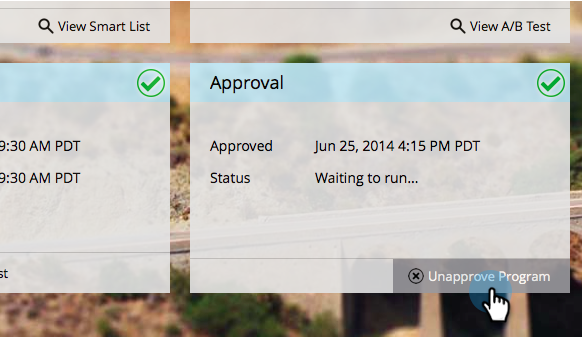

# Een e-mailprogramma goedkeuren/goedkeuren {#approve-unapprove-an-email-program}

>[!PREREQUISITES]
>
>* [&#x200B; creeer een E-mailprogramma &#x200B;](/help/marketo/product-docs/email-marketing/email-programs/creating-an-email-program/create-an-email-program.md)
>* [&#x200B; bepaalt een Publiek met een Slimme Lijst &#x200B;](/help/marketo/product-docs/email-marketing/email-programs/managing-people-in-email-programs/define-an-audience-with-a-smart-list.md) of [&#x200B; bepaalt een Publiek door een Lijst &#x200B;](/help/marketo/product-docs/email-marketing/email-programs/managing-people-in-email-programs/define-an-audience-by-importing-a-list.md) in te voeren
>
>* [&#x200B; kies een Bestaande E-mail &#x200B;](/help/marketo/product-docs/email-marketing/email-programs/email-program-actions/choose-an-existing-email.md) of [&#x200B; creeer een E-mail voor een E-mailprogramma &#x200B;](/help/marketo/product-docs/email-marketing/email-programs/email-program-actions/create-an-email-for-an-email-program.md)
>
>* [&#x200B; Plan Uw E-mailprogramma &#x200B;](/help/marketo/product-docs/email-marketing/email-programs/email-program-actions/schedule-your-email-program.md)

## Uw e-mailprogramma goedkeuren {#approve-your-email-program}

Nu uw programma klaar is om te starten, moet u het goedkeuren. Hieronder wordt beschreven hoe:

1. Ga naar **[!UICONTROL Marketing Activities]** .

   

   Selecteer uw e-mailprogramma.
   

   >[!CAUTION]
   >
   >Als u uw e-mailprogramma niet goedkeurt, wordt het e-mailbericht niet verzonden.

1. Ga onder de **[!UICONTROL Approval]** -tegel verder en klik op **[!UICONTROL Approve Program]** .

   

1. Als we problemen vinden, zullen we u op de hoogte stellen - los deze op en probeer het opnieuw goed te keuren.

   

   Perfect! Je bent klaar. Je e-mail wordt verzonden op het geplande tijdstip.

   

## Uw e-mailprogramma niet goedkeuren {#unapprove-your-email-program}

Als u van gedachten verandert en besluit dat u het e-mailprogramma niet wilt laten doorgaan, kunt u het goedkeuren van het e-mailprogramma ongedaan maken.

1. Ga naar **[!UICONTROL Marketing Activities]** .

   

1. Selecteer uw e-mailprogramma.

   

1. Klik onder de **[!UICONTROL Approval]** -tegel gewoon op **[!UICONTROL Unapprove Program]** .

   

Gereed en klaar! Je e-mailbericht wordt pas verzonden nadat je het opnieuw hebt goedgekeurd.
