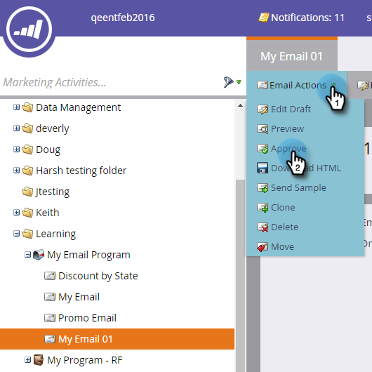

# Een e-mail maken voor een e-mailprogramma {#create-an-email-for-an-email-program}

>[!PREREQUISITES]
>
>* [ creeer een E-mailprogramma ](/help/marketo/product-docs/email-marketing/email-programs/creating-an-email-program/create-an-email-program.md)
>* [ bepaalt een Publiek met een Slimme Lijst ](/help/marketo/product-docs/email-marketing/email-programs/managing-people-in-email-programs/define-an-audience-with-a-smart-list.md) of [ bepaalt een Publiek door een Lijst ](/help/marketo/product-docs/email-marketing/email-programs/managing-people-in-email-programs/define-an-audience-by-importing-a-list.md) in te voeren

Nadat u uw e-mailprogramma hebt gemaakt en uw publiek hebt gedefinieerd, wilt u bepalen welke e-mail u verzendt. U kunt [ bestaande e-mail ](/help/marketo/product-docs/email-marketing/email-programs/email-program-actions/choose-an-existing-email.md) kiezen of creeer één van kras. Zo maakt u een nieuwe e-mail.

1. Ga naar **[!UICONTROL Marketing Activities]** .

   

1. Selecteer uw e-mailprogramma. Klik onder de **[!UICONTROL Email]** -tegel op **[!UICONTROL New Email]** .

   

1. Voer een **[!UICONTROL Name]** in, selecteer de gewenste sjabloon en klik op **[!UICONTROL Create]** .

   

1. Breng alle gewenste wijzigingen aan en sluit de editor af.

   

   >[!NOTE]
   >
   >Leer hoe te [ elementen in e-mail ](/help/marketo/product-docs/email-marketing/general/email-editor-2/edit-elements-in-an-email.md) uitgeven.

1. Vergeet niet uw e-mail goed te keuren.

   

Geweldig! Nu wij een e-mail hebben gecreeerd die wij willen verzenden, laten wij [ een test A/B ](/help/marketo/product-docs/email-marketing/email-programs/email-program-actions/email-test-a-b-test/add-an-a-b-test.md) toevoegen of direct overslaan aan [ het plannen van uw e-mailprogramma ](/help/marketo/product-docs/email-marketing/email-programs/email-program-actions/schedule-your-email-program.md).
