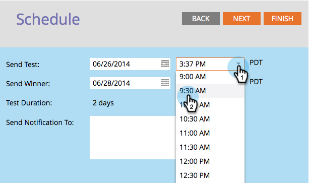

# De A/B-test plannen {#schedule-the-a-b-test}

Nadat u een A/B-test hebt toegevoegd aan een e-mailprogramma en de criteria voor winnaars hebt gedefinieerd die u moet plannen wanneer de test begint. Zo gaat het.

>[!PREREQUISITES]
>
>[ voeg A/B Test ](/help/marketo/product-docs/email-marketing/email-programs/email-program-actions/email-test-a-b-test/add-an-a-b-test.md) toe

>[!NOTE]
>
>Voor Datum-/tijdtests hoeft u alleen in te stellen wanneer u de samenvatting van de testresultaten ontvangt.

1. Selecteer de **[!UICONTROL Send Test]** datum.

1. Selecteer de **[!UICONTROL Send Test]** tijd.

   

   >[!NOTE]
   >
   >Test verzenden en Winner verzenden moet ten minste vier uur van elkaar verwijderd zijn. Voor grotere verzendingen wilt u echter misschien 24 uur wachten om voldoende tijd voor goede resultaten te krijgen.

1. Doe hetzelfde voor **[!UICONTROL Send Winner]** . Voer (optioneel) ontvangers van een melding in en klik op **[!UICONTROL Next]** .

   >[!NOTE]
   >
   >Alleen de testgroep ontvangt de testvarianten.

   

   >[!NOTE]
   >
   >Als u verkoos om een winnaar manueel te verklaren, zult u **Rapport bepalen verzend** datum/tijd in plaats van **beëindig het Verzenden van** datum/tijd.

   Super! U bent klaar, bekijk alleen de samenvatting en klik op **[!UICONTROL Close]** .

   

   U ziet dat de tegel **[!UICONTROL Schedule]** nu is bijgewerkt.

   

   >[!NOTE]
   >
   >Het plannen van een test A/B vormt ook de definitieve verzenddatum of het rapport verzendt datum.

   Ervan uitgaande dat u al uw publiek hebt gedefinieerd en een e-mail hebt gekozen, bestaat de enige resterende stap uit het goedkeuren van het programma.

   >[!MORELIKETHIS]
   >
   >[ keur/keur een E-mailprogramma ](/help/marketo/product-docs/email-marketing/email-programs/email-program-actions/approve-unapprove-an-email-program.md) goed
