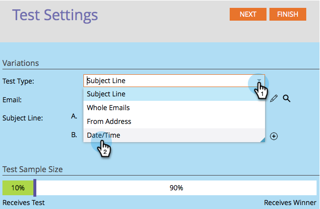
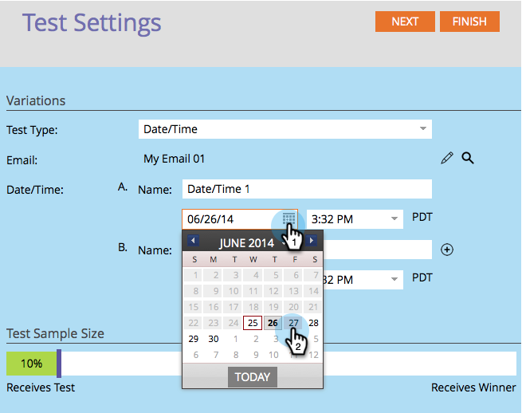

# Datum-/tijdtests A/B gebruiken {#use-date-time-a-b-testing}

U kunt uw e-mailberichten eenvoudig testen. Een test is de **[!UICONTROL Date/Time]** test. Hiermee wordt getest op welk tijdstip van de dag of de dag van de week het beste e-mailberichten kunnen worden verzonden. Hier is hoe u het kunt instellen.

>[!PREREQUISITES]
>
>[&#x200B; voeg A/B Test &#x200B;](/help/marketo/product-docs/email-marketing/email-programs/email-program-actions/email-test-a-b-test/add-an-a-b-test.md) toe
>

1. Klik onder de **[!UICONTROL Email]** -tegel op **[!UICONTROL Add A/B Test]** .

   

1. Er wordt een nieuw venster geopend. Selecteer **[!UICONTROL Date/Time]** voor **[!UICONTROL Test Type]** .

   

1. Als u eerdere testinformatie hebt (zoals een onderwerptest), kunt u veilig op **[!UICONTROL Reset Test]** klikken.

   

1. Selecteer de datum voor uw eerste datum/tijd.

   

1. Selecteer de tijd voor uw eerste datum/tijd.

   

1. Doe het zelfde voor uw tweede datum/tijd.

   

1. Gebruik de schuifregelaar om te kiezen welk percentage van het publiek u wilt opnemen in de A/B-test en klik op **[!UICONTROL Next]** .

   

   >[!NOTE]
   >
   >De verschillende variaties zijn van toepassing op gelijke delen van de gekozen monstergrootte voor de test.

   >[!CAUTION]
   >
   >**wij adviseren u vermijden plaatsend de steekproefgrootte aan 100%**. Als u een statische lijst gebruikt, verzendt het plaatsen van de steekproefgrootte aan 100% de e-mail naar iedereen in het publiek en de winnaar gaat aan niemand. Als u a **slimme** lijst gebruikt, die de steekproefgrootte aan 100% plaatst verzendt e-mail naar iedereen in het publiek _op dat ogenblik_. Wanneer het e-mailprogramma later opnieuw wordt uitgevoerd, ontvangen alle nieuwe personen die in aanmerking komen voor de slimme lijst ook de e-mail omdat ze nu in het publiek zijn opgenomen.

   Oké, we zijn één stap dichterbij. Nu moeten wij [&#x200B; de criteria van de A/B testwinnaar &#x200B;](/help/marketo/product-docs/email-marketing/email-programs/email-program-actions/email-test-a-b-test/define-the-a-b-test-winner-criteria.md) bepalen.
