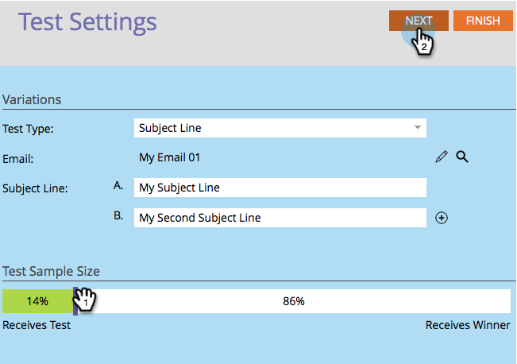

# Testen van "onderwerpregel" A/B gebruiken {#use-subject-line-a-b-testing}

U kunt uw e-mailberichten eenvoudig testen. Een van de meest voorkomende tests is de **onderwerpregel** .

>[!PREREQUISITES]
>
>* [Een A/B-test toevoegen](add-an-a-b-test.md)

>

1. Klik onder de tegel E-mail op A/B-test toevoegen terwijl uw e-mail is geselecteerd.

1. Het venster van de testredacteur zal openen. Voer een of meer nieuwe onderwerpregel in.

   >[!NOTE]
   >
   >Kies** A******** vooraf de informatie in het geselecteerde e-mailbericht.

   

   >[!TIP]
   >
   >U kunt op het **plusteken***** klikken om meer onderwerpregel's toe te voegen.

1. Gebruik de schuif om te kiezen welk percentage van het publiek u uw test A/B wilt ontvangen en **daarna** klikken.

   

   >[!CAUTION]
   >
   >**U wordt aangeraden de voorbeeldgrootte niet in te stellen op 100%**. Als u een statische lijst gebruikt, zou het plaatsen van de steekproefgrootte aan 100% de e-mail naar iedereen in het publiek verzenden en de winnaar aan niemand gaan. Als u een slimme lijst gebruikt, zou het plaatsen van de steekproefgrootte aan 100% e-mail naar iedereen in publiek *op dat ogenblik verzenden. *En wanneer het e-mailprogramma later opnieuw wordt uitgevoerd, ontvangen alle nieuwe personen die in aanmerking komen voor de slimme lijst ook de e-mail omdat ze nu in het publiek zijn opgenomen.

   >[!NOTE]
   >
   >De verschillende variaties van het onderwerp nemen zelfs delen van de geselecteerde Grootte van het Monster van de Test.

   Oké, we zijn er bijna. Nu moeten we de criteria [voor de winnaars van de A/B-test](define-the-a-b-test-winner-criteria.md)definiëren.

   >[!NOTE]
   >
   >**Verwante artikelen**
   >
   >    
   >    
   >    * [Bepaal de Criteria van de Winner van de Test A/B](define-the-a-b-test-winner-criteria.md)

