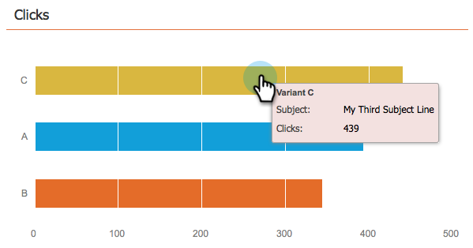

# Het dashboard voor het e-mailprogramma gebruiken - A/B-testweergave {#use-the-email-program-dashboard-a-b-test-view}

Controle uit hoe uw [&#x200B; e-mailprogramma A/B test &#x200B;](/help/marketo/product-docs/email-marketing/email-programs/email-program-actions/email-test-a-b-test/add-an-a-b-test.md) met dit dashboard presteert.

## Test verzenden {#send-test}

Hier kunt u het totale geleverde en de onderverdelingen door varianten zien.

## Klikken {#clicks}

Hier kunt u zien hoeveel klikken elke variant heeft.

## Klik om te openen {#click-to-open}

In dit diagram ziet u de klik om de verhouding te openen. (# klikken / # opent).

## Samenvatting {#summary}

Hier ziet u een uitsplitsing van kliks en unsubscribes door varianten voor gemakkelijke vergelijking.

Koel dashboard, denk je niet?

>[!MORELIKETHIS]
>
>[&#x200B; Gebruik het Dashboard van het E-mailProgramma &#x200B;](/help/marketo/product-docs/email-marketing/email-programs/email-program-data/use-the-email-program-dashboard.md)
