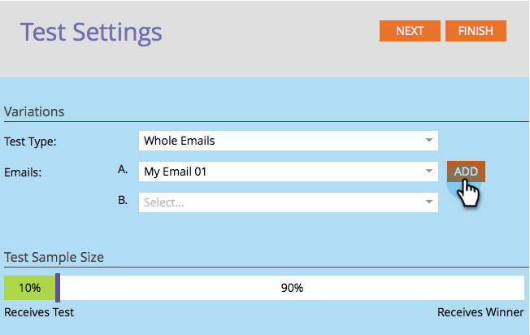

# "Hele e-mail" A/B testen {#use-whole-email-a-b-testing} gebruiken

U kunt uw e-mailberichten eenvoudig testen. Een geweldige test is de **Volledige e-mailtest**. Hier is hoe je het instelt.

>[!PREREQUISITES]
>
>* [Een A/B-test toevoegen](add-an-a-b-test.md)

>

1. Klik onder de tegel E-mail op A/B-test toevoegen terwijl uw e-mail is geselecteerd.

` 

`

1. Er wordt een nieuw venster geopend. Klik op de vervolgkeuzelijst **Type testen** en selecteer **Hele e-mails**.

   

1. Als u vorige testinformatie hebt (zoals een onderwerptest), kunt u veilig **Test opnieuw instellen** klikken.

   

1. Selecteer uw eerste e-mail.

   

1. Klik **Add** om e-mail toe te passen.

   ` 

   `

   >[!TIP]
   >
   >U kunt meerdere e-mails toevoegen. Als u echter te veel toevoegt, kan dit het testproces vertragen.

1. Selecteer uw tweede e-mail.

   ` 

   `

1. Klik **Add** om tweede e-mail toe te passen. Sleep de schuifregelaar om te kiezen welk percentage van het publiek u de A/B-test wilt ontvangen en klik op **Volgende**.

   ` 

   `

   >[!NOTE]
   >
   >De verschillende variaties verzenden naar gelijke delen van de gekozen **Monstergrootte testen**.

   >[!CAUTION]
   >
   >**U wordt aangeraden de voorbeeldgrootte niet in te stellen op 100%**. Als u een statische lijst gebruikt, verzendt het plaatsen van de steekproefgrootte aan 100% de e-mail naar iedereen in het publiek en de winnaar gaat aan niemand. Als u een **smart** lijst gebruikt, verzendt het plaatsen van de steekproefgrootte aan 100% de e-mail naar iedereen in publiek *op dat ogenblik. *Wanneer het e-mailprogramma later opnieuw wordt uitgevoerd, ontvangen alle nieuwe personen die in aanmerking komen voor de slimme lijst ook de e-mail omdat ze nu in het publiek zijn opgenomen.

   Oké, we zijn er bijna. Nu moeten wij [de criteria van de A/B testwinnaar bepalen](define-the-a-b-test-winner-criteria.md).

   >[!MORELIKETHIS]
   >
   >
   >    
   >    
   >    * [Bepaal de Criteria van de Winner van de Test A/B](define-the-a-b-test-winner-criteria.md)

