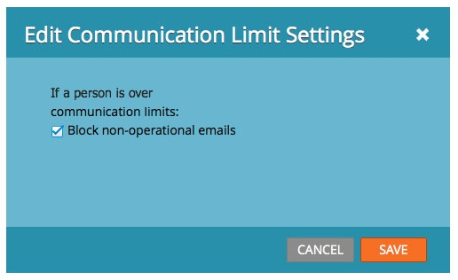

# Communicatielimieten in-/uitschakelen in een e-mailprogramma {#enable-disable-communication-limits-in-an-email-program}

Wanneer het runnen van een e-mailprogramma, kunt u verkiezen om de [&#x200B; communicatielimieten van het adminniveau te negeren of te respecteren &#x200B;](/help/marketo/product-docs/administration/email-setup/enable-communication-limits.md). Zo doe je het.

>[!NOTE]
>
>De communicatielimieten worden [&#x200B; geplaatst in de Admin sectie &#x200B;](/help/marketo/product-docs/administration/email-setup/enable-communication-limits.md) en helpen u vermijden verzendend één persoon teveel e-mails.

1. Ga naar **[!UICONTROL Marketing Activities]** .

   

1. Zoek en selecteer uw e-mailprogramma.

   

1. Dubbelklik op het regelitem voor de communicatielimiet onder het tabblad **[!UICONTROL Setup]** .

   

1. Niet-operationele e-mailberichten worden standaard geblokkeerd als de communicatielimieten zijn bereikt, maar als u deze wilt omzeilen, schakelt u het selectievakje uit en klikt u op **[!UICONTROL Save]** .

   

   Als u **[!UICONTROL Block non-operational emails]** ingeschakeld laat, wordt het bericht niet verzonden naar iedereen die meer e-mails heeft ontvangen dan is toegestaan door uw beheerinstellingen.
