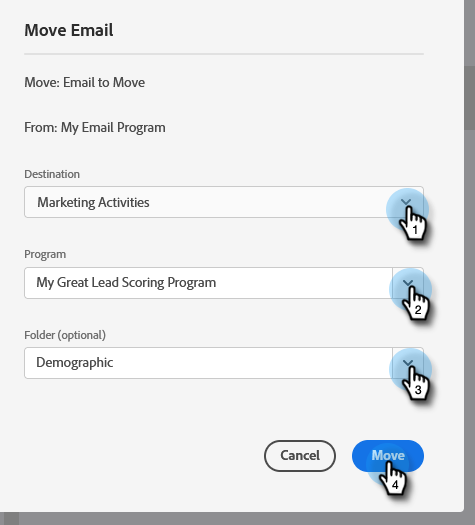

# Een e-mail verplaatsen {#move-an-email}

Wilt u een e-mailbericht van het ene programma naar het andere verplaatsen? Zo gaat het.

1. Ga naar **Marketingactiviteiten**.

   

1. Zoek het e-mailbericht dat u wilt verplaatsen, klik er met de rechtermuisknop op en selecteer **Verplaatsen**.

   

1. Selecteer **Doel**, **Programma** en optioneel **Map**. Selecteren **Verplaatsen**.

   

   >[!NOTE]
   >
   >In dit voorbeeld wordt een e-mailbericht verplaatst naar een ander programma, maar u kunt een e-mailbericht ook verplaatsen naar een map in de Design Studio.

   Je ziet je email nu in het andere programma leven.

   

   >[!NOTE]
   >
   >U kunt uw e-mail ook eenvoudig slepen en neerzetten naar een nieuwe bestemming in de boomstructuur.
