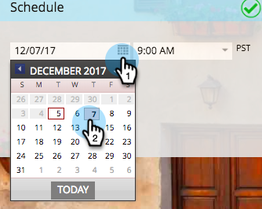

# Uw e-mailprogramma plannen {#schedule-your-email-program}

>[!PREREQUISITES]
>
>* [&#x200B; creeer een E-mailprogramma &#x200B;](/help/marketo/product-docs/email-marketing/email-programs/creating-an-email-program/create-an-email-program.md)
>* [&#x200B; bepaalt een Publiek met een Slimme Lijst &#x200B;](/help/marketo/product-docs/email-marketing/email-programs/managing-people-in-email-programs/define-an-audience-with-a-smart-list.md) of [&#x200B; bepaalt een Publiek door een Lijst &#x200B;](/help/marketo/product-docs/email-marketing/email-programs/managing-people-in-email-programs/define-an-audience-by-importing-a-list.md) in te voeren
>
>* [&#x200B; kies een Bestaande E-mail &#x200B;](/help/marketo/product-docs/email-marketing/email-programs/email-program-actions/choose-an-existing-email.md) of [&#x200B; creeer een E-mail voor een E-mailprogramma &#x200B;](/help/marketo/product-docs/email-marketing/email-programs/email-program-actions/create-an-email-for-an-email-program.md)

Met uw gecreeerd e-mailprogramma, die publiek wordt bepaald, en e-mail wordt geselecteerd, zult u uw programma *willen vertellen wanneer* om e-mail te verzenden. Zo gaat het.

1. Ga naar **[!UICONTROL Marketing Activities]** .

   

1. Selecteer uw e-mailprogramma.

   

1. Stel de datum in onder de tegel **[!UICONTROL Schedule]** .

   

1. En dan de tijd.

   

1. U kunt ook de functies [[!UICONTROL Recipient Time Zone]](/help/marketo/product-docs/email-marketing/email-programs/email-program-actions/scheduling-with-recipient-time-zone/schedule-email-programs-with-recipient-time-zone.md) en/of [[!UICONTROL Head Start]](/help/marketo/product-docs/email-marketing/email-programs/email-program-actions/head-start-for-email-programs.md) gebruiken.

   

   Hoe makkelijk was dat? Het enige verlaten ding is een e-mailprogramma [&#x200B; goed te keuren en u bent goed te gaan.](/help/marketo/product-docs/email-marketing/email-programs/email-program-actions/approve-unapprove-an-email-program.md)

>[!MORELIKETHIS]
>
>* [&#x200B; E-mailprogramma&#39;s van het Programma met de Ontvankelijke Streek van de Tijd &#x200B;](/help/marketo/product-docs/email-marketing/email-programs/email-program-actions/scheduling-with-recipient-time-zone/schedule-email-programs-with-recipient-time-zone.md)
>* [&#x200B; Begin van het Kop voor E-mailProgramma&#39;s &#x200B;](/help/marketo/product-docs/email-marketing/email-programs/email-program-actions/head-start-for-email-programs.md)
