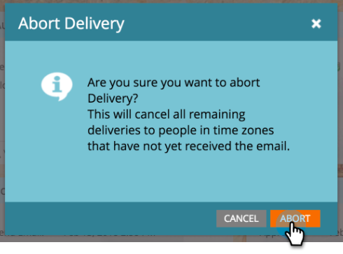
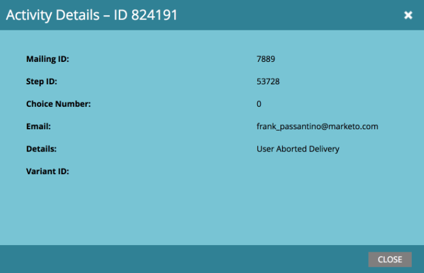

# Aflevering van e-mailprogramma&#39;s afbreken die zijn gepland met de tijdzone van de ontvanger {#abort-delivery-of-email-programs-scheduled-with-recipient-time-zone}

In noodgevallen kunt u de levering afbreken van een e-mailprogramma dat al is gestart met het uitvoeren van de tijdzone voor ontvangers ingeschakeld.

Aangezien e-mailprogramma&#39;s die zijn gepland met de tijdzone van de ontvanger maximaal 24 uur kunnen duren, wordt elke volgende verzending na dat punt geannuleerd wanneer de levering van het programma wordt afgebroken.

1. Selecteer het e-mailprogramma dat u wilt annuleren en klik vervolgens op **Aflevering** afbreken onder de titel Goedkeuring in het configuratiescherm.

   

1. Bevestig dat u de levering wilt annuleren door op **Afbreken** te klikken.

   

1. Na annulering ziet het raster **Resultaten** van uw e-mailprogramma er ongeveer zo uit als hieronder. Alle volgende verzendingen worden geannuleerd en worden weergegeven als &quot;Verzonden via e-mail&quot; in de kolom **Type** activiteit.

   

   >[!NOTE]
   >
   >Geannuleerde e-mails worden **pas** als een zachte stuit weergegeven *wanneer* de levering volgens de planning in de respectievelijke tijdzones moet plaatsvinden. Tot dat moment worden ze nog steeds weergegeven als &quot;E-mail verzenden&quot;.

1. Vanuit het raster kunt u op een e-mail klikken om de activiteitengegevens weer te geven. Voor geannuleerde verzendingen ziet het pop-upvenster Details er als volgt uit:

   

>[!MORELIKETHIS]
>
>* [Tijdzone van ontvanger](understanding-recipient-time-zone.md)
>* [E-mailprogramma&#39;s met tijdzone voor ontvangers plannen](schedule-email-programs-with-recipient-time-zone.md)

>

