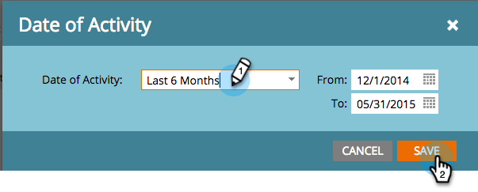
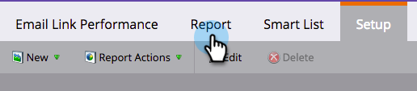

# E-mailkoppelingsprestatierapport {#email-link-performance-report}

Maak een e-mailkoppelingprestatierapport om te zien hoe goed de koppelingen in uw e-mails functioneren.

1. [Een rapport maken in een programma](/help/marketo/product-docs/reporting/basic-reporting/creating-reports/create-a-report-in-a-program.md) en selecteert u **Prestaties van e-mailkoppelingen** als het rapporttype.

   

1. Klikken **Instellen**.

   

1. Dubbelklikken op **Datum van activiteit** krachtens **Instellingen**.

   

1. Plaats een aangewezen tijdkader voor uw rapport. Klikken **Opslaan**.

   

1. Klikken **Rapport**.

   

1. Geweldig! Nu hebt u een rapport van de Prestaties van de Verbinding E-mail gecreeerd.

   

[Beschikbare kolommen](/help/marketo/product-docs/reporting/basic-reporting/editing-reports/select-report-columns.md) voor een E-mailkoppelingsprestatierapport zijn onder meer:

<table> 
 <thead> 
  <tr> 
   <th colspan="1" rowspan="1">Kolom</th> 
   <th colspan="1" rowspan="1">Beschrijving</th> 
  </tr> 
 </thead> 
 <tbody> 
  <tr> 
   <td colspan="1" rowspan="1">Koppeling</td> 
   <td colspan="1" rowspan="1">Gegroepeerd op e-mailnaam. Klik op het plusteken (+) om alle koppelingen in het e-mailbericht weer te geven.</td> 
  </tr> 
  <tr> 
   <td colspan="1" rowspan="1">Klikken</td> 
   <td colspan="1" rowspan="1">Het aantal keren dat op die koppeling is geklikt.</td> 
  </tr> 
  <tr> 
   <td colspan="1" rowspan="1">% klikken</td> 
   <td colspan="1" rowspan="1">Van het totaal klikt u op alle koppelingen in die e-mail, percentage op deze koppeling.</td> 
  </tr> 
  <tr> 
   <td colspan="1" rowspan="1">Mensen</td> 
   <td colspan="1" rowspan="1">Het aantal unieke personen dat op de koppeling heeft geklikt.</td> 
  </tr> 
  <tr> 
   <td colspan="1" rowspan="1">% Mensen</td> 
   <td colspan="1" rowspan="1">Percentage van de totale unieke personen die op koppelingen in die e-mail hebben geklikt.</td> 
  </tr> 
 </tbody> 
</table>

>[!NOTE]
>
>In dit rapport wordt &quot;beschadigde koppeling&quot; weergegeven wanneer ongeldige/lege koppelingen aan een e-mail worden toegevoegd. Als dit bericht wordt weergegeven, [de HTML-bron controleren](/help/marketo/product-docs/email-marketing/general/functions-in-the-editor/edit-an-emails-html.md) in de e-maileditor voor lege koppelingen of tokens die geen volledige koppeling bevatten.

>[!TIP]
>
>Als u precies wilt weten wat een persoon heeft gedaan, kunt u de [Activiteitenlogboek](/help/marketo/product-docs/core-marketo-concepts/smart-lists-and-static-lists/managing-people-in-smart-lists/filter-activity-types-in-the-activity-log-of-a-person.md) in de [Persoonsgegevens](/help/marketo/product-docs/core-marketo-concepts/smart-lists-and-static-lists/managing-people-in-smart-lists/using-the-person-detail-page.md) pagina van het lusje van Leden in het programma.

>[!MORELIKETHIS]
>
>* [E-mailprestatierapport](/help/marketo/product-docs/email-marketing/email-programs/email-program-data/email-performance-report.md)
>* [Middelen in een e-mailrapport filteren](/help/marketo/product-docs/reporting/basic-reporting/report-activity/filter-assets-in-an-email-report.md)
