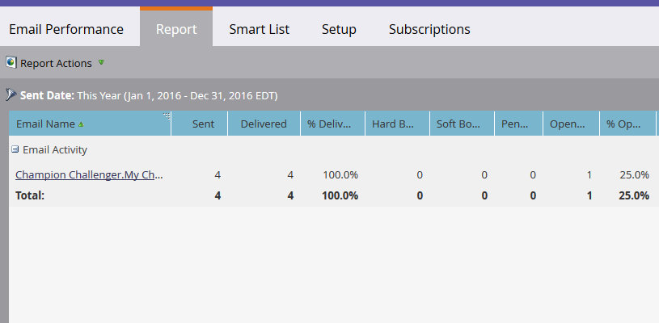

# E-mailprestatierapport {#email-performance-report}

Als u wilt zien hoe goed uw e-mails presteren met stats zoals geleverde, geopende, geklikt, enz., maakt u een e-mailprestatierapport.

1. [ creeer een Rapport in een Programma ](/help/marketo/product-docs/reporting/basic-reporting/creating-reports/create-a-report-in-a-program.md) en selecteer het **[!UICONTROL Email Performance]** [ Type van Rapport ](/help/marketo/product-docs/reporting/basic-reporting/report-types/report-type-overview.md).
1. [ verander het Kader van de Tijd van het Rapport ](/help/marketo/product-docs/reporting/basic-reporting/editing-reports/change-a-report-time-frame.md) en klik het **[!UICONTROL Report]** lusje.
1. Je bent er! Bekijk nu het rapport om te zien hoe uw e-mail(s) zijn uitgevoerd.

   >[!NOTE]
   >
   >Het filter Datum verzenden is gebaseerd op de eerste datum waarop de e-mail is verzonden.

   

   >[!TIP]
   >
   >Klik op de naam van een e-mailbericht om het te openen in de e-mailvoorvertoning.

   >[!NOTE]
   >
   >Een e-mailprestatierapport bevat activiteiten voor alle personen, inclusief personen die zijn verwijderd sinds het e-mailbericht is verzonden. Soms wil je alleen activiteiten voor actieve mensen zien. In dat geval moet u verwijderde personen uit uw rapport filteren. Gebruik het **[!UICONTROL Smart List]** lusje aan [ creeer een slimme lijst ](/help/marketo/product-docs/core-marketo-concepts/smart-lists-and-static-lists/creating-a-smart-list/create-a-smart-list.md) voor het rapport. Wanneer u niet filtert op een specifiek veld, stelt u het filter E-mailadres in op: **[!UICONTROL is not empty]** .

   [ Uitgezochte de Kolommen van het Rapport ](/help/marketo/product-docs/reporting/basic-reporting/editing-reports/select-report-columns.md) voor een E-mailrapport van Prestaties omvatten:

   <table><thead>
<tr>
    <th>Kolom</th>
    <th>Beschrijving</th>
  </tr></thead>
<tbody>
  <tr>
    <td>Hard geprononceerd</td>
    <td>E-mail is geweigerd vanwege een permanente voorwaarde, zoals een niet-bestaand e-mailadres.</td>
  </tr>
  <tr>
    <td>Zacht gebogen</td>
    <td>E-mail is geweigerd vanwege een tijdelijke voorwaarde, zoals het uitvallen van een server of een volledig inbox.</td>
  </tr>
  <tr>
    <td>In behandeling</td>
    <td>Dit aantal wordt berekend door het aantal geleverde e-mails, afgeschreven berichten en zachte afrekeningen af te trekken van het totale aantal verzonden.</td>
  </tr>
  <tr>
    <td>Klikte koppeling</td>
    <td>Aantal e-mailontvangers dat op een koppeling in de e-mail heeft geklikt.</td>
  </tr>
  <tr>
    <td>Niet geabonneerd</td>
    <td>Aantal e-mailontvangers dat op de koppeling Abonnement opzeggen in de e-mail heeft geklikt en het formulier heeft ingevuld.</td>
  </tr>
  <tr>
    <td>Afgebroken</td>
    <td>Aantal e-mails dat niet kon worden bezorgd en er is geen stuitgebeurtenis ontvangen. Een e-mailbericht wordt automatisch afgebroken genoemd als een antwoord niet binnen drie dagen na het verzenden van het e-mailbericht is ontvangen.</td>
  </tr>
</tbody></table>

>[!NOTE]
>
>Koppelingen en e-mailadressen waarop wordt geklikt opzeggen, worden niet geregistreerd onder Geklikte koppelingen in het rapport.

Over het algemeen proberen we het gezond verstand te gebruiken om deze statistieken op te nemen. Als iemand bijvoorbeeld op een koppeling in een e-mailbericht heeft geklikt, heeft hij of zij het e-mailbericht eerst geopend. We volgen deze specifieke regels voor het e-mailprestatierapport:

* **Regel 1**: Elk e-mailactiviteitenverslag wordt geplaatst aan één, en slechts één, van het volgende: _Geleverde_, _Vaste Begoten_, _Zachte Begoten_, of _Hangende_.

* **Regel 2**: Als het e-mailverslag *[!UICONTROL Opened]* toont, wordt het geteld als *Geleverd*.

* **Regel 3**: Als het e-mailverslag _[!UICONTROL Clicked Email]_&#x200B;of&#x200B;_[!UICONTROL Unsubscribed]_ toont, wordt het geteld als _Geleverd_ en _Geopend_.

* **Regel 4**: Als e-mail _[!UICONTROL Opened]_&#x200B;is, worden de grenzen genegeerd. Als e-mail niet is geopend,_ Vaste Omgeslagen _neemt belangrijkheid over_ Zacht die _en_ wordt teruggestuurd _.

* **Regel 5**: Als geen e-mailactiviteit drie dagen nadat het werd verzonden wordt ontvangen, wordt het _Geaborteerd_ verondersteld.

>[!NOTE]
>
>* Meervoudig verzendt van de zelfde campagne naar de zelfde persoon wordt slechts één keer geteld.
>
>* Meerdere verzendingen van verschillende campagnes naar dezelfde persoon worden afzonderlijk geteld.

>[!MORELIKETHIS]
>
>* [ de Filter Assets in Campagne E-mailRapporten ](/help/marketo/product-docs/reporting/basic-reporting/report-activity/filter-assets-in-a-campaign-email-reports.md){target="_blank"}
>* [ de Filter schrapte/verenigde verslagen in een Rapport van E-mailprestaties ](/help/marketo/product-docs/reporting/basic-reporting/report-activity/filter-deleted-merged-records-email-performance-report.md){target="_blank"}
>* [ Rapport van de Prestaties van de Verbinding E-mail ](/help/marketo/product-docs/email-marketing/email-programs/email-program-data/email-link-performance-report.md){target="_blank"}
