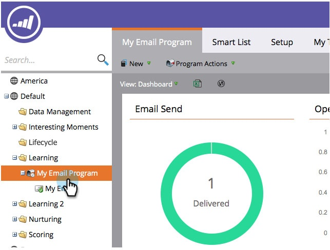

# Resultaten van e-mailprogramma weergeven {#view-email-program-results}

Net als het tabblad [!UICONTROL Results] in slimme campagnes kunt u dezelfde informatie in e-mailprogramma&#39;s bekijken.

1. Ga naar **[!UICONTROL Marketing Activities]** .

   

1. Zoek en selecteer uw e-mailprogramma.

   

   >[!NOTE]
   >
   >Als het e-mailprogramma al is gestart, gaat u rechtstreeks naar het dashboard voor het e-mailprogramma.

1. Selecteer onder **[!UICONTROL View]** de optie **[!UICONTROL Control Panel]** .

   

1. Klik onder de **[!UICONTROL Audience]** -tegel op **[!UICONTROL View Results]** .

   

   Daar heb je het!

   
