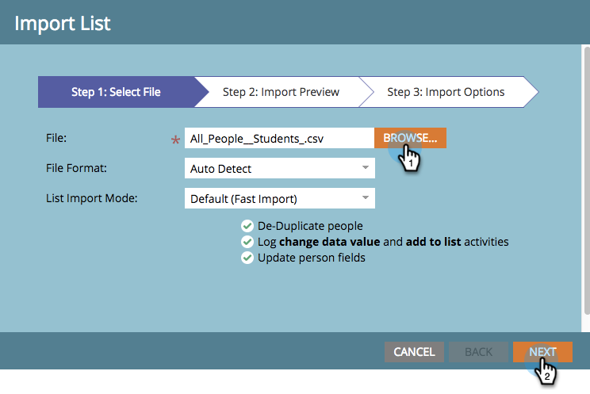

# Een publiek definiëren door een lijst te importeren {#define-an-audience-by-importing-a-list}

>[!PREREQUISITES]
>
>[&#x200B; creeer een E-mail voor een E-mailprogramma &#x200B;](/help/marketo/product-docs/email-marketing/email-programs/email-program-actions/create-an-email-for-an-email-program.md)

Als u eenmaal een e-mailprogramma hebt gemaakt, wilt u het weten naar wie de e-mail moet worden verzonden. U kunt dit doen door [&#x200B; een slimme lijst &#x200B;](/help/marketo/product-docs/core-marketo-concepts/smart-lists-and-static-lists/creating-a-smart-list/create-a-smart-list.md) te creëren of door een lijst in te voeren. Hieronder wordt beschreven hoe u dit kunt bereiken door een lijst te importeren.

>[!NOTE]
>
>Het definiëren van uw publiek werkt alleen wanneer het e-mailprogramma niet is goedgekeurd.
>
>Alle datum-/tijdvelden die worden geïmporteerd, worden behandeld als Central Time. Als u datum-/tijdgebieden in een verschillende tijdzone hebt, kunt u een formule van Excel gebruiken om het in Centrale Tijd (Amerika/Chicago) om te zetten.

1. Ga naar **[!UICONTROL Marketing Activities]** .

   

1. Selecteer het e-mailprogramma en klik op **[!UICONTROL Import List]** onder de tegel **[!UICONTROL Audience]** .

   

1. Het venster voor het importeren van lijsten wordt geopend, klik op **[!UICONTROL Browse]** en selecteer het bestand dat u wilt importeren. Als u de lijst met personen hebt geselecteerd, klikt u op **[!UICONTROL Next]** .

   

   >[!CAUTION]
   >
   >Controleer of de lijst UTF-8, UTF-16, Shift-JIS of EUC-JP heeft gecodeerd en of de bestandsgrootte niet groter is dan 50 MB.

1. Controleer of de velden in het bestand correct zijn toegewezen en klik op **[!UICONTROL Next]** .

   

   >[!TIP]
   >
   >Marketo zal zich de toewijzingen voor toekomstige import herinneren!

1. Voer een **[!UICONTROL Name]** in voor de lijst en klik op **[!UICONTROL Import]** .

   

1. Wanneer het importeren is voltooid, gaat u terug naar het hoofdprogrammatabblad. Je zult zien hoeveel mensen in aanmerking komen.

   

>[!NOTE]
>
>**Definitie**
>
>Heb je het geblokkeerde nummer gezien? Dit nummer is een subset van de gekwalificeerde personen en vertegenwoordigt personen die dit e-mailbericht niet kunnen verzenden omdat ze:
>
>* Niet geabonneerd
>* Marketing opgeschort
>* Gevoegd op lijst van gewenste personen
>* E-mail ongeldig
>* Lege e e-mail
>
>Klik op het nummer voor een gedetailleerde lijst met personen die zijn geblokkeerd voor verzending.
>
>Gebruik de knop  op de **[!UICONTROL Audience]** -tegel om te zien hoeveel personen in aanmerking kwamen om de e-mail te ontvangen op basis van criteria voor slimme lijsten. Trek het geblokkeerde nummer van het Personen-nummer af om het totale aantal personen op te halen dat het e-mailbericht ontvangt.

>[!TIP]
>
>U hoeft niet te wachten tot de import van de lijst is voltooid. U kunt blijven werken als u wilt.

Fantastisch! Nu is het tijd om een bestaande e-mail te kiezen of een nieuwe e-mail te maken om naar deze mensen te verzenden.

>[!MORELIKETHIS]
>
>* [&#x200B; kies een Bestaande E-mail &#x200B;](/help/marketo/product-docs/email-marketing/email-programs/email-program-actions/choose-an-existing-email.md)
>* [&#x200B; creeer een E-mail voor een E-mailprogramma &#x200B;](/help/marketo/product-docs/email-marketing/email-programs/email-program-actions/create-an-email-for-an-email-program.md)
