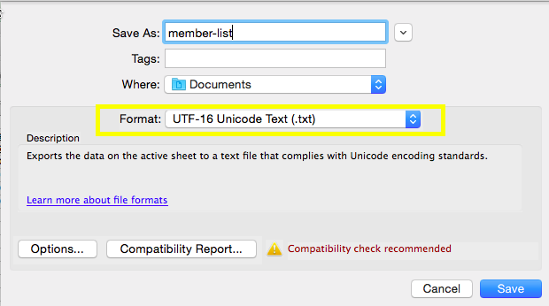

# Een lijst met niet-Latijnse tekens importeren {#import-a-non-latin-characters-list}

Een bestand importeren dat niet in het Engels staat? De lijst ziet er perfect uit als u deze opent met Excel.

Maar wanneer u het in Marketo invoert, zou u kunnen zien dat de niet-Engelse karakters niet correct worden opgepikt.

Dit komt doordat het bestand niet correct is opgeslagen zodat Marketo alle niet-Latijnse tekens herkent. Het goede nieuws is dat er een paar eenvoudige stappen zijn die je kunt volgen om het op te lossen.

1. Selecteer **Opslaan als...** in het menu **Bestand** in Excel.

   

1. Kies **UTF-16 Unicode-tekst (.txt)** als de optie **Indeling** . Hiermee wordt het bestand gecodeerd op de manier waarop Marketo deze kan weergeven.

   

   >[!NOTE]
   >
   >Marketo ondersteunt ook UTF-8, Shift-JIS of EUC-JP.

1. Excel slaat het nieuwe bestand op als een tekstbestand met de extensie .txt. Maar het zet ook alle komma&#39;s in het dossier in lusjes om. We moeten het weer veranderen.

   >[!TIP]
   >
   >U kunt het Dossier van de Tekst openen gebruikend **Blocnote** als u Vensters of **TextEdit** gebruikt als u MAC gebruikt.

   

1. Selecteer een tabblad in het document en kopieer het.

   

1. Selecteer **Zoeken en vervangen...** in het menu **Bewerken** .

   

   >[!TIP]
   >
   >De equivalente actie voor Windows-gebruikers is: **Bewerken > Vervangen...**

1. Plak de tab die u in stap 4 hebt gekopieerd in het eerste (te vervangen) vak en typ een komma in het tweede (te vervangen door) vak. Klik op **Alles**.

   

1. En voila, alle komma&#39;s zijn terug en we zijn klaar om te rollen.

   

1. Importeer het nieuwe bestand in Marketo en de informatie moet nu correct worden weergegeven.

   

   >[!NOTE]
   >
   >Alle datum-/tijdvelden die worden geïmporteerd, worden behandeld als Central Time. Als u datum-/tijdgebieden in een verschillende tijdzone hebt, kunt u een formule van Excel gebruiken om het in Centrale Tijd (Amerika/Chicago) om te zetten.

We weten dat dit vreemd is, maar het werkt. Happy Importing!