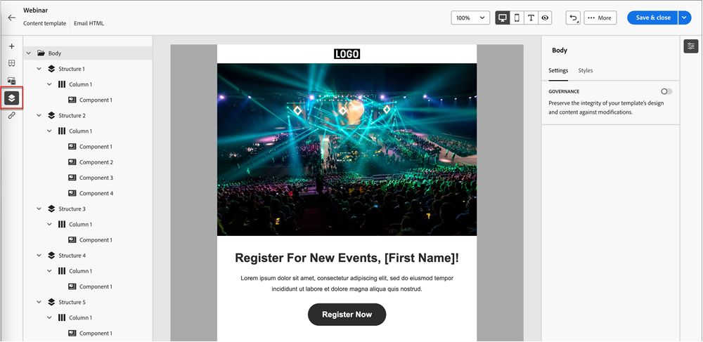
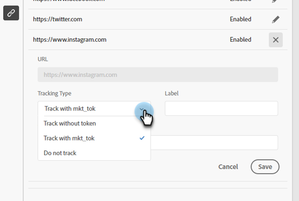
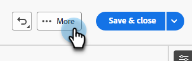
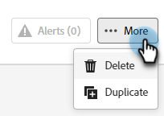

# E-mailsjablonen {#email-templates}

Voor een versneld en verbeterd ontwerpproces kunt u zelfstandige e-mailsjablonen maken om eenvoudig aangepaste inhoud te hergebruiken.

>[!IMPORTANT]
>
>Dit artikel is alleen van toepassing op leden van de nieuwe Marketo Engage Email Designer beta. Verspreid niet.

>[!NOTE]
>
>E-mailsjablonen in de nieuwe e-mailontwerper kunnen alleen worden gebruikt om e-mails te maken in de nieuwe e-mailontwerper. In de oude e-maileditor kan niet naar deze instellingen worden verwezen.

## Een e-mailsjabloon maken {#create-an-email-template}

1. Login aan Marketo Engage via [ Adobe Experience Cloud ](https://experiencecloud.adobe.com/) {target="_blank"}.

1. In Mijn Marketo, uitgezochte **Studio van het Ontwerp**.

   

1. In de boom, uitgezochte **E-mailMalplaatjes (Nieuwe Redacteur)**.

   

1. Klik **creeer malplaatje** knoop.

   

1. Voer een sjabloonnaam en een optionele beschrijving in. Klik **creëren**.

   

## Uw sjabloon ontwerpen {#design-your-template}

In het _Ontwerp uw malplaatje_ pagina, kunt u van een paar opties kiezen. [ Ontwerp van kras ](#design-from-scratch), [ voer uw eigen HTML ](#import-html) in, of [ selecteer een bestaand malplaatje ](#choose-a-template) (één van onze steekproeven of één u reeds) bewaarde.

### Ontwerpen vanuit niets {#design-from-scratch}

Definieer de inhoud door structuurelementen toe te voegen en te verplaatsen met eenvoudige acties voor slepen en neerzetten.

1. In het _Ontwerp uw malplaatje_ pagina, uitgezocht **Ontwerp van kras**.

1. Voeg [ structuur en inhoud ](#add-structure-and-content) toe.

### HTML importeren {#import-your-html}

U kunt bestaande HTML-inhoud importeren om uw e-mailsjablonen te ontwerpen. De inhoud kan zijn:

* Een HTML-bestand met een opgenomen stijlblad

* Een .zip-bestand dat een HTML-bestand, de stijlpagina (.css) en afbeeldingen bevat

>[!NOTE]
>
>Er gelden geen beperkingen voor de .zip-bestandsstructuur. Verwijzingen moeten echter relatief zijn en passen bij de boomstructuur van de ZIP-map.

1. In het _Ontwerp uw malplaatje_ pagina, uitgezochte **HTML van de Invoer**.

1. De belemmering en laat vallen het gewenste HTML of .zip dossier (of selecteert een dossier van uw computer) en klikt **de Invoer**.

   

   >[!NOTE]
   >
   >Wanneer de HTML-inhoud wordt geüpload, wordt de inhoud in de compatibiliteitsmodus uitgevoerd. In deze modus kunt u alleen uw tekst aanpassen, koppelingen toevoegen of elementen aan uw inhoud toevoegen.

1. Om hefboomwerking te kunnen gebruiken de de inhoudscomponenten van Designer E-mail, klik de **converter van de HTML** tabel en klik **Omzetten**.

   >[!CAUTION]
   >
   >Als u een `<table>` -tag als eerste laag in een HTML-bestand gebruikt, kan dit leiden tot stijlverlies, zoals de achtergrond- en breedte-instellingen in de bovenste laagtag.

U kunt het geïmporteerde bestand nu naar wens aanpassen met de visuele e-maileditor.

### Een sjabloon kiezen {#choose-a-template}

Er zijn twee typen sjablonen waaruit u kunt kiezen.

* **malplaatjes van de Steekproef**: Marketo Engage biedt vier uit-van-de-doos e-mailmalplaatjes aan.

* **Bewaarde malplaatjes**: Dit zijn malplaatjes u van kras gebruikend het menu van Malplaatjes creeerde, of e-mail u creeerde en verkoos om als malplaatje te bewaren.

>[!BEGINTABS]

>[!TAB  malplaatjes van de Steekproef ]

Kies een van de kant-en-klare sjablonen voor een vliegende start in je e-mailsjabloonontwerp.

1. Het tabblad Voorbeeldsjablonen is standaard geopend.

1. Selecteer de sjabloon die u wilt gebruiken.

   

1. Klik **Gebruik dit malplaatje**.

   

1. Bewerk de inhoud naar wens met de visuele ontwerper van de inhoud.

>[!TAB  Bewaarde malplaatjes ]

1. Klik het **Opgeslagen malplaatjes** lusje en selecteer het gewenste malplaatje.

   

1. Klik **Gebruik dit malplaatje**.

   

1. Bewerk de inhoud naar wens met de visuele contentontwerper.

>[!ENDTABS]

## Structuur en inhoud toevoegen {#add-structure-and-content}

1. Als u wilt beginnen met het maken of wijzigen van inhoud, sleept u een item van Structuren naar het canvas. Bewerk de instellingen in het deelvenster aan de rechterkant.

   >[!TIP]
   >
   >Selecteer de n:n kolomcomponent om het aantal kolommen van uw keus (tussen drie en 10) te bepalen. U kunt ook de breedte van elke kolom definiëren door de pijlen onder de kolom te verplaatsen.

   

   >[!NOTE]
   >
   >Elke kolomgrootte mag niet kleiner zijn dan 10% van de totale breedte van de structuurcomponent. Alleen lege kolommen kunnen worden verwijderd.

1. Sleep in het gedeelte Inhoud over de gewenste items en zet deze neer in een of meer structuurcomponenten.

   

1. Elke component kan worden aangepast via de tabbladen Instellingen of Stijl. Wijzig het lettertype, de tekststijl, de marge en meer.

### Elementen toevoegen {#add-assets}

Voeg beelden toe die in de [ sectie van Beelden en van Dossiers ](/help/marketo/product-docs/demand-generation/images-and-files/add-images-and-files-to-marketo.md){target="_blank"} van uw instantie van het Marketo Engage worden opgeslagen.

>[!NOTE]
>
>U kunt alleen afbeeldingen toevoegen in de nieuwe ontwerper, momenteel geen andere bestandstypen.

1. Klik op het pictogram Asset Selector om uw afbeeldingen te openen.

   

1. Sleep de gewenste afbeelding naar een structuurcomponent.

   

   >[!NOTE]
   >
   >Om een bestaand beeld te vervangen, selecteer het, dan klik **Uitgezocht een activa** in het lusje van Montages op het recht.

### Lagen, instellingen en stijlen {#layers-settings-styles}

Open de boomstructuur om toegang te krijgen tot specifieke structuren en hun kolommen/componenten voor meer gedetailleerde bewerkingen. Klik op het pictogram Navigatieboom om toegang te krijgen.

In het onderstaande voorbeeld worden de stappen beschreven voor het aanpassen van de opvulling en de verticale uitlijning binnen een structuurcomponent die uit kolommen bestaat.

1. Selecteer de kolom in de structuurcomponent direct in het canvas of gebruikend de _boom van de Navigatie_ die bij de linkerzijde wordt getoond.

1. Klik in de kolomwerkbalk op het gereedschap _[!UICONTROL Select a column]_en kies het gereedschap dat u wilt bewerken.

   U kunt deze ook selecteren in de boomstructuur. De bewerkbare parameters voor die kolom worden weergegeven op de tabbladen _[!UICONTROL Settings]_en_[!UICONTROL Styles]_ rechts.

   

1. Als u de kolomeigenschappen wilt bewerken, klikt u op de tab _[!UICONTROL Styles]_aan de rechterkant en wijzigt u deze naar wens:

   * Wijzig voor **[!UICONTROL Background]** de achtergrondkleur zo nodig.

     Schakel het selectievakje voor een transparante achtergrond uit. Schakel de instelling **[!UICONTROL Background image]** in om een afbeelding te gebruiken als achtergrond in plaats van als een effen kleur.

   * Voor **[!UICONTROL Alignment]**, selecteer de _Hoogste_, _Midden_, of _Onderste_ pictogram.
   * Definieer bij **[!UICONTROL Padding]** de opvulling voor alle zijden.

     Selecteer **[!UICONTROL Different padding for each side]** als u de opvulling wilt aanpassen. Klik het __ pictogram van het Slot {om synchronisatie te breken.

   * Vouw de sectie **[!UICONTROL Advanced]** uit om inline stijlen voor de kolom te definiëren.

   

1. Herhaal deze stappen zo nodig om de uitlijning en opvulling voor de andere kolommen in de component aan te passen.

1. Sla uw wijzigingen op.

### Inhoud personaliseren {#personalize-content}

Tokens werken in de nieuwe redacteur de zelfde manier zij in het oude, maar het pictogram ziet er anders uit. In het onderstaande voorbeeld wordt een voornaamtoken toegevoegd met terugvaltekst.

1. Selecteer de tekstcomponent. Plaats de curseur waar u het teken wilt verschijnen en **klikken verpersoonlijking** pictogram toevoegt.

   

1. Klik het gewenste [ symbolische type ](/help/marketo/product-docs/demand-generation/landing-pages/personalizing-landing-pages/tokens-overview.md){target="_blank"}.

   

1. Zoek het gewenste token en klik op het pictogram **...** (klik op het pictogram + om een token zonder terugvaltekst toe te voegen).

   

   >[!NOTE]
   >
   >&quot;Tekst voor alternatieven&quot; is de nieuwe editorterm voor de standaardwaarde. Voorbeeld: ``{{lead.First Name:default=Friend}}`` . Het wordt aanbevolen als er geen waarde voor de persoon is in het veld dat u kiest.

1. Plaats uw reservetekst en klik **toevoegen**.

   

1. Klik **sparen**.

### URL-tracking bewerken {#edit-url-tracking}

Soms wilt u de URL voor het bijhouden van Marketo niet inschakelen voor een koppeling in een e-mailbericht. Dit is handig wanneer de doelpagina geen URL-parameters ondersteunt en een verbroken koppeling tot gevolg kan hebben.

1. Klik op het pictogram Koppelingen om alle URL&#39;s in uw e-mail weer te geven.

   

1. Klik op het potloodpictogram om de tekstspatiëring voor de gewenste koppelingen te bewerken.

1. Klik het **Volgen Type** drop-down en maak uw selectie.

   

   <table><tbody>
     <tr>
       <td><b>Track zonder mkt_tok</b></td>
       <td>Activeert het volgen op URL zonder het gebruik van de parameter van het mkt_tok vraagkoord in bestemmingsURL</td>
     </tr>
     <tr>
       <td><b>Bijhouden met mkt_tok</b></td>
       <td>Activeert het volgen op URL met gebruik van de markt_tok parameter van het vraagkoord in bestemmingsURL</td>
     </tr>
     <tr>
       <td><b>Niet bijhouden</b></td>
       <td>Schakelt het bijhouden van de URL uit</td>
     </tr>
   </tbody>
   </table>

1. U kunt de URL desgewenst een label geven of tags toevoegen.

1. Klik **sparen** wanneer gedaan.

### Weergaveopties {#view-options}

Gebruik de opties voor weergave- en inhoudsvalidatie die beschikbaar zijn in de visuele e-maileditor.

* Zoom in of uit op de inhoud met behulp van vooraf ingestelde zoomopties.

* Geef de inhoud weer op desktopcomputers, mobiele apparaten en tekstvelden.

   * Klik op het pictogram van de live weergave (oog) voor de voorvertoning van inhoud op verschillende apparaten.

   * Selecteer een van de apparaten uit de doos of voer aangepaste afmetingen in om een voorvertoning van uw inhoud weer te geven.

### Meer opties {#more-options}

Van **Meer** opties in de inhoudsredacteur, kunt u de volgende acties nemen:

* **malplaatje van het Terugstellen**: Selecteer dit om het visuele e-maildesigner canvas aan een lege lei te ontruimen en de bouwende inhoud opnieuw te beginnen.

* **Verandering uw ontwerp**: Terugkeer aan het _Ontwerp uw malplaatje_ pagina. Van hier, kunt u om het even welke cursus van actie zoals die in [ wordt geschetst Ontwerp uw malplaatje ](#design-your-template) sectie.

* **de Uitvoer HTML**: Download de inhoud in het visuele canvas aan uw lokaal systeem in HTML formaat dat als zip dossier wordt verpakt.

## Sjabloondetails weergeven {#view-template-details}

In de _E-mail malplaatjes_ lijstpagina, klik de naam van een e-mailmalplaatje om zijn details te bekijken.

(assets/view-template-details-1.png

U kunt basisgegevens zoals naam en beschrijving bewerken. Klik buiten het veld dat u hebt bewerkt om uw wijzigingen op te slaan.

Klik **Meer** om uw malplaatje snel te schrappen of te dupliceren.

Als er actieve waarschuwingen zijn (fouten/waarschuwingen voor de e-mailsjabloon), klikt u op Waarschuwingen om de informatie weer te geven.

>[!NOTE]
>
>Hoewel deze waarschuwingen het gebruik van de e-mailsjabloon voor het maken van e-mail niet belemmeren, geeft de informatie inzicht in wat mogelijk niet werkt en in de updates die nodig zijn voordat de e-mail kan worden gebruikt voor levering.

## E-mailsjabloon gebruikt door verwijzingen weergeven {#email-template-used-by-references}

In de samenvatting van het e-mailmalplaatje, klik **Gebruikt door** lusje om details te bekijken van waar dit e-mailmalplaatje binnen Marketo Engage is gebruikt.

## E-mailsjablonen bewerken {#edit-email-templates}

Deze actie kan worden uitgevoerd op:

* Het detaillusje - klik **geeft e-mailmalplaatje** uit.

Deze actie neemt u aan het _Ontwerp uw malplaatje_ pagina of de visuele pagina van de inhoudsredacteur die op het laatste bewaarde statuut van het e-mailmalplaatje wordt gebaseerd. Vanaf hier kunt u de inhoud van uw e-mailsjabloon naar wens bewerken. Zie E-mailsjablonen maken voor informatie over de bewerkingsopties.

## E-mailsjablonen dupliceren {#duplicate-email-templates}

U kunt een e-mailsjabloon op twee manieren dupliceren:

* Van de e-mailmalplaatjedetails op het recht, klik **Meer** en selecteer **Dupliceer**.

  

* In de _E-mail malplaatjes_ het vermelden pagina, klik het Meer actiepictogram (drie punten) van het gewenste e-mailmalplaatje en kies **Dupliceer**.

Voer in het dialoogvenster een unieke naam en een optionele beschrijving in. Klik **Dupliceren** wanneer gedaan.

Het gedupliceerde e-mailmalplaatje verschijnt dan in de _E-mailmalplaatjes_ lijstpagina.

## E-mailsjablonen verwijderen {#delete-email-templates}

U kunt een e-mailsjabloon op twee manieren verwijderen.

>[!CAUTION]
>
>Het verwijderen van een e-mailsjabloon kan niet ongedaan worden gemaakt.

* Van de e-mailmalplaatjedetails op het recht, klik **Meer** en selecteer **Schrapping**.

  

* In de _E-mail malplaatjes_ het vermelden pagina, klik het Meer actiepictogram (drie punten) van het gewenste e-mailmalplaatje en kies **Schrapping**.

## Bulkacties {#bulk-actions}

Van de _E-mail malplaatjes_ lijst pagina, selecteer veelvoudige malplaatjes door checkboxes aan de linkerzijde te selecteren. Onderaan wordt een banner weergegeven.

**Schrapping**: U kunt een maximum van 20 malplaatjes in één keer schrappen. In een bevestigingsdialoogvenster kunt u de handeling afbreken of de verwijdering bevestigen.

>[!MORELIKETHIS]
>
>[ E-mail authoring ](/help/marketo/product-docs/email-marketing/general/beta-new-email-designer/email-authoring.md){target="_blank"}: Leer hoe te om, een e-mail in de nieuwe ontwerper tot stand te brengen te ontwerpen en van verwijzingen te voorzien.
