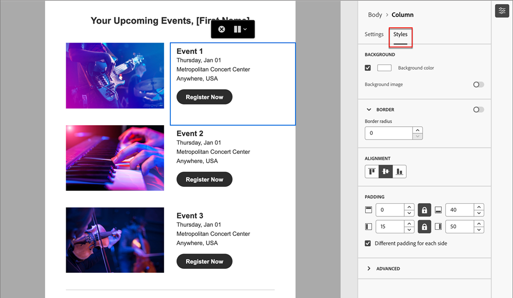

# E-mailontwerp {#email-authoring}

Leer hoe u e-mailberichten kunt maken, personaliseren en bekijken in de nieuwe Marketo Engage-e-mailtoepassing Designer.

>[!IMPORTANT]
>
>Dit artikel is alleen van toepassing op leden van de bètaversie van de Nieuwe Marketo Engage-e-maileditor. Verspreid niet.

## Een e-mail maken {#create-an-email}

1. Login aan Marketo Engage via [ Adobe Experience Cloud ](https://experiencecloud.adobe.com/) {target="_blank"}.

1. In Mijn Marketo, uitgezochte **Studio van het Ontwerp**.

   

1. In de boom, uitgezochte **E-mail (Nieuwe Redacteur)**.

   

1. Klik **creëren e-mail** knoop.

   

1. Voer een e-mailnaam en een onderwerpregel in. Klik **creëren**.

   

Dat is het. Nu is het tijd om je e-mail te ontwerpen.

## Kies uw inhoudstype {#choose-your-content-type}

1. In e-mail u enkel creeerde, klik **toevoegen e-mailinhoud**.

   

1. _creeer uw e-mail_ pagina laadt. U kunt uit een paar opties kiezen:

* [ Ontwerp van kras ](#design-from-scratch) gebruikend de visuele e-mailredacteur

* [ voer uw eigen HTML ](#import-html) via een HTML of zip dossier in

* [ selecteer een bestaand malplaatje ](#choose-a-template) (één van onze steekproeven of één u reeds bewaarde)

### Ontwerpen vanaf nul {#design-from-scratch}

Wanneer u helemaal niets begint in de e-maileditor, gebruikt u de onderstaande opties om uw inhoud te definiëren.

1. In _creeer uw e-mail_ pagina, uitgezocht **Ontwerp van kras**.

1. Voeg [ structuur en inhoud ](#add-structure-and-content) aan uw e-mail toe.

1. Voeg [ beelden ](#add-assets) toe.

1. [ Personaliseer ](#personalize-content) uw inhoud.

1. De verbindingen van het overzicht en [ geven het volgen ](#edit-url-tracking) uit.

### HTML importeren {#import-html}

U kunt bestaande HTML-inhoud importeren om uw e-mail te ontwerpen. De inhoud kan zijn:

* Een HTML-bestand met een opgenomen stijlblad

* Een zip-bestand dat een HTML-bestand, de stijlpagina (.css) en afbeeldingen bevat

>[!NOTE]
>
>Er gelden geen beperkingen voor de .zip-bestandsstructuur. Verwijzingen moeten echter relatief zijn en passen bij de boomstructuur van de ZIP-map.

1. In het Ontwerp uw malplaatjepagina, uitgezochte **HTML van de Invoer**.

1. De belemmering en laat vallen het gewenste HTML of .zip dossier (of selecteert een dossier van uw computer) en klikt **de Invoer**.

   

>[!NOTE]
>
>Wanneer de HTML-inhoud wordt geüpload, wordt de inhoud in de compatibiliteitsmodus uitgevoerd. In deze modus kunt u alleen uw tekst aanpassen, koppelingen toevoegen of elementen aan uw inhoud toevoegen.

U kunt gewenste veranderingen in de ingevoerde inhoud aanbrengen gebruikend de [ visuele e-mailredacteurshulpmiddelen ](#add-structure-and-content).

### Een sjabloon kiezen {#choose-a-template}

Er zijn twee typen sjablonen waaruit u kunt kiezen.

* Voorbeeldsjablonen: Marketo Engage bevat vier e-mailsjablonen die buiten de box vallen.

* Opgeslagen sjablonen: dit zijn geheel nieuwe sjablonen die u hebt gemaakt via het menu Sjablonen of via een e-mail die u hebt gemaakt en die u als sjabloon hebt opgeslagen.

>[!BEGINTABS]

>[!TAB  malplaatjes van de Steekproef ]

Kies een van de out-of-the-box sjablonen voor een head start op uw sjabloonontwerp voor e-mail.

1. Het tabblad Voorbeeldsjablonen is standaard geopend.

1. Selecteer de sjabloon die u wilt gebruiken.

   

1. Klik **Gebruik dit malplaatje**.

   

1. Bewerk de inhoud naar wens met de visuele ontwerper van de inhoud.

>[!TAB  Bewaarde malplaatjes ]

1. Klik het **Bewaarde malplaatjes** lusje en selecteer het gewenste malplaatje.

   

1. Klik **Gebruik dit malplaatje**.

   

1. Bewerk de inhoud naar wens met de visuele ontwerper van de inhoud.

>[!ENDTABS]

## Structuur en inhoud toevoegen {#add-structure-and-content}

1. Als u wilt beginnen met het maken of wijzigen van inhoud, sleept u een item van Structuren naar het canvas. Bewerk de instellingen in het deelvenster aan de rechterkant.

   >[!TIP]
   >
   >Selecteer de n:n kolomcomponent om het aantal kolommen van uw keus (tussen drie en 10) te bepalen. U kunt ook de breedte van elke kolom definiëren door de pijlen onder de kolom te verplaatsen.

   

   >[!NOTE]
   >
   >Elke kolomgrootte mag niet kleiner zijn dan 10% van de totale breedte van de structuurcomponent. Alleen lege kolommen kunnen worden verwijderd.

1. Sleep in het gedeelte Inhoud over de gewenste items en zet deze neer in een of meer structuurcomponenten.

   

1. Elke component kan worden aangepast via de tabbladen Instellingen of Stijl. Wijzig het lettertype, de tekststijl, de marge en meer.

### Assets toevoegen {#add-assets}

```
ADD ASSETS OR ADD IMAGES? WHAT OTHER ASSETS CAN YOU ADD?
```

```
Access assets stored in the Assets library. IMAGES AND FILES ONLY?
```

1. Klik op het pictogram Asset Selector om uw afbeeldingen te openen.

   SCREENSHOT

1. Sleep de gewenste afbeelding naar een structuurcomponent.

   SCREENSHOT

   >[!NOTE]
   >
   >Om een bestaand beeld te vervangen, selecteer het, dan klik **selecteer een activa** in het lusje van Montages op het recht.

Klik op Voorwaardelijke inhoud inschakelen om dynamische inhoud toe te voegen en de inhoud aan te passen aan de doelprofielen op basis van voorwaardelijke regels.


Indien nodig, kunt u uw e-mail verder personaliseren door Overschakelen naar code redacteur van het geavanceerde menu te klikken. Op deze manier kunt u de broncode van de e-mail bewerken, bijvoorbeeld door tags voor bijhouden of aangepaste HTML toe te voegen.

VOORZIENING
U kunt niet terugkeren naar de visuele ontwerper voor deze e-mail na het schakelen naar de coderedacteur.

Wanneer de inhoud gereed is, klikt u op de knop Inhoud simuleren om de rendering te controleren. U kunt kiezen voor de weergave Computer of Mobiel.

Klik, indien gereed, op Opslaan

### Lagen, instellingen en stijlen {#layers-settings-styles}

```
ARE THEY CALLED LAYERS OR COMPONENTS
```

Open de navigatieboom om tot specifieke structuren en hun kolommen/componenten voor meer korrelige het uitgeven toegang te hebben. Klik op het pictogram Navigatieboom om toegang te krijgen.


In het onderstaande voorbeeld worden de stappen beschreven voor het aanpassen van de opvulling en de verticale uitlijning binnen een structuurcomponent die uit kolommen bestaat.

1. Selecteer de kolom in de structuurcomponent direct in het canvas of gebruikend de _boom van de Navigatie_ die bij de linkerzijde wordt getoond.

1. Klik in de kolomwerkbalk op het gereedschap _[!UICONTROL Select a column]_en kies het gereedschap dat u wilt bewerken.

   U kunt deze ook selecteren in de boomstructuur. De bewerkbare parameters voor die kolom worden weergegeven op de tabbladen _[!UICONTROL Settings]_en_[!UICONTROL Styles]_ rechts.

   

1. Als u de kolomeigenschappen wilt bewerken, klikt u op de tab _[!UICONTROL Styles]_aan de rechterkant en wijzigt u deze naar wens:

   * Wijzig voor **[!UICONTROL Background]** de achtergrondkleur zo nodig.

     Schakel het selectievakje voor een transparante achtergrond uit. Schakel de instelling **[!UICONTROL Background image]** in om een afbeelding te gebruiken als achtergrond in plaats van als een effen kleur.

   * Voor **[!UICONTROL Alignment]**, selecteer de _Hoogste_, _Midden_, of _Onderste_ pictogram.
   * Definieer bij **[!UICONTROL Padding]** de opvulling voor alle zijden.

     Selecteer **[!UICONTROL Different padding for each side]** als u de opvulling wilt aanpassen. Klik het __ pictogram van het Slot {om synchronisatie te breken.

   * Vouw de sectie **[!UICONTROL Advanced]** uit om inline stijlen voor de kolom te definiëren.

   

1. Herhaal deze stappen zo nodig om de uitlijning en opvulling voor de andere kolommen in de component aan te passen.

1. Sla uw wijzigingen op.

### Inhoud personaliseren {#personalize-content}

Tokens werken in de nieuwe redacteur de zelfde manier zij in het oude, maar het pictogram ziet er anders uit. In het onderstaande voorbeeld wordt een voornaamtoken toegevoegd met terugvaltekst.

1. Selecteer de tekstcomponent. Plaats de curseur waar u het teken wilt verschijnen en **klikken verpersoonlijking** pictogram toevoegt.

   

1. Klik het gewenste [ symbolische type ](/help/marketo/product-docs/demand-generation/landing-pages/personalizing-landing-pages/tokens-overview.md){target="_blank"}.

   

1. Zoek het gewenste token en klik op het pictogram **...** (als u op het pictogram + klikt, wordt in plaats daarvan een token zonder terugvaltekst toegevoegd).

   

   >[!NOTE]
   >
   >De &quot;tekst van de reserve&quot;is de nieuwe redacteurstermijn voor standaardwaarde. Voorbeeld: ``{{lead.First Name:default=Friend}}`` . Het wordt aanbevolen als er geen waarde is voor de persoon in het veld dat u kiest.

1. Plaats uw reservetekst en klik **toevoegen**.

   

1. Klik **sparen**.

### URL-tracking bewerken {#edit-url-tracking}

Soms wilt u de URL voor het bijhouden van Marketo niet inschakelen voor een koppeling in een e-mailbericht. Dit is handig wanneer de doelpagina geen URL-parameters ondersteunt en een verbroken koppeling tot gevolg kan hebben.

1. Klik op het pictogram Koppelingen om alle URL&#39;s in uw e-mail weer te geven.

   

1. Klik op het potloodpictogram om de tekstspatiëring voor de gewenste koppelingen te bewerken.

1. Klik het **Volgen Type** drop-down en maak uw selectie.

   

   ```
   LABEL?
   
   TAGS?
   ```

   <table><tbody>
     <tr>
       <td><b>Track zonder mkt_tok</b></td>
       <td>definitie</td>
     </tr>
     <tr>
       <td><b>Bijhouden met mkt_tok</b></td>
       <td>definitie</td>
     </tr>
     <tr>
       <td><b>Niet bijhouden</b></td>
       <td>definitie</td>
     </tr>
   </tbody>
   </table>

1. Klik **sparen** wanneer gedaan.

## Waarschuwingen controleren {#check-alerts}

Terwijl u de inhoud ontwerpt, worden waarschuwingen rechtsboven op het scherm weergegeven wanneer er geen toetseninstellingen aanwezig zijn.

Er zijn twee typen waarschuwingen:

**Waarschuwingen**

De waarschuwingen verwijzen naar aanbevelingen en beste praktijken zoals:

* **de opt-out verbinding is niet aanwezig in het e-maillichaam**: Terwijl unsubscribe verbindingen een vereiste zijn, is het toevoegen van hen aan het lichaam van uw e-mail een beste praktijk.

>[!NOTE]
>
>Het toevoegen van een unsubscribe optie wordt niet vereist voor [ Operationele E-mail ](/help/marketo/product-docs/email-marketing/general/functions-in-the-editor/make-an-email-operational.md) (niet-marketing).

* **de versie van de Tekst van HTML is leeg**: U moet een tekstversie van uw e-maillichaam bepalen voor wanneer de inhoud van de HTML niet kan worden getoond.

* **Lege verbinding is aanwezig in e-maillichaam**: Verifieer alle verbindingen in uw e-mail correct zijn.

* **e-mailgrootte heeft de grens van 100KB** overschreden: Voor optimale levering, zorg ervoor de grootte van uw e-mail niet 100KB overschrijdt.

**Fouten**

Fouten verhinderen dat u de e-mail verzendt of test totdat deze is opgelost:

* **Onderwerpregel mist**: Een e-mailonderwerpregel wordt vereist.

* **E-mailversie van het bericht is leeg**: Deze fout komt voor wanneer de e-mailinhoud niet is gevormd.

## Uw e-mail testen {#test-your-email}

Wanneer de inhoud van uw bericht is gedefinieerd, kunt u testprofielen gebruiken om deze voor te vertonen, proefdrukken te verzenden en om te bepalen hoe deze wordt weergegeven in populaire desktops, mobiele clients en webclients. Als u gepersonaliseerde inhoud opnam, kunt u controleren hoe het in het bericht wordt getoond gebruikend de gegevens van het testprofiel.

Om uw e-mailinhoud voor te vertonen, klik **inhoud** simuleren, dan voeg een testprofiel toe om uw bericht te controleren gebruikend de gegevens van het testprofiel.


## Verwijzen naar een e-mail {#reference-an-email}

Nadat u een e-mail in de nieuwe redacteur hebt gecreeerd, kunt u het in Slimme Campagnes en/of Slimme Lijsten van verwijzingen voorzien zoals u met een andere e-mail.

* Verwijzing het in een Slimme Lijst door [ na de gebruikelijke stappen ](/help/marketo/product-docs/core-marketo-concepts/smart-lists-and-static-lists/creating-a-smart-list/create-a-smart-list.md).

* Verwijzing het in een Slimme Campagne door [ na de gebruikelijke stappen ](/help/marketo/product-docs/core-marketo-concepts/smart-campaigns/creating-a-smart-campaign/create-a-new-smart-campaign.md).

>[!NOTE]
>
>Er kan alleen naar opgeslagen e-mails worden verwezen. De nieuwe e-maileditor bevat geen status &quot;goedgekeurd&quot;.

>[!MORELIKETHIS]
>
>[ E-mailmalplaatjes ](/help/marketo/product-docs/email-marketing/general/beta-new-email-editor/email-templates.md){target="_blank"}: Leer hoe te om, tot een e-mailmalplaatje in de nieuwe redacteur te leiden te ontwerpen en toegang te hebben.
