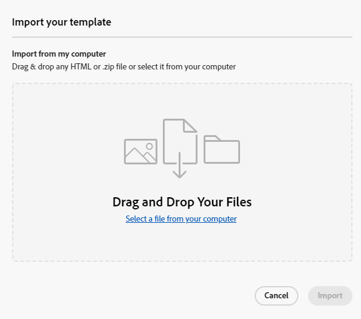
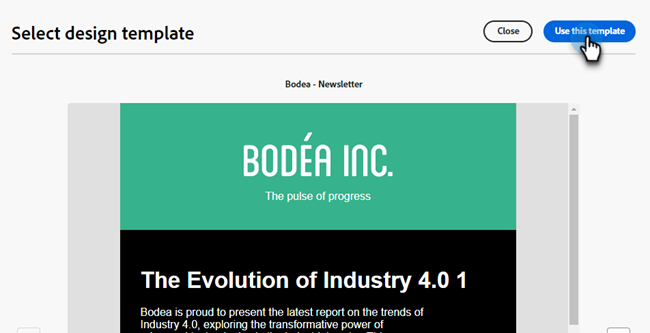

# E-mailsjablonen {#email-templates}

Voor een versnelde en verbeterde ontwerpprocedure kunt u zelfstandige e-mailsjablonen maken om aangepaste inhoud eenvoudig te hergebruiken.

>[!IMPORTANT]
>
>Dit artikel is alleen van toepassing op leden van de bètaversie van de Nieuwe Marketo Engage-e-maileditor. Verspreid niet.

>[!NOTE]
>
>E-mailsjablonen in de nieuwe e-maileditor kunnen alleen worden gebruikt om e-mailberichten te maken in de nieuwe e-maileditor. In de oude e-maileditor kan niet naar deze instellingen worden verwezen.

## Een e-mailsjabloon maken {#create-an-email-template}

1. Login aan Marketo Engage via [ Adobe Experience Cloud ](https://experiencecloud.adobe.com/) {target="_blank"}.

1. In Mijn Marketo, uitgezochte **Studio van het Ontwerp**.

   

1. In de boom, uitgezochte **E-mailMalplaatjes (Nieuwe Redacteur)**.

   

1. Klik **creeer malplaatje** knoop.

   

1. Voer een sjabloonnaam en een optionele beschrijving in. Klik **creëren**.

   

## Uw sjabloon ontwerpen {#design-your-template}

In het _Ontwerp uw malplaatje_ pagina, kunt u van een paar opties kiezen. [ Ontwerp van kras ](#design-from-scratch), [ voert uw eigen HTML ](#import-html) in, of [ selecteert een bestaand malplaatje ](#choose-a-template) (één van onze steekproeven of één u reeds) bewaarde.


### Ontwerpen vanaf nul {#design-from-scratch}

Definieer de inhoud door structuurelementen toe te voegen en te verplaatsen met eenvoudige acties voor slepen en neerzetten.

1. In het _Ontwerp uw malplaatje_ pagina, uitgezocht **Ontwerp van kras**.

1. Voeg [ structuur en inhoud ](#add-structure-and-content) toe.

### HTML importeren {#import-your-html}

U kunt bestaande HTML-inhoud importeren om uw e-mailsjablonen te ontwerpen. De inhoud kan zijn:

* Een HTML-bestand met een opgenomen stijlblad

* Een zip-bestand dat een HTML-bestand, de stijlpagina (.css) en afbeeldingen bevat

>[!NOTE]
>
>Er gelden geen beperkingen voor de .zip-bestandsstructuur. Verwijzingen moeten echter relatief zijn en passen bij de boomstructuur van de ZIP-map.

1. In het _Ontwerp uw malplaatje_ pagina, uitgezochte **HTML van de Invoer**.

1. De belemmering en laat vallen het gewenste HTML of .zip dossier (of selecteert een dossier van uw computer) en klikt **de Invoer**.

   

   >[!NOTE]
   >
   >Wanneer de HTML-inhoud wordt geüpload, wordt de inhoud in de compatibiliteitsmodus uitgevoerd. In deze modus kunt u alleen uw tekst aanpassen, koppelingen toevoegen of elementen aan uw inhoud toevoegen.

1. Om hefboomwerking te kunnen gebruiken de de inhoudscomponenten van Designer E-mail, klik de **converter van de HTML** tabel en klik **Omzetten**.

   SCREENSHOT

   >[!CAUTION]
   >
   >Als u een `<table>` -tag als eerste laag in een HTML-bestand gebruikt, kan dit leiden tot stijlverlies, zoals de achtergrond- en breedte-instellingen in de bovenste laagtag.

U kunt het geïmporteerde bestand nu naar wens aanpassen met de visuele e-maileditor.

### Een sjabloon kiezen {#choose-a-template}

Er zijn twee typen sjablonen waaruit u kunt kiezen.

* Voorbeeldsjablonen: Marketo Engage bevat vier e-mailsjablonen die buiten de box vallen.

* Opgeslagen sjablonen: dit zijn geheel nieuwe sjablonen die u hebt gemaakt via het menu Sjablonen of via een e-mail die u hebt gemaakt en die u als sjabloon hebt opgeslagen.

>[!BEGINTABS]

>[!TAB  malplaatjes van de Steekproef ]

Kies een van de out-of-the-box sjablonen voor een head start op uw sjabloonontwerp voor e-mail.

1. Het tabblad Voorbeeldsjablonen is standaard geopend.

1. Selecteer de sjabloon die u wilt gebruiken.

   

1. Klik **Gebruik dit malplaatje**.

   

1. Bewerk de inhoud naar wens met de visuele ontwerper van de inhoud.

>[!TAB  Bewaarde malplaatjes ]

1. Klik het **Bewaarde malplaatjes** lusje en selecteer het gewenste malplaatje.

   

1. Klik **Gebruik dit malplaatje**.

   

1. Bewerk de inhoud naar wens met de visuele ontwerper van de inhoud.

>[!ENDTABS]

## Structuur en inhoud toevoegen {#add-structure-and-content}

1. Als u wilt beginnen met het maken of wijzigen van inhoud, sleept u een item van Structuren naar het canvas. Bewerk de instellingen in het deelvenster aan de rechterkant.

   >[!TIP]
   >
   >Selecteer de n:n kolomcomponent om het aantal kolommen van uw keus (tussen drie en 10) te bepalen. U kunt ook de breedte van elke kolom definiëren door de pijlen onder de kolom te verplaatsen.

   

   >[!NOTE]
   >
   >Elke kolomgrootte mag niet kleiner zijn dan 10% van de totale breedte van de structuurcomponent. Alleen lege kolommen kunnen worden verwijderd.

1. Sleep in het gedeelte Inhoud over de gewenste items en zet deze neer in een of meer structuurcomponenten.

   

1. Elke component kan worden aangepast via de tabbladen Instellingen of Stijl. Wijzig het lettertype, de tekststijl, de marge en meer.

SCREENSHOT

### Assets toevoegen {#add-assets}

```
ADD ASSETS OR ADD IMAGES? WHAT OTHER ASSETS CAN YOU ADD?
```

```
Access assets stored in the Assets library. IMAGES AND FILES ONLY?
```

1. Klik op het pictogram Asset Selector om uw afbeeldingen te openen.

   SCREENSHOT

1. Sleep de gewenste afbeelding naar een structuurcomponent.

   SCREENSHOT

   >[!NOTE]
   >
   >Om een bestaand beeld te vervangen, selecteer het, dan klik **selecteer een activa** in het lusje van Montages op het recht.

Klik op Voorwaardelijke inhoud inschakelen om dynamische inhoud toe te voegen en de inhoud aan te passen aan de doelprofielen op basis van voorwaardelijke regels.


Indien nodig, kunt u uw e-mail verder personaliseren door Overschakelen naar code redacteur van het geavanceerde menu te klikken. Op deze manier kunt u de broncode van de e-mail bewerken, bijvoorbeeld door tags voor bijhouden of aangepaste HTML toe te voegen.

VOORZIENING
U kunt niet terugkeren naar de visuele ontwerper voor deze e-mail na het schakelen naar de coderedacteur.

Wanneer de inhoud gereed is, klikt u op de knop Inhoud simuleren om de rendering te controleren. U kunt kiezen voor de weergave Computer of Mobiel.

Klik, indien gereed, op Opslaan

### Lagen, instellingen en stijlen {#layers-settings-styles}

```
ARE THEY CALLED LAYERS OR COMPONENTS
```

Open de navigatieboom om tot specifieke structuren en hun kolommen/componenten voor meer korrelige het uitgeven toegang te hebben.

1. Klik op het pictogram Navigatieboom om toegang te krijgen.

SCREENSHOT


In het onderstaande voorbeeld wordt beschreven hoe u opvulling en verticale uitlijning kunt aanpassen binnen een structuurcomponent die uit drie kolommen bestaat.

Selecteer de structuurcomponent rechtstreeks in de e-mail of met behulp van de navigatiestructuur die beschikbaar is in het menu aan de linkerkant.

Klik in de werkbalk op Een kolom selecteren en kies de kolom die u wilt bewerken. U kunt deze ook selecteren in de boomstructuur.

De bewerkbare parameters voor die kolom worden weergegeven op het tabblad Stijlen.


Selecteer Boven, Midden of Onder Uitlijning onder.


Definieer onder Opvulling de opvulling voor alle zijden.

Selecteer Verschillende opvulling voor elke zijde als u de opvulling wilt verfijnen. Klik op het vergrendelingspictogram om de synchronisatie te verbreken.


Ga op dezelfde manier te werk om de uitlijning en opvulling van de andere kolommen aan te passen.

Sla uw wijzigingen op.


### Inhoud personaliseren {#personalize-content}

Tokens werken in de nieuwe redacteur de zelfde manier zij in het oude, maar het pictogram ziet er anders uit.

1. Selecteer de tekstcomponent en klik **verpersoonlijking** pictogram toevoegen.

   SCREENSHOT

1. Klik het gewenste [ symbolische type ](/help/marketo/product-docs/demand-generation/landing-pages/personalizing-landing-pages/tokens-overview.md){target="_blank"}.

   SCREENSHOT

1. Klik op + of ... om een token toe te voegen aan de lege ruimte.

   SCREENSHOT

   >[!NOTE]
   >
   >De &quot;tekst van de reserve&quot;is de nieuwe redacteurstermijn voor standaardwaarde. Voorbeeld: ``{{lead.First Name:default=Friend}}``

1. Klik **sparen** wanneer gedaan.

### URL-tracking bewerken {#edit-url-tracking}

Soms wilt u de URL voor het bijhouden van Marketo niet inschakelen voor een koppeling in een e-mailbericht. Dit is handig wanneer de doelpagina geen URL-parameters ondersteunt en een verbroken koppeling tot gevolg kan hebben.

1. Klik op het pictogram Koppelingen om alle URL&#39;s in uw e-mail weer te geven.

   SCREENSHOT

1. Klik op het potloodpictogram om de tekstspatiëring voor de gewenste koppelingen te bewerken.

   SCREENSHOT

   ```
   LABEL?
   
   TAGS?
   ```

   <table><tbody>
     <tr>
       <td><b>Track zonder mkt_tok</b></td>
       <td>definitie</td>
     </tr>
     <tr>
       <td><b>Bijhouden met mkt_tok</b></td>
       <td>definitie</td>
     </tr>
     <tr>
       <td><b>Niet bijhouden</b></td>
       <td>definitie</td>
     </tr>
   </tbody>
   </table>

1. Klik **sparen** wanneer gedaan.

### Weergaveopties {#view-options}

Gebruik de opties voor weergave- en inhoudsvalidatie die beschikbaar zijn in de visuele e-maileditor.

* Zoom in of uit op de inhoud met behulp van vooraf ingestelde zoomopties.

* Geef de inhoud weer op desktopcomputers, mobiele apparaten en tekstvelden.

   * Klik op het pictogram van de live weergave (oog) voor de voorvertoning van inhoud op verschillende apparaten.

   * Selecteer een van de apparaten uit de doos of voer aangepaste afmetingen in om een voorvertoning van uw inhoud weer te geven.

### Meer opties {#more-options}

Van **Meer** opties in de inhoudsredacteur, kunt u de volgende acties nemen:

SCREENSHOT

* **malplaatje van het Terugstellen**: Selecteer dit om het visuele e-maildesigner canvas aan een lege lei te ontruimen en de bouwende inhoud opnieuw te beginnen.

* **Verandering uw ontwerp**: Terugkeer aan het _Ontwerp uw malplaatje_ pagina. Van hier, kunt u om het even welke cursus van actie zoals die in [ wordt geschetst Ontwerp uw malplaatje ](#design-your-template) sectie.

* **de Uitvoer HTML**: Download de inhoud in het visuele canvas aan uw lokaal systeem in HTML formaat dat als zip dossier wordt verpakt.

## Sjabloondetails weergeven {#view-template-details}

In de _E-mail malplaatjes_ het vermelden pagina, klik de naam van een e-mailmalplaatje om zijn details te bekijken.

SCREENSHOT

U kunt basisgegevens zoals naam en beschrijving bewerken. Klik buiten het veld dat u hebt bewerkt om de wijzigingen op te slaan.

Klik **Meer** om uw malplaatje snel te schrappen of te dupliceren.

Als er actieve waarschuwingen zijn (fouten/waarschuwingen voor de e-mailsjabloon), klikt u op Waarschuwingen om de informatie weer te geven.

>[!NOTE]
>
>Hoewel deze waarschuwingen het gebruik van de e-mailsjabloon voor het maken van e-mail niet verbieden, biedt de informatie inzicht in wat mogelijk niet werkt en in de updates die nodig zijn voordat de e-mail kan worden gebruikt voor levering.

## E-mailsjabloon weergeven die wordt gebruikt door verwijzingen {#email-template-used-by-references}

In de samenvatting van het e-mailmalplaatje, klik **Gebruikt door** tabel om details van te bekijken waar dit e-mailmalplaatje binnen Marketo Engage is gebruikt.

SCREENSHOT

## E-mailsjablonen bewerken {#edit-email-templates}

Deze actie kan worden uitgevoerd op:

* Het detaillusje - klik **uitgeeft e-mailmalplaatje**.

* De _e-mailmalplaatjes_ lijst pagina - klik het Meer actiepictogram (drie punten) van het gewenste e-mailmalplaatje en kies uitgeven.

```
THE SECOND ONE DOESN'T WORK IN MARKETO?? JUST LISTS DUPE AND DELETE
```

Deze actie neemt u aan het _Ontwerp uw malplaatje_ pagina of de visuele pagina van de inhoudsredacteur die op het laatste bewaarde statuut van het e-mailmalplaatje wordt gebaseerd. Vanaf hier kunt u de inhoud van uw e-mailsjabloon naar wens bewerken. Zie E-mailsjablonen maken voor informatie over de bewerkingsopties.

## E-mailsjablonen dupliceren {#duplicate-email-templates}

U kunt een e-mailsjabloon op twee manieren dupliceren:

* Van de e-mailmalplaatjedetails op het recht, klik **Meer** en selecteer **Dupliceer**.

SCREENSHOT

* In de _E-mail malplaatjes_ het vermelden pagina, klik het Meer actiepictogram (drie punten) van het gewenste e-mailmalplaatje en kies **Dupliceer**.

Voer in het dialoogvenster een unieke naam en een optionele beschrijving in. Klik **Dupliceren** wanneer gedaan.

Het gedupliceerde e-mailmalplaatje verschijnt dan in de _E-mailmalplaatjes_ lijstpagina.

## E-mailsjablonen verwijderen {#delete-email-templates}

U kunt een e-mailsjabloon op twee manieren verwijderen.

>[!CAUTION]
>
>Het verwijderen van een e-mailsjabloon kan niet ongedaan worden gemaakt.

* Van de e-mailmalplaatjedetails op het recht, klik **Meer** en selecteer **Schrapping**.

SCREENSHOT

* In de _E-mail malplaatjes_ het vermelden pagina, klik het Meer actiepictogram (drie punten) van het gewenste e-mailmalplaatje en kies **Schrapping**.

## Bulkacties {#bulk-actions}

Van de _E-mail malplaatjes_ lijst pagina, selecteer veelvoudige malplaatjes door checkboxes aan de linkerzijde te selecteren. Onderaan wordt een banner weergegeven.

**Schrapping**: U kunt een maximum van 20 malplaatjes in één keer schrappen. In een bevestigingsdialoogvenster kunt u de handeling afbreken of de verwijdering bevestigen.

>[!MORELIKETHIS]
>
>[ E-mail authoring ](/help/marketo/product-docs/email-marketing/general/beta-new-email-editor/email-authoring.md){target="_blank"}: Leer hoe te om, een e-mail in de nieuwe redacteur tot stand te brengen te ontwerpen en van verwijzingen te voorzien.
