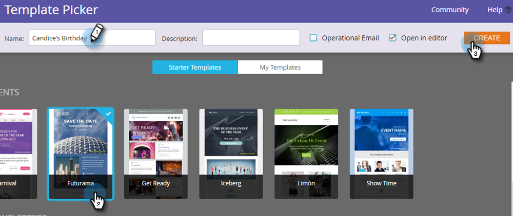

# Een e-mail maken {#create-an-email}

Er zijn twee manieren om een e-mailbericht te maken in Marketo. Laten we naar beide kijken.

## Een e-mail maken in de Design Studio {#create-an-email-in-the-design-studio}

1. Ga naar de **[!UICONTROL Design Studio]** .

   

1. Klik op de vervolgkeuzelijst **[!UICONTROL New]** en selecteer **[!UICONTROL New Email]** .

   

   >[!NOTE]
   >
   >Wanneer u een e-mail in [!UICONTROL Design Studio] creeert, kan het in de boom onder &quot;[!UICONTROL Emails]&quot;worden gevonden.

Eenvoudig! Nu andersom...

## E-mail maken bij marketingactiviteiten {#create-an-email-in-marketing-activities}

1. Ga naar **[!UICONTROL Marketing Activities]** .

   

1. Selecteer het programma waaraan u de e-mail wilt toevoegen, klik op de vervolgkeuzelijst **[!UICONTROL New]** en selecteer **[!UICONTROL New Local Asset]** .

   

1. Klik op **[!UICONTROL Email]**.

   

   En dat is het!

Welke methode u kiest, brengt u naar de sjabloonkiezer.

1. Geef uw e-mailadres een naam, klik op de sjabloon die u wilt gebruiken en klik op **[!UICONTROL Create]** .

   

   >[!NOTE]
   >
   >U kunt kiezen uit een verzameling kant-en-klare responsieve e-mailsjablonen of een sjabloon die u hebt opgeslagen door eerst **[!UICONTROL My Templates]** te selecteren en dezelfde stappen uit te voeren.

1. Voer een onderwerpregel in. De aanbevolen tekenlimiet is 50.

   

   Afhankelijk van de sjabloon die u hebt gekozen, hebt u verschillende opties om uw e-mail te bewerken. Voor e-mail met modules, controleer [ Modules aan uw E-mail ](/help/marketo/product-docs/email-marketing/general/email-editor-2/add-modules-to-your-email.md) toevoegen.

Uw e-mailadres is nu gemaakt, dus bewerk het weg!

>[!MORELIKETHIS]
>
>[ geef Uw E-mailkopbal uit ](/help/marketo/product-docs/email-marketing/general/creating-an-email/edit-your-email-header.md)
