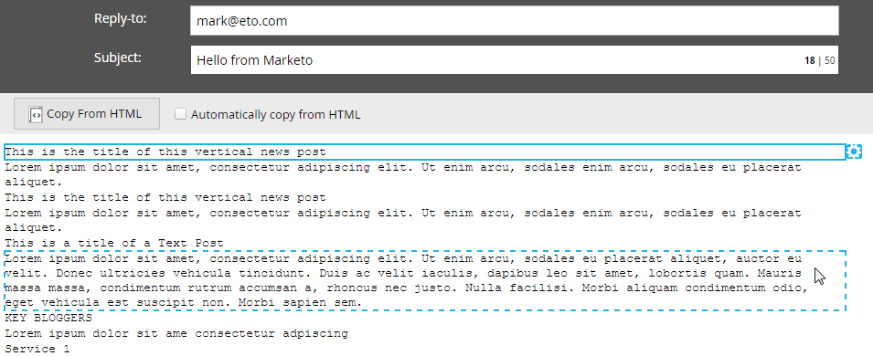

# De tekstversie van een e-mail bewerken {#edit-the-text-version-of-an-email}

Wanneer u een e-mailbericht maakt, wilt u mogelijk dat de tekstversie anders wordt geformuleerd dan de HTML-versie. Marketo kopieert standaard automatisch de tekstinhoud van alle tekstelementen in uw e-mail naar de tekstversie. Hieronder wordt beschreven hoe u het bestand kunt bewerken.

>[!NOTE]
>
>Dit is geen artikel over het maken van een e-mail met alleen tekst. Voor informatie over dat, zie [ een tekst-Enige E-mail ](/help/marketo/product-docs/email-marketing/general/creating-an-email/create-a-text-only-email.md) creëren.

1. Klik in de e-maileditor op het tabblad **[!UICONTROL Text]** onder aan de e-mail.

   

1. Schakel **[!UICONTROL Automatically copy from HTML]** uit om wijzigingen aan te brengen.

   

1. Dubbelklik op het tekstgebied.

   

1. Breng de gewenste wijzigingen aan. Nadat u klaar bent sluit eenvoudig de redacteur, of ga terug naar de versie van HTML. De wijzigingen worden automatisch opgeslagen.

   

   Als u alleen statische inhoud hebt, kan de tekst in één groot blok worden bewerkt (zie stap 3). Als u dynamische inhoud hebt, wordt de tekst opgedeeld in verschillende bewerkbare secties, zoals hieronder wordt weergegeven.

   

>[!CAUTION]
>
>Het selecteren van **Exemplaar van HTML**, of het opnieuw selecteren **kopieert automatisch van HTML** in e-mails die dynamische inhoud bevatten zal de Gereviseerde vlag aan _waar_ voor alle segmenten (die het groene vinkje veroorzaken dat erop wijst dat het) in zowel HTML als de versies van de Tekst van e-mail is herzien. Als u een van de bovenstaande handelingen uitvoert, moet u de inhoud controleren voordat u deze verzendt.
