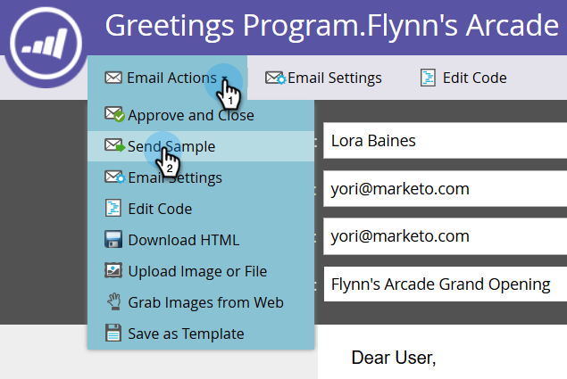

# Een voorbeeld-e-mail verzenden {#send-a-sample-email}

Het is snel en gemakkelijk om voorbeelden van een e-mail te verzenden. Om een dynamische inhouds e-mail te verzenden, zie [&#x200B; Voorproef e-mail met Dynamische Inhoud &#x200B;](/help/marketo/product-docs/email-marketing/general/functions-in-the-editor/preview-an-email-with-dynamic-content.md).

>[!NOTE]
>
>U moet het **Gegevensbestand van de Toegang hebben - Looppas Enige Acties van de Stroom** toestemming om steekproefe-mails te verzenden.

## Een voorbeeld-e-mail verzenden {#send-a-sample-email-1}

1. Zoek en selecteer uw e-mail. Klik op de vervolgkeuzelijst **[!UICONTROL Email Actions]** en selecteer **[!UICONTROL Send Sample]** .
   

   >[!NOTE]
   >
   >Mijn tokens worden omgezet in de waarde die geschikt is voor het e-mailprogramma.

1. Voer een of meerdere e-mailadressen in voor levering. Gebruik komma&#39;s als scheidingsteken voor meerdere e-mailadressen. Klik op **[!UICONTROL Send]** als u klaar bent.

   

   >[!IMPORTANT]
   >
   >Als u meerdere e-mailadressen opgeeft, zijn deze allemaal zichtbaar voor elke ontvanger. Het eerste ingevoerde e-mailadres is de hoofdontvanger en elk volgend e-mailadres is een CC-ontvanger.

   >[!TIP]
   >
   >Als u tokens als specifieke persoon wilt oplossen, verkies genoemde persoon in **persoonlijke drop-down** in Stap 2.

## Een voorbeeld-e-mail verzenden tijdens bewerken {#send-a-sample-email-while-editing}

1. Zoek de e-mail, selecteer deze en klik op de tab **[!UICONTROL Edit Draft]** .

   

1. Klik op **[!UICONTROL Email Actions]** en selecteer **[!UICONTROL Send Sample]** .

   

1. Voer een e-mailadres in voor levering en klik op **[!UICONTROL Send]** .

   

   >[!NOTE]
   >
   >Het trekkergebied is slechts van toepassing voor die die [&#x200B; e-mailscripting &#x200B;](https://experienceleague.adobe.com/nl/docs/marketo-developer/marketo/email-scripting) gebruiken.

## Een voorbeeld-e-mail verzenden op basis van een segment {#send-a-sample-email-based-on-a-segment}

>[!PREREQUISITES]
>
>[&#x200B; pas segmentatie op uw e-mail &#x200B;](/help/marketo/product-docs/email-marketing/general/functions-in-the-editor/using-dynamic-content-in-an-email.md) toe.

1. Zoek de e-mail, selecteer deze en klik op de tab **[!UICONTROL Edit Draft]** .

   

1. Klik op **[!UICONTROL Preview]**.

   

1. Klik op de vervolgkeuzelijst **[!UICONTROL View By]** en selecteer **[!UICONTROL Segmentation]** .

   

1. Er verschijnt een vervolgkeuzelijst met beschikbare segmentaties. Klik erop en selecteer de gewenste optie.

   

1. Gebruik de pijlen om door uw opties te scrollen (in dit geval hebben wij dynamisch de onderwerpregel veranderd).

   

1. Klik op **[!UICONTROL Send Sample]** om een test-e-mail van het segment te ontvangen.

   

   >[!TIP]
   >
   >U kunt ook een e-mailvoorbeeld verzenden op basis van een segment in de bewerkingsmodus van uw e-mail. Klik op de vervolgkeuzelijst **[!UICONTROL Email Actions]** , selecteer **[!UICONTROL Send Sample]** en kies het segment.

Het is erg belangrijk om uw inhoud te samplen voordat u een campagne start. Meet twee keer, knip één keer!
