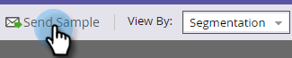

# Een voorbeeld-e-mail verzenden {#send-a-sample-email}

Het is snel en gemakkelijk om voorbeelden van een e-mail te verzenden. Zie [Een e-mail met dynamische inhoud voorvertonen](/help/marketo/product-docs/email-marketing/general/functions-in-the-editor/preview-an-email-with-dynamic-content.md) als u een e-mailbericht met dynamische inhoud wilt verzenden.

>[!NOTE]
>
>U moet **Gegevensbestand van de Toegang hebben - stel Enige Acties van de Stroom in werking** toestemming om steekproefe-mails te verzenden.

## Een voorbeeld-e-mail verzenden {#send-a-sample-email-1}

1. Zoek en selecteer uw e-mail. Klik op de vervolgkeuzelijst **E-mailhandelingen** en selecteer **Monster verzenden**.\
   

   >[!NOTE]
   >
   >Mijn tokens worden omgezet in de waarde die geschikt is voor het e-mailprogramma.

1. Voer een e-mailadres in voor levering en klik op **Verzenden**.

   

   >[!NOTE]
   >
   >Als u meerdere e-mailadressen wilt invoeren, scheidt u deze met komma&#39;s.

   >[!TIP]
   >
   >Als u tokens als specifieke persoon wilt oplossen, verkies genoemde persoon in **persoondrop-down** in Stap 2.

## Een voorbeeld-e-mail verzenden tijdens het bewerken {#send-a-sample-email-while-editing}

1. Zoek uw e-mail, selecteer het en klik **uitgeven Ontwerp** tabel.

   

1. Klik **E-mailacties**, selecteer **Sample verzenden**.

   

1. Voer een e-mailadres in voor levering en klik op **Verzenden**.

   

   >[!NOTE]
   >
   >Het triggerveld is alleen van toepassing op gebruikers die [e-mailscripting](https://developers.marketo.com/documentation/velocity-script/) gebruiken.

## Een voorbeeld-e-mail verzenden op basis van een segment {#send-a-sample-email-based-on-a-segment}

>[!PREREQUISITES]
>
>[Pas segmentatie toe op uw e-mail](/help/marketo/product-docs/email-marketing/general/functions-in-the-editor/using-dynamic-content-in-an-email.md).

1. Zoek uw e-mail, selecteer het en klik **uitgeven Ontwerp** tabel.

   

1. Klik **Voorvertoning**.

   

1. Klik op de vervolgkeuzelijst **Weergeven op** en selecteer **Segmentatie**.

   

1. Er verschijnt een vervolgkeuzelijst met beschikbare segmentaties. Klik erop en selecteer de gewenste optie.

   

1. Gebruik de pijlen om door uw opties te scrollen (in dit geval hebben wij dynamisch de onderwerpregel veranderd).

   

1. Klik op **Sample verzenden** om een teste-mail van uw segment in actie te ontvangen.

   

   >[!TIP]
   >
   >U kunt ook een e-mailvoorbeeld verzenden op basis van een segment in de bewerkingsmodus van uw e-mail. Klik op de vervolgkeuzelijst **E-mailhandelingen**, selecteer **Monster verzenden** en kies vervolgens het segment.

Het is erg belangrijk om uw inhoud te samplen voordat u een campagne start. Meet twee keer, knip één keer!
