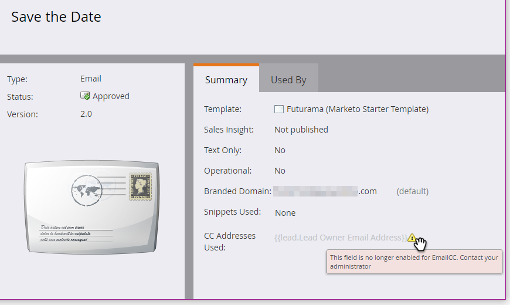

# E-mail CC {#email-cc}

Met e-mail CC kunnen via Marketo opgegeven e-mails worden verzonden met CC-ontvangers.

Deze functie is beschikbaar voor alle e-mailmiddelen van Marketo, ongeacht hoe de e-mail is verzonden (batch- of triggercampagne). De ontvanger van de CC ontvangt een exacte kopie van de e-mail die naar de gekozen Marketo-persoon is verzonden. Daarom worden alle betrokkenheidsactiviteiten (openen, klikken, enz.) geregistreerd bij het activiteitenlogboek van de Marketo-persoon in de regel Aan van de e-mail. Nochtans, zal de leveringsactiviteit (verzonden, geleverd, harde stuit, enz.) _buiten &quot;zachte stuit&quot;_ **niet** registreren, aangezien Marketo niet leveringsgebeurtenissen voor de Persoon van Marketo van de ontvangers van CC kan onderscheiden. Marketo maakt slechts maximaal 100.000 mensen tegelijk CC. Als uw slimme lijst meer dan 100 kB is en het noodzakelijk is iedereen op het wordt CCd, adviseren wij omhoog het breken van uw lijst.

>[!NOTE]
>
>E-mail CC is niet ontworpen voor gebruik met A/B-tests. U kunt het hoe dan ook gebruiken als u wilt, maar aangezien het technisch niet wordt gesteund, zou de Steun van Marketo niet bij het oplossen van problemen kunnen helpen.

## E-mail CC instellen {#set-up-email-cc}

1. In Mijn Marketo, klik **Admin**.

   

1. In de boom, uitgezochte **E-mail**.

   

1. Klik **uitgeven de Montages van E-mail CC**.

   

1. Selecteer maximaal 25 Marketo Lead- of Company-velden (van het type &quot;E-mail&quot;) om beschikbaar te maken voor gebruik als CC-adressen in e-mails. Klik **sparen** wanneer gedaan.

   

## E-mail CC gebruiken {#using-email-cc}

1. Selecteer uw e-mail en klik **uitgeven Ontwerp**.

   

1. Klik **E-mailmontages**.

   

1. Selecteer de velden die u wilt gebruiken voor CC-personen. _Er is een grens van vijf per e-mail_. In dit voorbeeld willen we alleen Lead Owner CC&#39;d. Klik **sparen** wanneer gedaan.

   

   Zo eenvoudig is het! In het bovenstaande voorbeeld is de eigenaar van de lead van de ontvangers die u hebt gekozen CC&#39;d.

   >[!NOTE]
   >
   >Als een ongeldig e-mailadres in een CC-veld staat, wordt het overgeslagen.

   Voor een snelle identificatie toont de weergave E-mailoverzicht u of en welke velden voor e-mail-CC zijn geselecteerd.

   

   Als e-mail wordt goedgekeurd, maar Marketo Admin één of meerdere gebieden van CC onbruikbaar maakt alvorens e-mail wordt verzonden, **zullen die mensen geen e-mail** ontvangen. In dat geval worden in de weergave E-mailoverzicht alle velden weergegeven die na goedkeuring zijn uitgeschakeld maar vooraf zijn verzonden:

   

   >[!NOTE]
   >
   >De bovenstaande fout wordt ook weergegeven in het gedeelte E-mailinstellingen van het e-mailconcept.

## Na de verzendknop {#after-the-send}

* Als een ontvanger van CC op een bijgehouden koppeling in de e-mail klikt, wordt de muisklik (net als alle andere betrokkenheidsactiviteiten) gekoppeld aan de hoofdontvanger van de e-mail. Bovendien kunnen ze door klikken naar een pagina met Marketo-webtrackingcode (munchkin.js), waardoor ze als de hoofdontvanger worden gekopieerd.

>[!TIP]
>
>U hebt de optie van [ onbruikbaar makend wat of alle het volgen verbindingen ](/help/marketo/product-docs/email-marketing/general/functions-in-the-editor/disable-tracking-for-an-email-link.md) in e-mail.

* Nadat een e-mailcampagne is uitgevoerd, bevat Verzenden e-mailactiviteit een lijst met alle CC-adressen die zijn opgenomen voor elke ontvanger van de mailing. Als om het even welke adressen van CC wegens afmelden werden overgeslagen, zal het ook in de activiteit worden genoteerd.
* Koppelingen en pagina&#39;s waarop u zich niet meer abonneert, functioneren normaal in CC&#39;d-e-mails. Op deze manier kunnen CC-ontvangers hun abonnement desgewenst opzeggen (conform de anti-spamregels) en wordt een record van deze actie opgeslagen in de Marketo-database.
* De mensen die als niet geabonneerd in uw Gegevensbestand van Marketo worden vermeld zullen **niet** e-mails via CC ontvangen.
