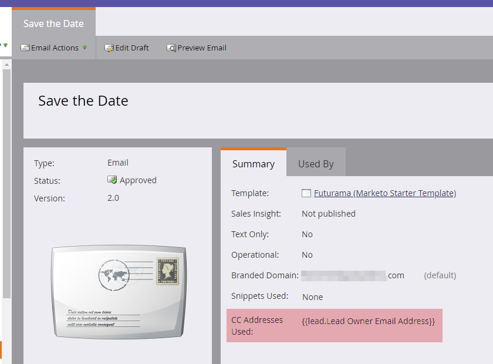

# E-mail CC {#email-cc}

Met e-mail CC kunnen via Marketo opgegeven e-mails worden verzonden met CC-ontvangers.

Deze functie is beschikbaar op alle e-mailmiddelen van Marketo, ongeacht hoe de e-mail is verzonden (batch- of triggercampagne). De ontvanger van CC zal een nauwkeurige kopie van e-mail ontvangen die naar de gekozen persoon van het Marketo wordt verzonden. Als zodanig, om het even welke betrokkenheidsactiviteit (opent, klikt, enz.) zal aan het activiteitenlogboek van de Persoon van de Marketo in &quot;aan&quot;lijn van e-mail worden geregistreerd. De leveringsactiviteit (verzonden, geleverd, hard bounce, enz.) *Met uitzondering van &quot;soft bounce&quot;* zal zich **niet** registreren, aangezien Marketo geen leveringsgebeurtenissen voor de Persoon van Marketo van de ontvangers van CC kan onderscheiden&quot;. Marketo maakt slechts maximaal 100.000 mensen tegelijk beschikbaar. Als uw slimme lijst meer dan 100 kB is en het noodzakelijk is iedereen op het wordt CCd, adviseren wij omhoog het breken van uw lijst.

>[!NOTE]
>
>E-mail CC is niet ontworpen voor gebruik met A/B-tests. U kunt het hoe dan ook gebruiken als u wilt, nochtans aangezien het technisch niet gesteund is, zou de Steun van Marketo niet met het oplossen van problemen kunnen helpen.

## E-mail CC instellen {#set-up-email-cc}

1. Klik in Mijn Marketo op **Beheer**.

   

1. Selecteer **E-mail** in de structuur.

   

1. Klik op E-mailCC-instellingen **bewerken**.

   

1. Selecteer maximaal 25 velden Marketo Lead of Company (van het type &quot;E-mail&quot;) om beschikbaar te maken voor gebruik als CC-adressen in e-mails. Klik op **Opslaan** als u klaar bent.

   

## E-mail CC gebruiken {#using-email-cc}

1. Selecteer uw e-mail en klik op Concept **** bewerken.

   

1. Klik op **E-mailinstellingen**.

   

1. Selecteer maximaal vijf velden die u wilt gebruiken voor CC-personen. In dit voorbeeld willen we alleen Lead Owner CC&#39;d. Klik op **Opslaan** als u klaar bent.

   

   Zo eenvoudig is het! In het bovenstaande voorbeeld is de eigenaar van de lead van de ontvangers die u hebt gekozen CC&#39;d.

   >[!NOTE]
   >
   >
   >Als een ongeldig e-mailadres in een CC-veld staat, wordt het overgeslagen.

   Voor een snelle identificatie toont de weergave E-mailoverzicht u of en welke velden voor e-mail-CC zijn geselecteerd.  

   Als het e-mailbericht is goedgekeurd maar Marketo Admin een of meer CC-velden uitschakelt voordat het e-mailbericht wordt verzonden, ontvangen **deze personen geen e-mail**. In dat geval worden in de weergave E-mailoverzicht alle velden weergegeven die na goedkeuring zijn uitgeschakeld maar vooraf zijn verzonden:

   

   >[!NOTE]
   >
   >De bovenstaande fout wordt ook weergegeven in het gedeelte E-mailinstellingen van het e-mailconcept.

## Na de verzending {#after-the-send}

* Als een ontvanger van CC op een bijgehouden koppeling in de e-mail klikt, wordt de muisklik (net als alle andere betrokkenheidsactiviteiten) gekoppeld aan de hoofdontvanger van de e-mail. Bovendien kunnen ze door klikken naar een pagina met Marketo&#39;s webtrackingcode (munchkin.js), waardoor ze als de hoofdontvanger worden gekopieerd.

>[!TIP]
>
>U kunt sommige of alle koppelingen [in een e-mail](http://docs.marketo.com/x/IwAd) uitschakelen.

* Nadat een e-mailcampagne is uitgevoerd, bevat Verzenden e-mailactiviteit een lijst met alle CC-adressen die zijn opgenomen voor elke ontvanger van de mailing. Als om het even welke adressen van CC wegens afmelden werden overgeslagen, zal het ook in de activiteit worden genoteerd.
* Koppelingen en pagina&#39;s waarop u zich niet meer abonneert, functioneren normaal in e-mailberichten van CC. Dit staat CC ontvangers toe om met succes af te melden als zij wensen (naleving van anti-anti-spamverordeningen), en een verslag van deze actie zal in het Gegevensbestand van de Marketo worden opgeslagen.
* Personen die in uw Marketo-database worden vermeld als niet-geabonneerd, ontvangen **geen** e-mails via CC.

