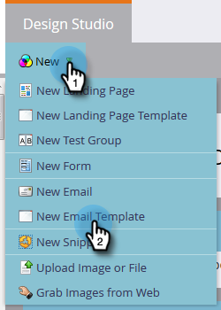
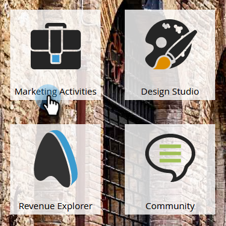

# Een e-mailsjabloon maken {#create-an-email-template}

Ga als volgt te werk om een nieuwe e-mailsjabloon te maken.

>[!NOTE]
>
>Marketo Support is niet ingesteld als hulp bij het oplossen van problemen met aangepaste HTML. Voor hulp van HTML raadpleegt u een webontwikkelaar.

>[!CAUTION]
>
>In de editor die we gebruiken, worden de waarden van CSS-eigenschappen voor kleur en achtergrondkleur omgezet in kleine letters. Gebruik dus liever geen hoofdletters en kleine letters en geen afbreekstreepjes.

## Een nieuwe e-mailsjabloon maken {#create-a-new-email-template}

1. Klik op **[!UICONTROL Design Studio]**.

   

1. Klik op **[!UICONTROL New]** en selecteer vervolgens **[!UICONTROL New Email Template]** .

   

1. Geef de nieuwe sjabloon een naam en klik op **[!UICONTROL Create]** .

   

1. Klik op **[!UICONTROL Edit Draft]** als u wilt beginnen met het bewerken van de nieuwe sjabloon.

   

   >[!CAUTION]
   >
   >Hoewel er geen vaste limiet is, kan het opnieuw goedkeuren van de sjabloon na een update leiden tot prestatieproblemen als een e-mailsjabloon eenmaal wordt gebruikt door meer dan 500 e-mailberichten. We raden u aan om zodra er 500 e-mailberichten aan een e-mailsjabloon zijn gekoppeld, een nieuwe sjabloon te maken.

## E-mail opslaan als sjabloon {#save-an-email-as-a-template}

Voer de volgende eenvoudige stappen uit als u een e-mailbericht hebt gemaakt dat u wilt opslaan als sjabloon voor toekomstig gebruik.

1. Klik op **[!UICONTROL Marketing Activities]**.

   

1. Zoek en selecteer uw e-mail en klik vervolgens op **[!UICONTROL Edit Draft]** .

   

1. Klik op de vervolgkeuzelijst **[!UICONTROL Email Actions]** en selecteer **[!UICONTROL Save as Template]** .

   

1. Klik op de vervolgkeuzelijst **[!UICONTROL Folder]** , selecteer waar u de sjabloon wilt laten leven en klik op **[!UICONTROL Save]** .

   

   En dat is het!

   >[!CAUTION]
   >
   >Als u een e-mailbericht opslaat als een sjabloon, worden waarden van variabelen niet overgedragen. Variabelen blijven de standaardwaarden gebruiken die in de onderliggende sjabloon zijn opgegeven. Beschikbare modules in de e-mail zullen ook niet worden overgedragen tenzij zij in het e-maillichaam zijn opgenomen.

Als u uw e-mailsjabloon wilt aanpassen, checkt u het onderstaande artikel uit.

>[!MORELIKETHIS]
>
>[ Syntaxis van het Malplaatje E-mail ](/help/marketo/product-docs/email-marketing/general/email-editor-2/email-template-syntax.md)
