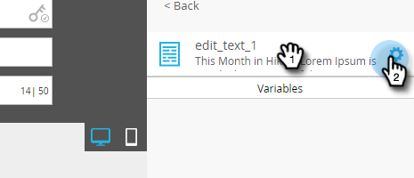

# Elementen bewerken in een e-mail {#edit-elements-in-an-email}

E-mails kunnen vier verschillende elementen bevatten: RTF-tekst, afbeeldingen, fragmenten en video. Hier is hoe te om elk uit te geven.

## Procedure voor het bewerken van het rijke tekstelement {#how-to-edit-the-rich-text-element}

1. Uw e-mail zoeken, deze selecteren en klikken **Concept bewerken**.

   

1. De e-maileditor wordt geopend. Selecteer de RTF-tekst, klik op het tandwielpictogram en selecteer **Bewerken**.

   

   U kunt de muisaanwijzer ook boven het element in het rechterdeelvenster plaatsen, zodat het tandwielpictogram wordt weergegeven.

   

1. Uw tekst toevoegen/bewerken en drukken op **Opslaan**.

   

   >[!NOTE]
   >
   >U kunt ook afbeeldingen, tokens, tabellen en andere elementen toevoegen. Zie [De Rich Text Editor gebruiken](/help/marketo/product-docs/email-marketing/general/understanding-the-email-editor/using-the-rich-text-editor.md).

   >[!CAUTION]
   >
   >Vermijd het kopiëren en plakken van tekst van een rijke tekstbron, zoals een website of een document van Word. Plak in plaats daarvan eerst rijke tekst in een onbewerkte teksteditor, zoals Kladblok (Windows) of TextEdit (Mac). Als het &#39;schoon&#39; is, kunt u het vervolgens kopiëren vanuit de teksteditor zonder opmaak en plakken in uw e-mail.

## Het afbeeldingselement bewerken {#how-to-edit-the-image-element}

1. Klik in de module met het element Afbeelding om het te selecteren.

   

1. Klik op het afbeeldingselement dat u wilt bewerken, klik op het tandwielpictogram en selecteer **Bewerken**.

   

   >[!NOTE]
   >
   >U kunt ook dubbelklikken op het element om te beginnen met bewerken.

1. De afbeeldingseditor wordt weergegeven.

   

   U hebt drie opties voor het invoegen van een afbeelding. Laten we naar elk kijken.

   **Externe URL**

   >[!NOTE]
   >
   >Gebruik deze optie als u een Marketo-token wilt gebruiken. Houd er rekening mee dat wanneer u een token gebruikt, de afbeelding wordt afgebroken in de editor, maar wordt weergegeven in de modus Voorbeeld en in het e-mailbericht Voorbeeld verzenden.

   Als u een externe URL wilt gebruiken, plakt u eerst in de URL van de afbeelding. Pas de afmetingen aan uw wensen aan en voeg alternatieve tekst (optioneel) toe. Druk vervolgens op **Wisselen**.

   

   **Deze computer**

   Als u een afbeelding vanaf uw computer wilt uploaden, klikt u op **Bladeren**.

   

   Navigeer naar de plaats op de computer waar de afbeelding zich bevindt en voeg deze in.

   

   Wijzig de afmetingen naar wens, wijzig de Alt-tekst (optioneel) en druk op **Wisselen**.

   

   >[!NOTE]
   >
   >Als u een afbeelding vervangt, moet u de optie **Bestaande afbeelding overschrijven** onder de URL/naam van de afbeelding.

   **Design Studio**

   Om een beeld van de Studio van het Ontwerp op te nemen, bepaal de plaats eenvoudig van het...

   

   ...en voeg het in. Wijzig de afmetingen naar wens, wijzig de Alt-tekst (optioneel) en druk op **Wisselen**.

   

## Het fragmentelement bewerken {#how-to-edit-the-snippet-element}

1. Klik in de module met het element Fragment.

   

1. Klik op het element Fragment, klik vervolgens op het tandwielpictogram en selecteer **Bewerken**.

   

1. Zoek het fragment, selecteer het en klik op **Opslaan**.

   

1. Uw fragment wordt vervolgens gevuld.

   

## Het Video-element bewerken {#how-to-edit-the-video-element}

1. Klik in de module met het Video-element.

   

1. Klik op het element Video, klik vervolgens op het tandwielpictogram en selecteer **Bewerken**.

   

1. Plak de video-URL vanuit Vimeo of YouTube. Klik vervolgens buiten het vak URL om de voorvertoning te laden. Wijzig de afmetingen naar wens en voeg Alt-tekst (optioneel) toe. Druk vervolgens op **Invoegen**.

   

   >[!NOTE]
   >
   >Voor YouTube-video&#39;s gebruikt u de volledige URL op de adresbalk, niet de snelkoppeling-URL in de optie Delen.

Veel plezier met het ontwerpen van de perfecte e-mail!
