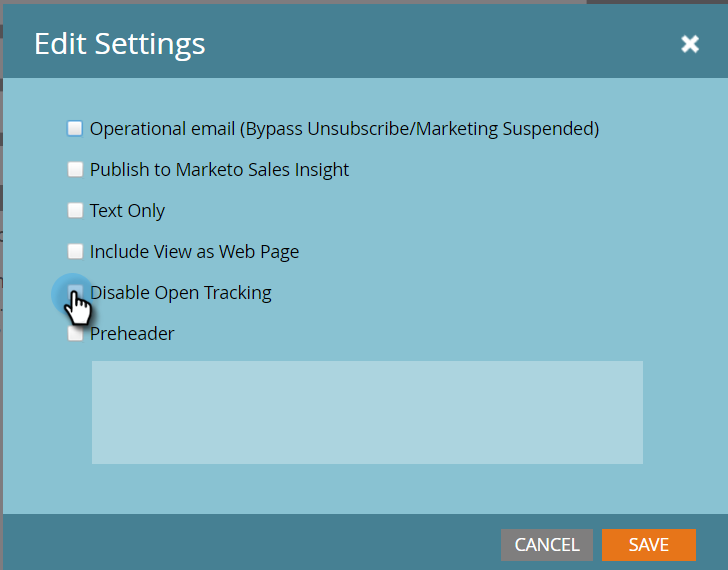

# Overzicht E-maileditor v2.0 {#email-editor-v2-overview}

Overzicht van de klassieke e-maileditor.

>[!IMPORTANT]
>
>Hoewel er geen exacte datum is ingesteld, wordt de klassieke e-maileditor waarschijnlijk ergens in 2026 vervangen (we zullen een exacte datum bekendmaken wanneer deze er is). Het wordt sterk geadviseerd om met goedkeuring van geavanceerde [&#x200B; E-mail Designer &#x200B;](/help/marketo/product-docs/email-marketing/email-designer/overview.md){target="_blank"} te beginnen, aangezien het vele mogelijkheden niet beschikbaar in de klassieke redacteur heeft.

**de Plukker van het Malplaatje E-mail**

Wanneer u nieuwe e-mail creeert, wordt u genomen aan de [&#x200B; Plukker van het Malplaatje E-mail &#x200B;](/help/marketo/product-docs/email-marketing/general/email-editor-2/email-template-picker-overview.md).

**E-mailredacteur**

Wanneer u uw e-mail gaat bewerken, ziet u dat de editor een geheel nieuw uiterlijk heeft.

**Modules**

Die dingen aan de rechterkant van de redacteur worden genoemd modules. Leer hoe te [&#x200B; modules aan uw e-mail &#x200B;](/help/marketo/product-docs/email-marketing/general/email-editor-2/add-modules-to-your-email.md) toevoegen.

**Versie van de Tekst**

Het schakelen tussen de HTML-versie en de tekstversie van uw e-mailbericht staat nu op een handig tabblad onderaan. Leer hoe te [&#x200B; de tekstversie van e-mail &#x200B;](/help/marketo/product-docs/email-marketing/general/creating-an-email/edit-the-text-version-of-an-email.md) uitgeven.

**E-mailkopbal**

Wilt u meer ontwerpruimte? De e-mailkopbal kan worden verborgen nadat u [&#x200B; het &#x200B;](/help/marketo/product-docs/email-marketing/general/creating-an-email/edit-your-email-header.md) het uitgeven wordt gedaan. Klik gewoon op dit pictogram...

...en de koptekst vouwt.

**Voorproef uw E-mail**

Standaard wordt in het e-mailbericht weergegeven hoe het eruitziet op een bureaublad, zoals aangegeven door het gemarkeerde blauwe pictogram. Als u rechts op het pictogram klikt...

...u zult zien hoe uw e-mail wordt weergegeven op een mobiel apparaat.

Voor een grotere voorvertoning klikt u op **[!UICONTROL Preview]** rechtsboven in het e-mailbericht.

De standaardweergave daar is bureaublad...

...maar u kunt ook zien hoe het er op een mobiel apparaat uitziet. U kunt ook een voorvertoning van de tekstversie weergeven. Klik gewoon op **[!UICONTROL Edit Draft]** rechtsboven om het bewerken te hervatten.

**[!UICONTROL Email Actions]**

Onder **[!UICONTROL Email Actions]** ziet u enkele nieuwe functies. **[!UICONTROL Upload an Image or File]** en **[!UICONTROL Grab Images from Web]** . U kunt het e-mailbericht zelf ook opslaan als een nieuwe e-mailsjabloon. Het enige wat je hoeft te doen, is het een naam en een bestemming geven.

>[!CAUTION]
>
>Als u een e-mailbericht opslaat als een sjabloon, worden waarden van variabelen niet overgedragen. Variabelen blijven de standaardwaarden gebruiken die in de onderliggende sjabloon zijn opgegeven. Beschikbare modules in de e-mail zullen ook niet worden overgedragen tenzij zij in het e-maillichaam zijn opgenomen.

>[!NOTE]
>
>**[[!UICONTROL Grab Images from Web]](/help/marketo/product-docs/demand-generation/images-and-files/grab-the-images-from-a-web-page.md)** werkt net zoals in de [!UICONTROL Design Studio] .

**[!UICONTROL Disable Open Tracking]** Onder **[!UICONTROL Edit Settings]** kunt u het openen van tekstspatiëring desgewenst uitschakelen.

**[!UICONTROL Edit Settings]**

U kunt desgewenst een [!UICONTROL Preheader] toevoegen. A [!UICONTROL Preheader] is de korte samenvattingstekst na de onderwerpregel wanneer e-mails in uw Postvak IN worden weergegeven.

>[!CAUTION]
>
>Tokens werken niet in de [!UICONTROL Preheader] wanneer u de e-maileditor gebruikt. Als u een token wilt gebruiken in de [!UICONTROL Preheader] , moet dit via uw eigen HTML in een e-mailsjabloon gebeuren.

Veel geweldige nieuwe functies! Veel plezier!

>[!NOTE]
>
>Als u nog dieper wilt delven, controleer deze [&#x200B; video &#x200B;](https://nation.marketo.com/videos/1463).

>[!MORELIKETHIS]
>
>[&#x200B; Syntaxis van het Malplaatje E-mail &#x200B;](/help/marketo/product-docs/email-marketing/general/email-editor-2/email-template-syntax.md)
