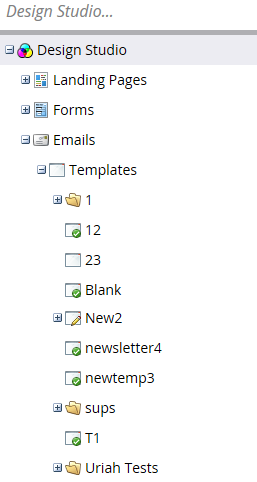
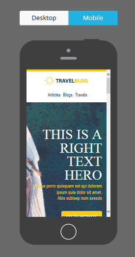

# Overzicht van de E-mailsjabloonkiezer {#email-template-picker-overview}

Wanneer u [&#x200B; een e-mail &#x200B;](/help/marketo/product-docs/email-marketing/general/creating-an-email/create-an-email.md) creeert, hebt u verscheidene vrije malplaatjes om van te kiezen. U kunt ook uw eigen sjabloon maken en deze opslaan voor toekomstig gebruik.

**[!UICONTROL Name]** wordt de naam van het e-mailbericht dat u maakt op basis van de sjabloon, niet de sjabloon zelf. **[!UICONTROL Description]** is ook van toepassing op de e-mail en is optioneel.

Als uw e-mail kritiek is en u het Communicatie Limieten wilt omzeilen, [&#x200B; maak het operationeel &#x200B;](/help/marketo/product-docs/email-marketing/general/functions-in-the-editor/make-an-email-operational.md) door de doos te controleren. **[!UICONTROL Open in editor]** is standaard geselecteerd. Dit betekent dat u meteen wilt beginnen met het bewerken van uw nieuwe e-mail. **[!UICONTROL Create]** betekent: maak!

**[!UICONTROL Starter Templates]** bevat een verzameling gebruiksklare e-mailsjablonen. U kunt ze ongewijzigd gebruiken of ze naar wens aanpassen.

**[!UICONTROL My Templates]** bestaat uit alle sjablonen die u hebt gemaakt. U hebt mogelijk ook mappen.

Alle mappen die onder **[!UICONTROL Emails]** > **[!UICONTROL Templates]** in de [!UICONTROL Design Studio] structuur worden weergegeven, zijn beschikbaar in **[!UICONTROL My Templates]** .

Als u een voorbeeld van een sjabloon wilt bekijken, beweegt u de muisaanwijzer over de bijbehorende miniatuur en klikt u op **[!UICONTROL Preview]** . U kunt er ook gewoon op dubbelklikken.

In de voorvertoning ziet u hoe de sjabloon op een desktopcomputer wordt weergegeven...

...en een mobiel apparaat.

Als deze sjabloon u bevalt, kiest u deze door op **[!UICONTROL Select]** rechtsonder te klikken. Wil je blijven zoeken? Klik **X** op het hogere recht. Gebruik de pijlen naar links en rechts om door sjablonen te bladeren.

U kunt ook met de rechtermuisknop op een sjabloonminiatuur klikken voor meer opties.

>[!NOTE]
>
>Een leuke aan sjabloonminiaturen is dat ze live zijn. Als u dus een wijziging aanbrengt in een sjabloon, verandert de miniatuur mee.

Mooi zo!

>[!MORELIKETHIS]
>
>* [&#x200B; Syntaxis van het Malplaatje E-mail &#x200B;](/help/marketo/product-docs/email-marketing/general/email-editor-2/email-template-syntax.md)
>* [&#x200B; creeer een E-mail &#x200B;](/help/marketo/product-docs/email-marketing/general/creating-an-email/create-an-email.md)
