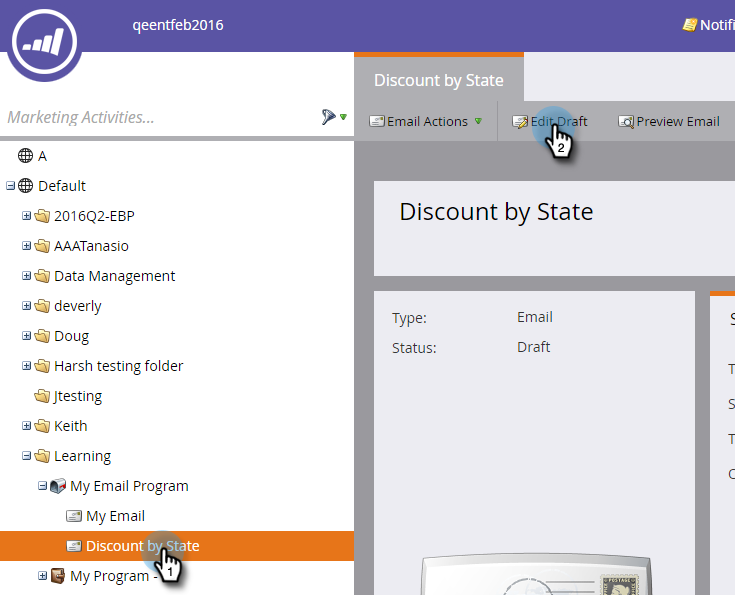

# Een fragment toevoegen aan een e-mail {#add-a-snippet-to-an-email}

Fragmenten zijn herbruikbare blokken tekst en afbeeldingen met opmaak die u kunt gebruiken in uw e-mails en landingspagina&#39;s.

>[!PREREQUISITES]
>
>[&#x200B; creeer een Fragment &#x200B;](/help/marketo/product-docs/personalization/segmentation-and-snippets/snippets/create-a-snippet.md)

>[!NOTE]
>
>U kunt geen [&#x200B; de e-mailsyntaxis van Marketo &#x200B;](/help/marketo/product-docs/email-marketing/general/email-editor-2/email-template-syntax.md) in fragmenten inbedden; het **&#x200B;**&#x200B;zal niet in e-mail werken. Fragmenten moeten alleen body-inhoud zijn (HTML + TEXT).

1. Zoek de e-mail, selecteer deze en klik op **[!UICONTROL Edit Draft]** .

   

1. Selecteer het bewerkbare gebied dat u naar een fragment wilt converteren, klik op het tandwielpictogram en selecteer **[!UICONTROL Replace with Snippet]** .

   

1. Selecteer het gewenste fragment en klik op **[!UICONTROL Save]** .

   

   >[!NOTE]
   >
   >Alleen goedgekeurde fragmenten worden weergegeven in de vervolgkeuzelijst.

   

   >[!NOTE]
   >
   >Telkens wanneer u uw fragment bijwerkt en goedkeurt, worden de wijzigingen doorgevoerd in de e-mail. E-mail zal worden opgesteld tenzij u het fragment met [&#x200B; goedkeurt nr-Ontwerp &#x200B;](/help/marketo/product-docs/administration/users-and-roles/enable-no-draft-for-snippets.md).

Dit is een snelle en eenvoudige manier om dynamische inhoud opnieuw te gebruiken.
