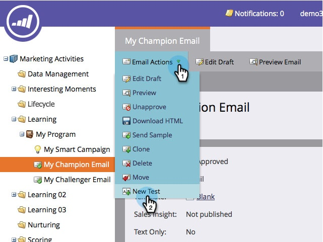

# Een e-mailkampioen/challenger toevoegen {#add-an-email-champion-challenger}

Het is een goed idee om e-mails te testen die je vaak gebruikt om er zeker van te zijn dat ze werken. Eén manier is om de effectiviteit van een e-mail te vergelijken met andere versies, of uitdagers. In een champion/challenger test, kunt u het volledige e-mail, de onderwerpregel, of het van adres testen.

De bestaande e-mail die u test, wordt beschouwd als de kampioen. Alle varianten die u binnen een test maakt, worden beschouwd als de uitdagers. U bepaalt het percentage mensen dat de champion-inhoud of de uitdager-inhoud ontvangt. Als je meerdere uitdagers hebt gedefinieerd, zullen ze gelijkelijk verdeeld worden over de klaaggroep.

Zo ga je aan de slag.

>[!PREREQUISITES]
>
>* [Een programma maken](/help/marketo/product-docs/core-marketo-concepts/programs/creating-programs/create-a-program.md)
>* [Een e-mail maken](/help/marketo/product-docs/email-marketing/general/creating-an-email/create-an-email.md)

>[!CAUTION]
>
>E-mails van Champion/Challenger werken alleen met triggercampagnes en betrokkenheidsprogrammastreams. Gebruik voor batchberichten de programma's [A/B-testfunctionaliteit](/help/marketo/product-docs/email-marketing/email-programs/email-program-actions/email-test-a-b-test/add-an-a-b-test.md).

1. Ga naar **Marketingactiviteiten**.

   

1. Zoek en selecteer een e-mail.

   

   >[!NOTE]
   >
   >Meer informatie over [e-mailprogramma's](/help/marketo/product-docs/email-marketing/email-programs/creating-an-email-program/create-an-email-program.md).

1. Onder **E-mailhandelingen**, klikt u op **Nieuwe test**.

   

1. Er wordt een nieuw venster geopend met verschillende opties voor het type test. Lees de verwante artikelen hieronder voor meer informatie.

   >[!MORELIKETHIS]
   >
   >* [Champion/Challenger: Hele e-mails](/help/marketo/product-docs/email-marketing/general/functions-in-the-editor/email-tests-champion-challenger/champion-challenger-whole-emails.md)
   >* [Champion/Challenger: Onderwerpregel](/help/marketo/product-docs/email-marketing/general/functions-in-the-editor/email-tests-champion-challenger/champion-challenger-subject-line.md)
   >* [Champion/Challenger: Van adres](/help/marketo/product-docs/email-marketing/general/functions-in-the-editor/email-tests-champion-challenger/champion-challenger-from-address.md)
