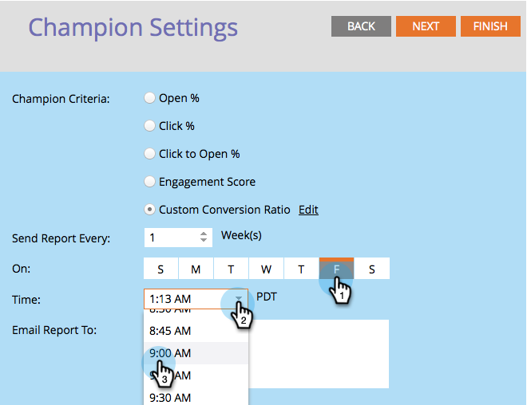

# Champion/Challenger: Analytics {#champion-challenger-analytics}

Ontvang rapportwaarschuwingen en/of bekijk het dashboard Champion/Challenger voor nuttige analyses.

>[!PREREQUISITES]
>
>[ Champion/Challenger: Bepaal Champion Criteria ](/help/marketo/product-docs/email-marketing/general/functions-in-the-editor/email-tests-champion-challenger/champion-challenger-define-champion-criteria.md)

## Rapportwaarschuwingen configureren {#configure-report-alerts}

Marketo stuurt je berichten over hoe de e-mailtest verloopt. Hier is hoe je het kunt plannen.

1. Laten we het rapport plannen om vrijdag om 9.00 uur eenmaal per week te verzenden.

   

   >[!TIP]
   >
   >U kunt desgewenst meerdere dagen van de week selecteren. Klik om te selecteren en klik nogmaals om de selectie ongedaan te maken.

1. Voer het e-mailadres in waarnaar de rapporten moeten worden verzonden.

   

1. Klik **daarna**.

   

1. Verifieer dat alle informatie correct is en **dicht** klikt.

   

   Het rapport bevat details zoals het type test, de criteria voor winnaars, het aantal e-mailberichten dat wordt geopend en meer. Er zal ook een directe link naar de test zelf zijn, zodat u de winnaar kunt verklaren! Koel spul.

## Champion/Challenger Dashboard {#champion-challenger-dashboard}

Het dashboard Champion/Challenger bevat gedetailleerde analyses van de prestaties van het besturingselement en de varianten in uw experimenteren met Champion/Challenger (wordt geopend, er wordt geklikt, er wordt een abonnement genomen en er worden andere variabelen gebruikt tijdens de configuratie van de e-mailtest). Het dashboard verstrekt ook distributiedetails betreffende het gerichte publiek voor diverse e-mailvarianten, evenals samengevoegde verhouding voor opent, klikt, klikt-aan-open verhouding, en unsubscribes voor alle varianten.

