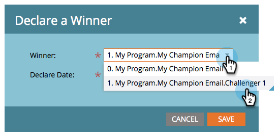

# Champion/Challenger: een Champion declareren {#champion-challenger-declare-a-champion}

Als je klaar bent, kun je een kampioen voor je e-mailtest declareren.

>[!MORELIKETHIS]
>
>[ Champion/Challenger: keur Uw E-mailtest ](/help/marketo/product-docs/email-marketing/general/functions-in-the-editor/email-tests-champion-challenger/champion-challenger-approve-your-email-test.md) goed

1. Ga naar **[!UICONTROL Marketing Activities]** .

   

1. Zoek en klik met de rechtermuisknop op de e-mailtest en klik vervolgens op **[!UICONTROL Declare Champion]** .

   

1. Selecteer de **[!UICONTROL Winner]** van uw keuze.

   

1. Stel de **[!UICONTROL Declare Date]** in.

   >[!NOTE]
   >
   >Tot aan **[!UICONTROL Declare Date]** zal Marketo de oude kampioen en uitdager(s) blijven sturen. Zodra datum/tijd wordt bereikt, slechts zal de nieuwe kampioen worden verzonden.

   

   >[!CAUTION]
   >
   >De standaardwaarde **[!UICONTROL Declare Date]** is morgen, niet vandaag.

1. Selecteer een tijd en klik op **[!UICONTROL Save]** .

   

   Leeg! Nu weet u hoe u eenvoudig een e-mailtest kunt uitvoeren om uw inhoud te verbeteren zonder onderbrekingen in uw campagne.
