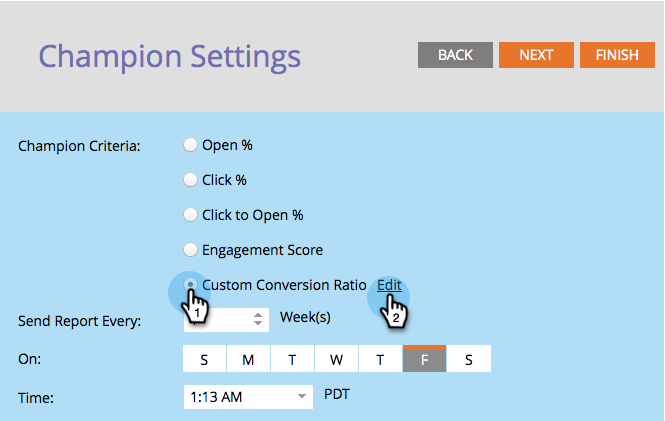

# Champion/Challenger: Champion-criteria definiëren {#champion-challenger-define-champion-criteria}

Nadat u het testtype hebt ingesteld, moet u de criteria voor de kampioenschappen definiëren. Zo gaat het.

>[!PREREQUISITES]
>
>[Een e-mailkampioen/challenger toevoegen](/help/marketo/product-docs/email-marketing/general/functions-in-the-editor/email-tests-champion-challenger/add-an-email-champion-challenger.md)

## Standaardkampioencriteria {#standard-champion-criteria}

1. Kies een van de beschikbare opties **Champion-criteria**.

   

   >[!NOTE]
   >
   >We volgen deze norm en sturen je een rapport met de gegevens per e-mail.

1. Als u een van de standaardinstellingen hebt gekozen **Champion-criteria**, ga verder [Champion/Challenger: Rapportwaarschuwingen configureren](/help/marketo/product-docs/email-marketing/general/functions-in-the-editor/email-tests-champion-challenger/champion-challenger-configure-report-alerts.md)!

## Aangepaste miniatuurcriteria {#custom-champion-criteria}

1. Als je leuk wilt worden, kun je naar eigen voorkeur gaan door **Aangepaste omzetting** en klikken **Bewerken**.

   

   >[!NOTE]
   >
   >Op deze manier kunt u elke gebeurtenis instellen als een conversie met behulp van triggers en filters.

1. Er verschijnt een venster. Zoek de trigger van uw keuze en sleep deze naar het canvas.

   

1. Definieer de trigger.

   

   Marketo staat alleen triggers toe voor mensen die het e-mailbericht van dit e-mailprogramma hebben ontvangen. U hoeft het filter &#39;&#39;Is verzonden via e-mail&#39;&#39; niet toe te voegen.

1. Klikken **Sluiten**.

   

   Geweldig! Nu is het tijd om het rapport te plannen.

   >[!MORELIKETHIS]
   >
   >[Champion/Challenger: Rapportwaarschuwingen configureren](/help/marketo/product-docs/email-marketing/general/functions-in-the-editor/email-tests-champion-challenger/champion-challenger-configure-report-alerts.md)
