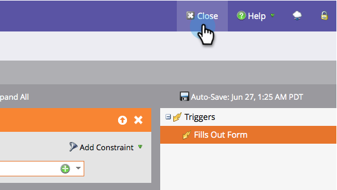

# Champion/Challenger: Champion-criteria definiëren {#champion-challenger-define-champion-criteria}

Nadat u het testtype hebt ingesteld, moet u de criteria voor de kampioenschappen definiëren. Zo gaat het.

>[!PREREQUISITES]
>
>[ voeg een Kampioen E-mail/Challenger ](/help/marketo/product-docs/email-marketing/general/functions-in-the-editor/email-tests-champion-challenger/add-an-email-champion-challenger.md) toe

## Standaardkampioencriteria {#standard-champion-criteria}

1. Kies een van de beschikbare **[!UICONTROL Champion Criteria]** .

   

   >[!NOTE]
   >
   >We volgen deze norm en sturen je een rapport met de gegevens per e-mail.

1. Als u één van standaard **Criteria van de Champion** koos, ga vooruit en ga op [ het vormen rapportalarm ](/help/marketo/product-docs/email-marketing/general/functions-in-the-editor/email-tests-champion-challenger/champion-challenger-analytics.md#configure-report-alerts) te werk!

## Aangepaste Champion-criteria {#custom-champion-criteria}

1. Als u fantasie wilt krijgen, kunt u aangepaste handelingen uitvoeren door **[!UICONTROL Custom Conversion Ratio]** te selecteren en op **[!UICONTROL Edit]** te klikken.

   

   >[!NOTE]
   >
   >Op deze manier kunt u elke gebeurtenis instellen als een conversie met behulp van triggers en filters.

1. Er verschijnt een venster. Zoek de trigger van uw keuze en sleep deze naar het canvas.

   

1. Geef de trigger op.

   

   Marketo staat alleen triggers toe voor mensen die het e-mailbericht van dit e-mailprogramma hebben ontvangen. Geen behoefte om &quot;[!UICONTROL Was Sent Email]&quot;filter toe te voegen.

1. Klik op **[!UICONTROL Close]**.

   

   Geweldig! Nu is het tijd om het rapport te plannen.

   >[!MORELIKETHIS]
   >
   >[ Champion/Challenger: Analytics ](/help/marketo/product-docs/email-marketing/general/functions-in-the-editor/email-tests-champion-challenger/champion-challenger-analytics.md)
